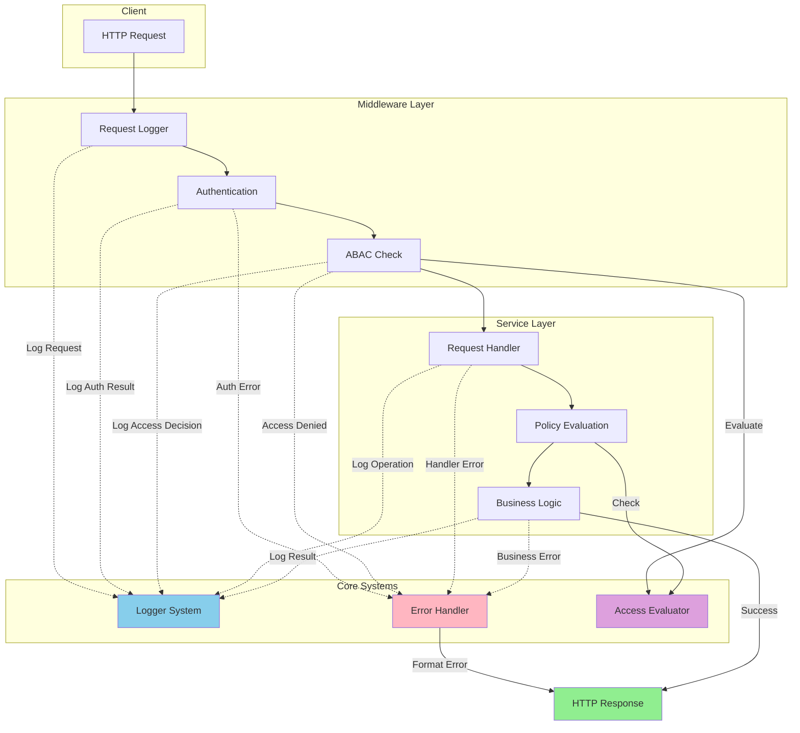

# System Integration Flow

This document illustrates how the Logger, Error Handling, and ABAC (Attribute-Based Access Control) systems work together in microservices.

## Request Flow Diagram



## Component Integration

### 1. Logger Integration

```typescript
import { pipe } from 'fp-ts/function';
import * as TE from 'fp-ts/TaskEither';
import { logger } from '@eduflow/common';

const processRequest = (request: FastifyRequest): TE.TaskEither<AppError, Response> =>
  pipe(
    TE.Do,
    TE.tap(() =>
      TE.right(
        logger.info('Starting request processing', {
          path: request.url,
          method: request.method,
          userId: request.user?.id,
        })
      )
    ),
    TE.chain(() => authenticateRequest(request)),
    TE.tap((authResult) =>
      TE.right(
        logger.info('Authentication result', {
          userId: request.user?.id,
          success: authResult.success,
        })
      )
    ),
    TE.chain(() => evaluateAccess(request)),
    TE.tap((accessResult) =>
      TE.right(
        logger.info('Access control result', {
          userId: request.user?.id,
          granted: accessResult.granted,
          policy: accessResult.policy,
        })
      )
    ),
    TE.chain(() => processBusinessLogic(request)),
    TE.tap((result) =>
      TE.right(
        logger.info('Operation completed', {
          userId: request.user?.id,
          operation: request.method,
          success: true,
        })
      )
    )
  );
```

### 2. Error Handler Integration

```typescript
const handleRequestError = (error: unknown): AppError =>
  pipe(
    error,
    E.fromPredicate(isAuthError, () => error),
    E.fold(
      (err) =>
        pipe(
          err,
          E.fromPredicate(isAbacError, () => err),
          E.fold(
            (e) => createUnexpectedError('Unexpected error', e),
            (abacError) => {
              logger.warn('Access denied', {
                reason: abacError.message,
                code: abacError.code,
              });
              return createForbiddenError(abacError.message);
            }
          )
        ),
      (authError) => {
        logger.warn('Authentication failed', {
          reason: authError.message,
          code: authError.code,
        });
        return createUnauthorizedError(authError.message);
      }
    )
  );
```

### 3. ABAC Integration

```typescript
const createSecureEndpoint =
  (policy: AccessPolicy, handler: RequestHandler) =>
  async (request: FastifyRequest, reply: FastifyReply): Promise<void> => {
    const requestLogger = logger.child({
      requestId: request.id,
      userId: request.user?.id,
    });

    await pipe(
      TE.tryCatch(
        () => evaluateAccess(request.user?.id, policy),
        (error) => handleRequestError(error)
      ),
      TE.tap((result) =>
        TE.right(
          requestLogger.info('Access evaluation result', {
            granted: result.granted,
            policy: policy.resource,
          })
        )
      ),
      TE.chain((result) =>
        !result.granted ? TE.left(createForbiddenError(result.reason)) : TE.right(undefined)
      ),
      TE.chain(() => handler(request, reply)),
      TE.mapLeft((error) => {
        const appError = handleRequestError(error);
        requestLogger.error('Request failed', {
          error: appError.message,
          code: appError.code,
          stack: appError.stack,
        });
        throw appError;
      })
    )();
  };
```

## System Responsibilities

### Logger System

- Request/Response logging
- Authentication events
- Access control decisions
- Operation results
- Error details
- Performance metrics

### Error Handler

- Error type classification
- Error transformation
- Error response formatting
- Error logging coordination
- Stack trace management
- Error code assignment

### ABAC System

- Policy evaluation
- Access decision logging
- Permission verification
- Role checking
- Environmental conditions
- Custom rule evaluation

## Integration Points

1. **Request Entry**

   - Logger: Records incoming request
   - Error Handler: Catches malformed requests
   - ABAC: Initializes context for evaluation

2. **Authentication**

   - Logger: Records auth attempt
   - Error Handler: Handles auth failures
   - ABAC: Uses auth context for evaluation

3. **Authorization**

   - Logger: Records access decisions
   - Error Handler: Formats access denied errors
   - ABAC: Evaluates access policies

4. **Business Logic**

   - Logger: Records operations
   - Error Handler: Handles business errors
   - ABAC: Enforces fine-grained permissions

5. **Response**
   - Logger: Records response details
   - Error Handler: Formats error responses
   - ABAC: Validates response permissions

## Best Practices

1. **Consistent Error Handling**

   ```typescript
   const withErrorHandling = <T>(
     operation: () => Promise<T>,
     context: LogContext
   ): TE.TaskEither<AppError, T> =>
     pipe(
       TE.tryCatch(operation, (error) => handleRequestError(error)),
       TE.tap((result) =>
         TE.right(
           logger.info('Operation completed', {
             ...context,
             success: true,
           })
         )
       ),
       TE.mapLeft((error) => {
         logger.error('Operation failed', {
           ...context,
           error: error.message,
         });
         return error;
       })
     );
   ```

2. **Structured Logging**

   ```typescript
   const createContextLogger = (request: FastifyRequest, operation: string) =>
     logger.child({
       requestId: request.id,
       userId: request.user?.id,
       operation,
       timestamp: new Date().toISOString(),
     });
   ```

3. **Policy Management**
   ```typescript
   const createPolicyWithLogging = (policy: AccessPolicy): AccessPolicy => ({
     ...policy,
     onEvaluate: (result) => {
       logger.info('Policy evaluated', {
         policy: policy.resource,
         granted: result.granted,
         reason: result.reason,
       });
     },
   });
   ```

## Related Documentation

### Core Implementation

- [ABAC Implementation](../../libs/common/docs/abac.md)
- [Error Handling Implementation](../../libs/common/docs/error-handling.md)
- [Logger Implementation](../../libs/logger/docs/logger-implementation.md)

### Integration Guides

- [ABAC Integration Guide](../../libs/docs/abac-integration.md)
- [Error Handling Integration](../../libs/docs/error-handling-integration.md)
- [Logger Integration](../../libs/docs/logger-integration.md)

### Usage Guides

- [ABAC Usage Guide](./abac-usage.md)
- [Error Handling Usage](./error-handling-usage.md)
- [Logger Usage](./logger-usage.md)

### Additional Resources

- [ABAC Flow](../../libs/types/src/auth/ABAC_FLOW.md)
- [ABAC Types](../../libs/types/src/auth/ABAC.md)
