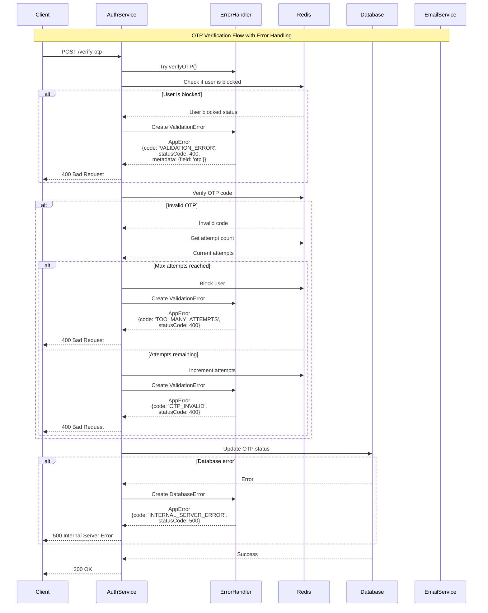

# Error Handling Flow in Microservices

This document outlines the error handling system implementation across microservices, using the auth service as an example.

## Sequence Diagram

## Error Handling System Architecture

### 1. Error Type System
- The system defines a comprehensive type hierarchy for errors in `libs/types/src/errors/types.ts`
- Errors are categorized into: AUTH, RESOURCE, VALIDATION, FILE, and SYSTEM
- Each category has specific error codes and metadata types
- All errors follow the `AppError` interface which includes:
  - name: Error name
  - message: Human-readable message
  - statusCode: HTTP status code
  - code: Application error code
  - metadata: Type-safe error metadata
  - cause: Original error (optional)

### 2. Error Creation
- Base error utilities are defined in `libs/common/src/errors/base.error.ts`
- Service-specific error creators (like auth errors) extend the base error system
- Error creators ensure type safety and consistent error structure
- HTTP status codes are automatically mapped to error codes

### 3. Error Handling in Auth Service Example
The OTP verification flow demonstrates multiple error scenarios:
- **Validation Errors**: Invalid OTP, expired OTP
- **Rate Limiting Errors**: Too many attempts
- **Database Errors**: Failed to update OTP status
- **System Errors**: Redis connection issues

### 4. Error Flow
- Services use TaskEither for error handling (from fp-ts)
- Errors are created using typed error creators
- Errors are propagated up the call stack
- Middleware transforms errors into standard error responses
- Clients receive consistent error response structure

### 5. Microservice Integration
- Each microservice can define its own error types
- Common error types are shared via the `@eduflow/types` package
- Error responses are standardized across all services
- Error metadata helps with debugging and client handling

### 6. Benefits
- Type-safe error handling
- Consistent error structure across services
- Detailed error metadata for debugging
- Clear HTTP status code mapping
- Centralized error type definitions

## Example Usage in Auth Service

The auth service example shows how the error handling system handles various error scenarios in a real-world application. The OTP verification flow demonstrates the following error handling patterns:

1. **Input Validation**
   - OTP code format validation
   - OTP expiration checks
   - User blocking status verification

2. **Rate Limiting**
   - Tracking failed attempts
   - User blocking after max attempts
   - Block duration management

3. **Database Operations**
   - OTP status updates
   - Error handling for database operations
   - Transaction management

4. **System Errors**
   - Redis connection issues
   - Email service failures
   - Internal server errors

This error handling system provides a robust foundation for handling errors across microservices while maintaining type safety and consistency. 