# EduFlow System Workflows

## Authentication & Verification Workflows

### User Registration
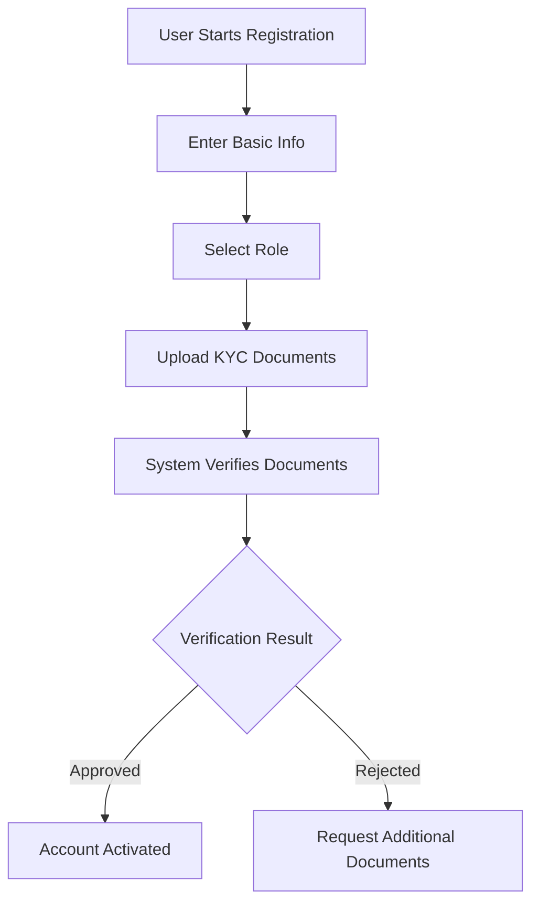

### Parent Verification
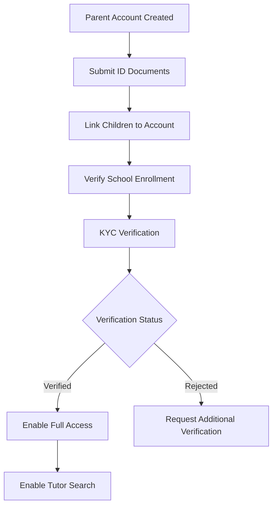

## Payment Workflows

### School Fee Payment
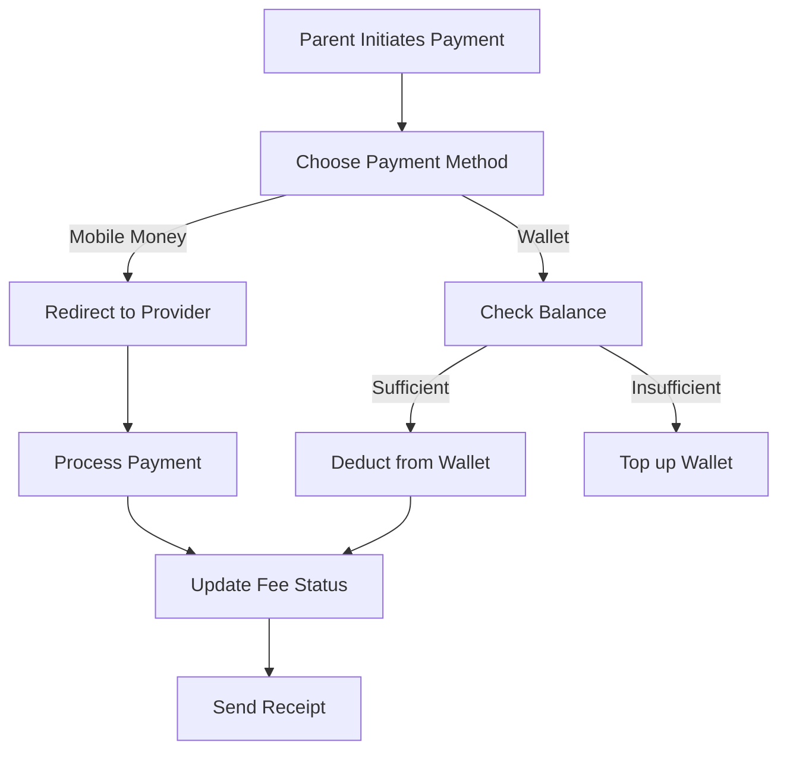

### Wallet Management
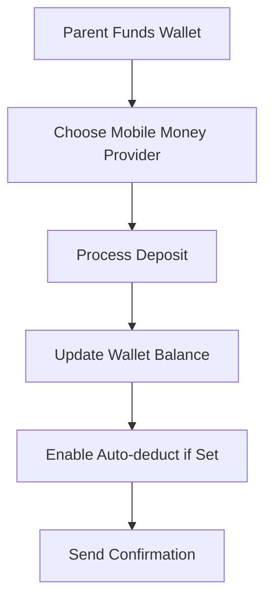

### Quiz Payment
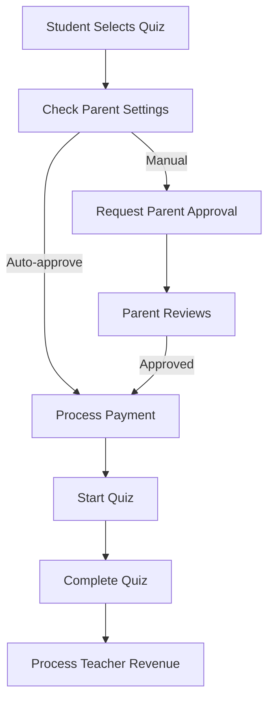

## Academic Workflows

### Quiz Creation & Management
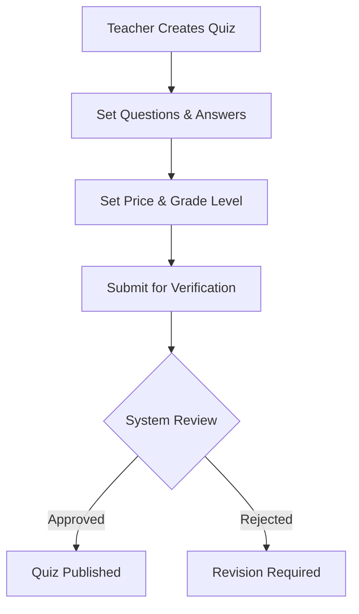

### Home Tutoring
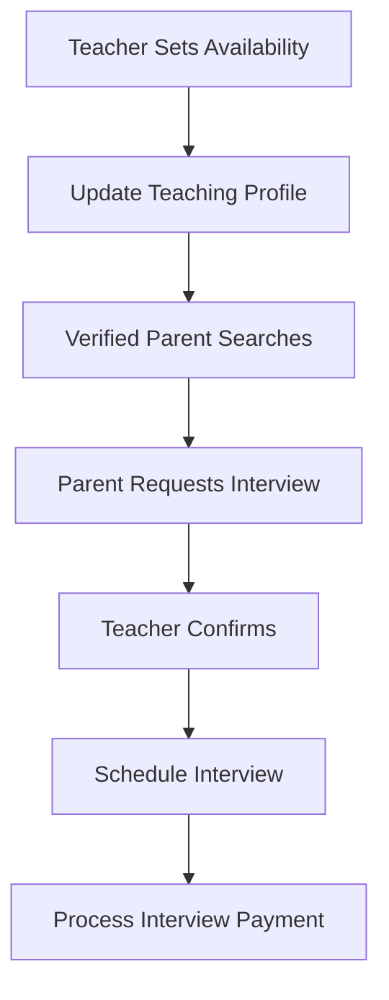

## Communication Workflows

### School Head Communications
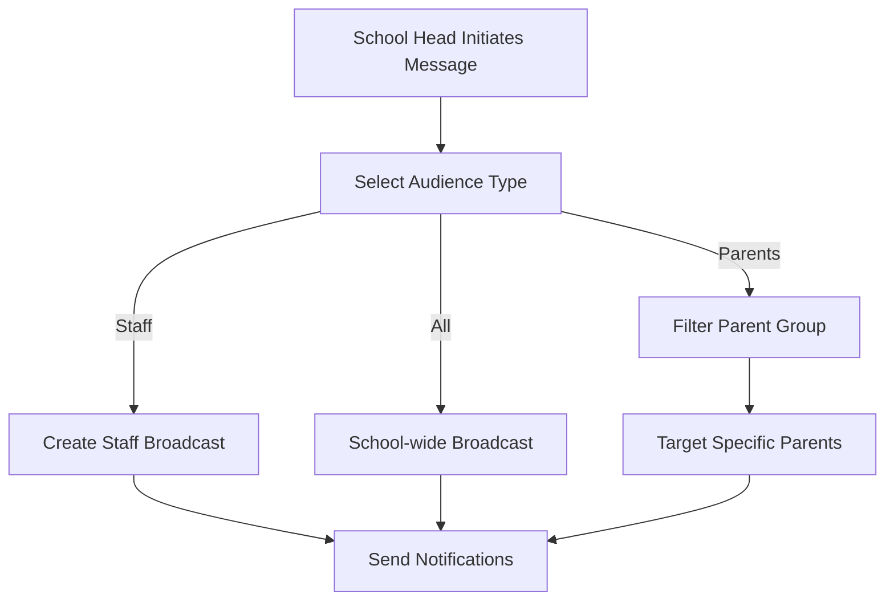

### Fee Payment Reminders
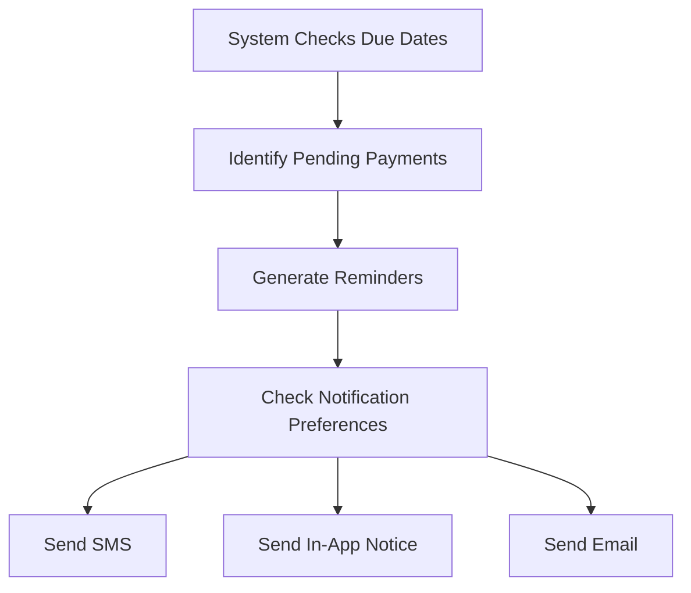

## Administrative Workflows

### School Setup
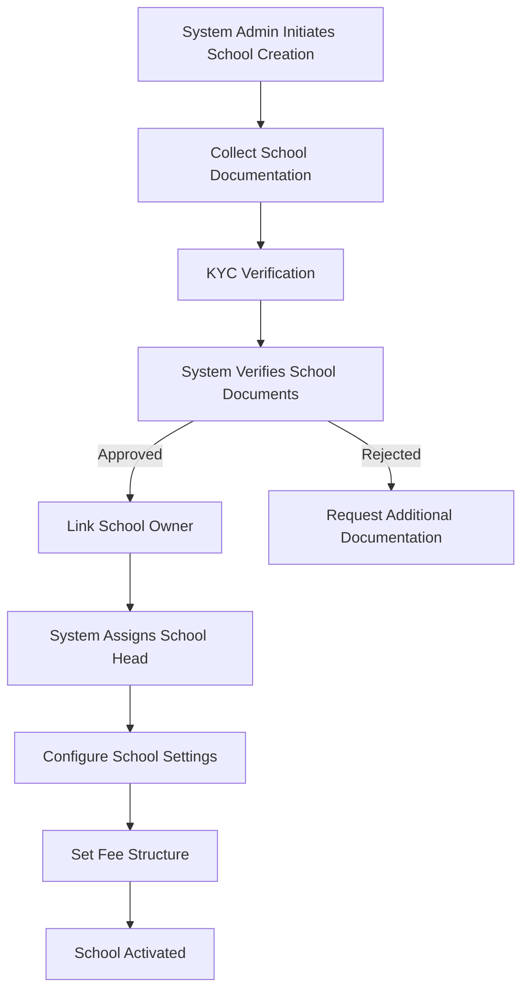

### Staff Management
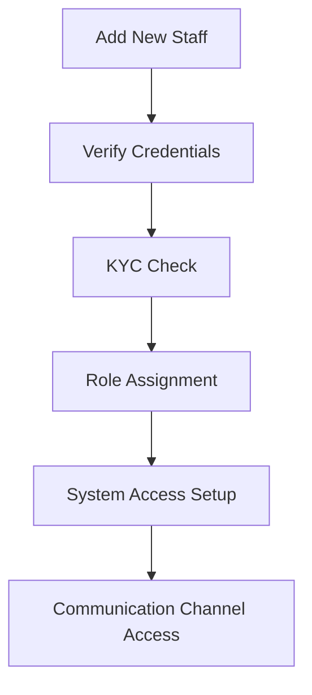

## Parent Control Workflows

### Quiz Authorization
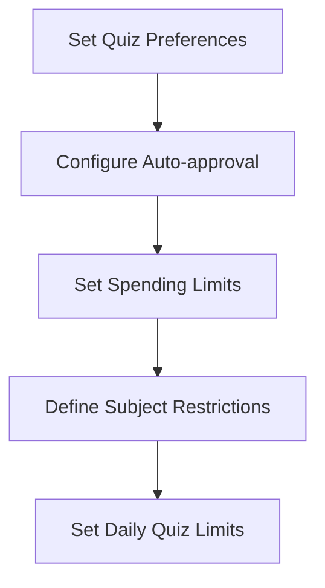

### Payment Preferences
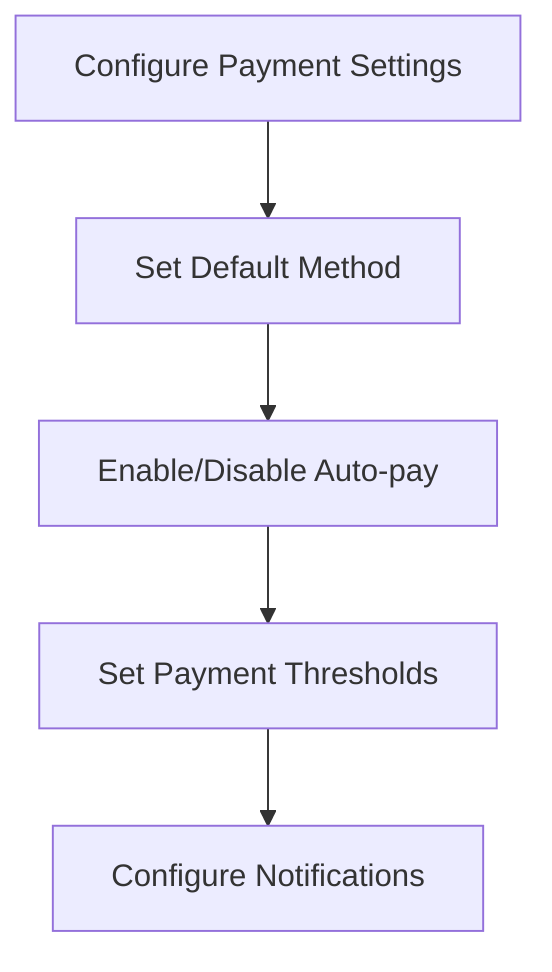

## System Integration Workflows

### Mobile Money Integration
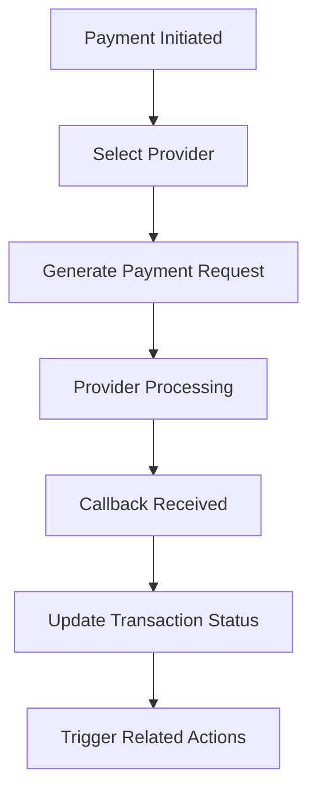

### Document Verification
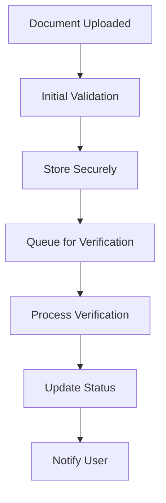

## Revenue Sharing Workflows

### Quiz Revenue Distribution
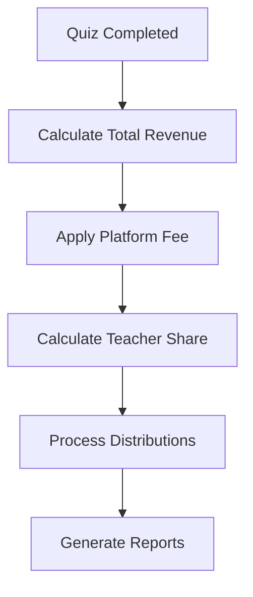

### Tutor Payment Processing
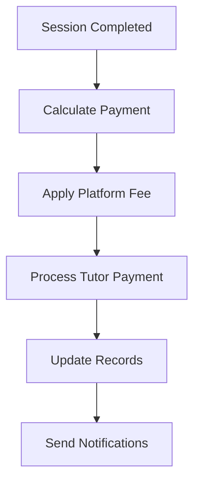