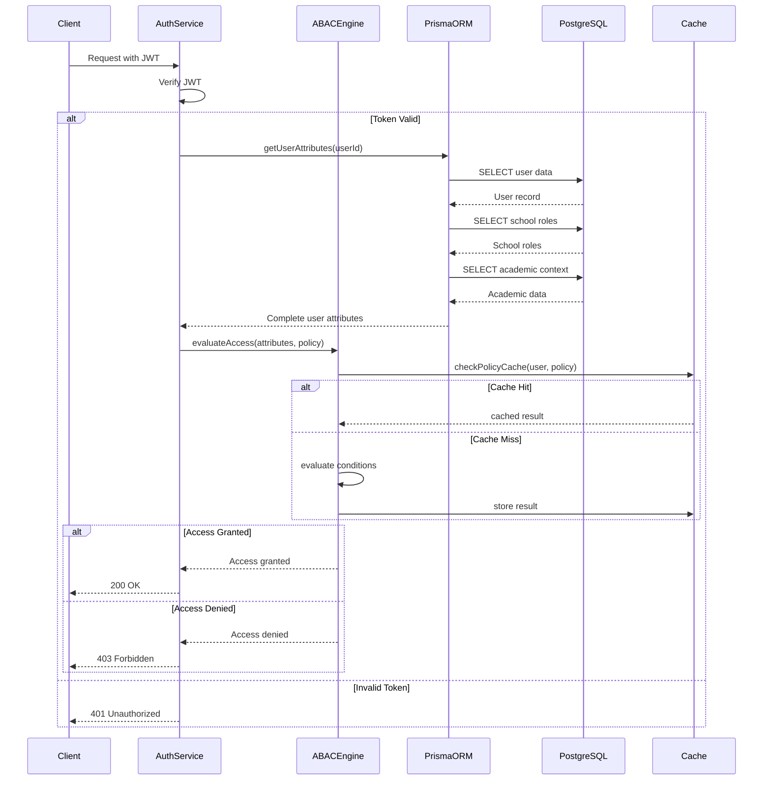
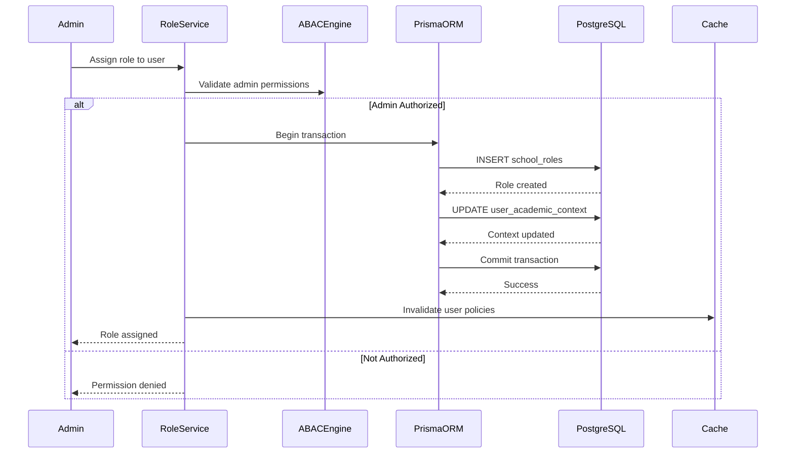
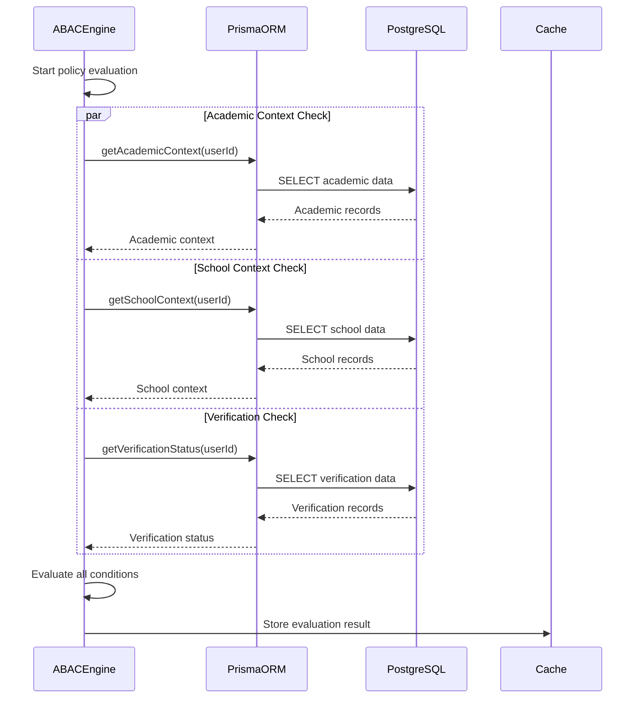

# Authentication and ABAC Database Interaction Flow

## System Components Overview

The system consists of several interconnected components:
1. **Auth Layer**: Handles authentication and basic role verification
2. **ABAC Layer**: Manages attribute-based access control decisions
3. **Prisma ORM**: Handles database interactions and type safety
4. **PostgreSQL**: Stores user data, roles, and permissions

## Database Schema Interaction

### Key Tables
1. **User**
   - Base user information
   - Global roles
   - Status and verification flags

2. **SchoolRole**
   - School-specific role assignments
   - Academic context
   - Role validity period

3. **UserKYC**
   - KYC verification status
   - Document references
   - Verification history

4. **UserEmployment**
   - Employment verification
   - School assignments
   - Position details

## Sequence Diagrams

### Authentication and Authorization Flow



### Role Assignment and Update Flow



### Policy Evaluation with Database Lookups



## Database Schema Requirements

### User Table Extensions
```sql
ALTER TABLE users ADD COLUMN academic_context JSONB;
ALTER TABLE users ADD COLUMN verification_status JSONB;
ALTER TABLE users ADD COLUMN access_restrictions JSONB;
```

### School Roles Table
```sql
CREATE TABLE school_roles (
    id UUID PRIMARY KEY,
    user_id UUID REFERENCES users(id),
    school_id UUID REFERENCES schools(id),
    base_role TEXT NOT NULL,
    academic_roles TEXT[],
    contextual_permissions JSONB,
    assigned_at TIMESTAMP NOT NULL,
    assigned_by UUID REFERENCES users(id),
    valid_until TIMESTAMP,
    UNIQUE(user_id, school_id, base_role)
);
```

### Academic Context Table
```sql
CREATE TABLE academic_contexts (
    id UUID PRIMARY KEY,
    user_id UUID REFERENCES users(id),
    school_id UUID REFERENCES schools(id),
    subjects TEXT[],
    grades TEXT[],
    departments TEXT[],
    programs TEXT[],
    created_at TIMESTAMP NOT NULL,
    updated_at TIMESTAMP NOT NULL,
    UNIQUE(user_id, school_id)
);
```

## Performance Considerations

1. **Caching Strategy**
   - Policy evaluation results are cached
   - User attributes are cached with short TTL
   - Role hierarchies are cached in-memory

2. **Database Optimization**
   - Indexes on frequently queried columns
   - JSONB for flexible attribute storage
   - Materialized views for complex role hierarchies

3. **Query Optimization**
   - Batch related queries
   - Use joins instead of multiple queries
   - Implement database-level row security

## Security Measures

1. **Data Access**
   - Row-level security in PostgreSQL
   - Encrypted sensitive data
   - Audit logging for role changes

2. **Cache Security**
   - Encrypted cache entries
   - Short TTL for sensitive data
   - Namespace isolation

3. **Transaction Safety**
   - Atomic role updates
   - Consistent permission states
   - Rollback on partial failures 