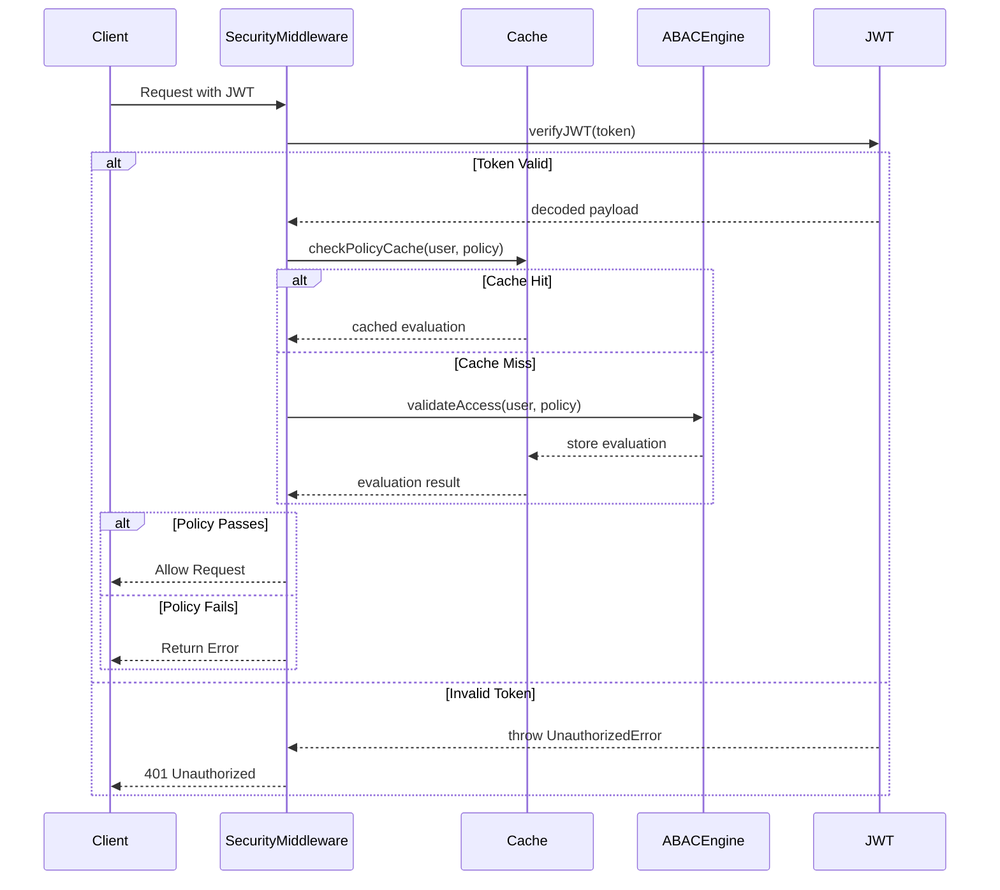

# Authentication and ABAC System Architecture

## System Overview

The system implements a comprehensive authentication and authorization infrastructure using Attribute-Based Access Control (ABAC). It provides fine-grained access control based on user attributes, roles, environmental conditions, and custom policies, with built-in caching for policy evaluations.

## Package Dependencies

### Internal Dependencies
- `@eduflow/types`: Shared type definitions for auth and ABAC
- `@eduflow/common`: Error handling and utilities
- `@eduflow/constants`: Security constants and enums
- `@eduflow/prisma`: Database models and role definitions

### External Dependencies
- `fp-ts`: Functional programming utilities for error handling
- `fastify`: HTTP middleware integration and request/response handling
- `jsonwebtoken`: JWT token validation and handling

## Core Components

### 1. ABAC Engine (`abac.ts`)
- Policy evaluation using functional programming patterns
- Validation functions for roles, verification, school context, and environment
- Error creation with specific error codes and metadata
- Policy composition utilities

### 2. Security Middleware (`middleware.ts`)
- FastifyRequest augmentation with user attributes
- Policy evaluation caching mechanism
- Basic auth validation with JWT support
- Policy factories for common use cases (admin, school staff)

### 3. Error Handling
Specific error types with codes:
- `INSUFFICIENT_ROLES`: Role validation failures
- `VERIFICATION_REQUIRED`: KYC/verification issues
- `INVALID_SCHOOL_CONTEXT`: School context validation errors
- `ENVIRONMENT_RESTRICTION`: Environmental condition failures
- `NO_TOKEN`: Missing authentication token

### 4. Policy Cache System
```typescript
const policyCache = new Map<string, PolicyEvaluation>();

interface PolicyEvaluation {
  success: boolean;
  error?: SecurityError;
  timestamp?: Date;
}
```

## Sequence Diagrams

### Authentication and Policy Evaluation Flow


## Policy Validation Pipeline

1. **Basic Authentication**
   ```typescript
   const validateBasicAuth = async (
     request: FastifyRequest,
     config?: SecurityLayer['authentication']['basicAuth']
   ): Promise<PolicyEvaluation>
   ```

2. **Role Validation**
   ```typescript
   const validateRoles = (
     user: UserAttributes,
     conditions: PolicyConditions
   ): E.Either<AppError, true>
   ```

3. **Verification Status**
   ```typescript
   const validateVerification = (
     user: UserAttributes,
     conditions: PolicyConditions
   ): E.Either<AppError, true>
   ```

4. **School Context**
   ```typescript
   const validateSchoolContext = (
     user: UserAttributes,
     conditions: PolicyConditions
   ): E.Either<AppError, true>
   ```

5. **Environmental Conditions**
   ```typescript
   const validateEnvironment = (
     user: UserAttributes,
     conditions: PolicyConditions
   ): E.Either<AppError, true>
   ```

## Policy Factory Functions

1. **Resource Policy Creation**
   ```typescript
   export const createResourcePolicy = (
     resource: string,
     action: ResourceAction,
     basicAuth: SecurityLayer['authentication']['basicAuth'],
     conditions?: PolicyConditions
   ): SecurityLayer
   ```

2. **Admin Policy Creation**
   ```typescript
   export const createAdminOnlyPolicy = (
     resource: string
   ): SecurityLayer
   ```

3. **School Staff Policy Creation**
   ```typescript
   export const createSchoolStaffPolicy = (
     resource: string,
     action: ResourceAction
   ): SecurityLayer
   ```

## Error Handling System

### Error Categories
1. **Authentication Errors**
   - Token missing or invalid
   - JWT verification failures
   
2. **Authorization Errors**
   - Insufficient roles
   - Failed verification requirements
   - Invalid school context
   
3. **Environmental Errors**
   - Time restrictions
   - IP restrictions
   - Custom condition failures

### Error Format
```typescript
interface SecurityError {
  code: string;
  message: string;
  metadata: Record<string, any>;
  status: number;
}
```

## Integration Examples

### 1. Protected Route with School Staff Policy
```typescript
app.get('/school/settings',
  createSecurityMiddleware(
    createSchoolStaffPolicy('school-settings', 'READ')
  ),
  async (req, reply) => {
    // Route handler
  }
);
```

### 2. Admin-Only Resource
```typescript
app.post('/system/config',
  createSecurityMiddleware(
    createAdminOnlyPolicy('system-config')
  ),
  async (req, reply) => {
    // Route handler
  }
);
```

### 3. Custom Policy with Verification
```typescript
app.put('/kyc/documents',
  createSecurityMiddleware({
    authentication: {
      basicAuth: {
        roles: ['KYC_OFFICER'],
      }
    },
    policies: {
      resource: 'kyc-documents',
      action: 'UPDATE',
      conditions: {
        verification: {
          requireKYC: true,
          kycStatus: [KYCStatus.VERIFIED],
        },
        environment: {
          timeRestrictions: {
            allowedDays: ['1', '2', '3', '4', '5'],
            allowedHours: ['09', '17']
          }
        }
      }
    }
  }),
  async (req, reply) => {
    // Route handler
  }
);
```

## Best Practices

1. **Policy Caching**
   - Use caching for frequently accessed policies
   - Implement cache invalidation strategies
   - Monitor cache hit rates

2. **Error Handling**
   - Always return specific error codes
   - Include helpful metadata
   - Maintain security through obscurity

3. **Performance**
   - Parallel validation when possible
   - Early termination on failures
   - Efficient policy evaluation

4. **Security**
   - JWT best practices
   - Role hierarchy enforcement
   - Principle of least privilege

## Policy Categories

1. **School Management**
   - School settings management
   - Staff management
   - Resource allocation

2. **KYC Management**
   - Document verification
   - Identity verification
   - Employment eligibility

3. **Academic Management**
   - Grade management
   - Course management
   - Student records

4. **System Administration**
   - User management
   - System configuration
   - Security settings

## Key Features

1. **Role-Based Access**: Basic role-based permissions
2. **Attribute-Based Control**: Fine-grained access based on attributes
3. **Environmental Conditions**: Time, IP, and context-based restrictions
4. **Custom Policies**: Domain-specific policy creation
5. **Policy Composition**: Combinable policy conditions
6. **Hierarchical Roles**: Role inheritance and hierarchy
7. **Verification Integration**: KYC and employment status checks
8. **Context Awareness**: School and user context validation

## Architecture Decisions

1. ABAC Implementation:
   - Functional programming approach
   - Composable policies
   - Type-safe validation
   - Error-first design

2. Policy Structure:
   - Declarative policy definition
   - Reusable conditions
   - Factory functions
   - Context injection

3. Validation Flow:
   - Parallel validation
   - Early termination
   - Specific error types
   - Context preservation

4. Security Features:
   - Strict headers
   - XSS protection
   - CSRF prevention
   - Content security

## Integration Points

1. Error System:
   - Specific error types
   - Error categorization
   - Context preservation
   - Recovery patterns

2. HTTP Layer:
   - Middleware integration
   - Header management
   - Request context
   - Response handling

3. School System:
   - Context validation
   - Role management
   - Resource access
   - IP restrictions

4. KYC System:
   - Status verification
   - Document access
   - Employment eligibility
   - Time restrictions

## Policy Examples

1. School Settings Update:
```typescript
{
  resource: 'school-settings',
  action: 'UPDATE',
  conditions: {
    anyOf: {
      roles: ['SCHOOL_OWNER', 'SCHOOL_HEAD']
    },
    verification: {
      requireKYC: true,
      kycStatus: [KYCStatus.VERIFIED],
      employmentStatus: [EmploymentEligibilityStatus.ELIGIBLE]
    },
    school: {
      mustBeCurrentSchool: true
    },
    environment: {
      ipRestrictions: {
        allowlist: ['${school.allowedIPs}']
      }
    }
  }
}
```

2. KYC Document Verification:
```typescript
{
  resource: 'kyc-document',
  action: 'UPDATE',
  conditions: {
    anyOf: {
      roles: ['SYSTEM_ADMIN']
    },
    verification: {
      officerPermissions: ['approvalAuthority']
    },
    environment: {
      timeRestrictions: {
        allowedDays: ['1', '2', '3', '4', '5'],
        allowedHours: ['09', '17'],
        timezone: 'UTC'
      }
    }
  }
} 