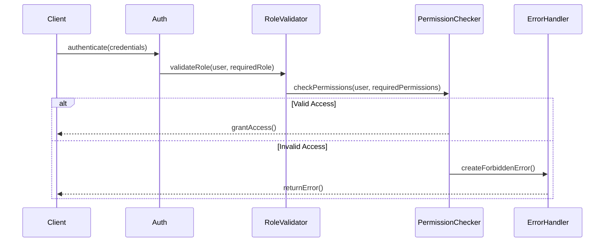
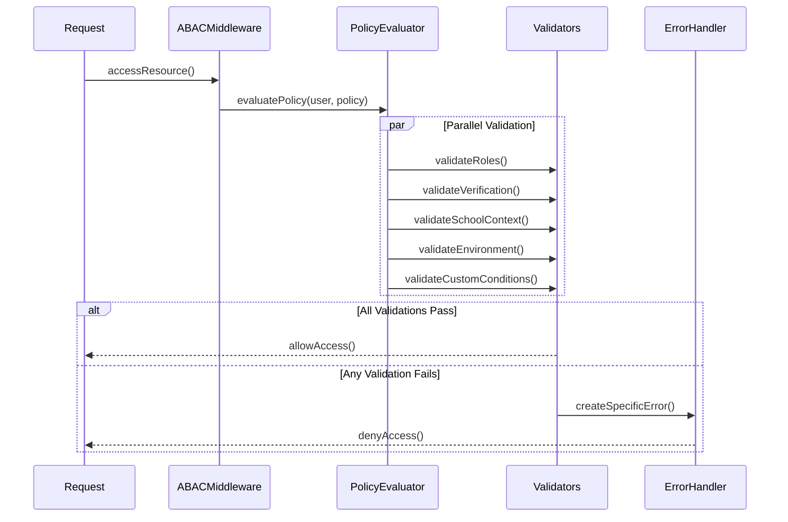

# Authentication and ABAC System Architecture

## System Overview

The system implements a comprehensive authentication and authorization infrastructure using Attribute-Based Access Control (ABAC). It provides fine-grained access control based on user attributes, roles, environmental conditions, and custom policies.

## Package Dependencies

### Internal Dependencies
- `@eduflow/types`: Shared type definitions for auth and ABAC
- `@eduflow/common`: Error handling and utilities
- `@eduflow/constants`: Security constants and enums

### External Dependencies
- `fp-ts`: Functional programming utilities for error handling
- `fastify`: HTTP middleware integration

## Sequence Diagrams

### Authentication Flow


### ABAC Policy Evaluation Flow


## Files Involved

### Core Security Files (`libs/common/src/security/`)
1. `abac.ts`
   - ABAC policy evaluation
   - Validation functions
   - Error handling
   - Middleware creation

2. `auth.ts`
   - Basic authentication utilities
   - Role validation
   - Permission checking
   - Security headers

3. `policies.ts`
   - Policy definitions
   - Policy factories
   - Custom conditions
   - Domain-specific policies

4. `index.ts`
   - Main entry point
   - Type re-exports
   - Utility exports

### Type Definitions (`libs/types/src/`)
5. `auth/roles.ts`
   - Role definitions
   - Permission types
   - Role hierarchies

6. `auth/ABAC.ts`
   - ABAC type definitions
   - Policy types
   - Condition types
   - Validation types

## Policy Categories

1. **School Management**
   - School settings management
   - Staff management
   - Resource allocation

2. **KYC Management**
   - Document verification
   - Identity verification
   - Employment eligibility

3. **Academic Management**
   - Grade management
   - Course management
   - Student records

4. **System Administration**
   - User management
   - System configuration
   - Security settings

## Key Features

1. **Role-Based Access**: Basic role-based permissions
2. **Attribute-Based Control**: Fine-grained access based on attributes
3. **Environmental Conditions**: Time, IP, and context-based restrictions
4. **Custom Policies**: Domain-specific policy creation
5. **Policy Composition**: Combinable policy conditions
6. **Hierarchical Roles**: Role inheritance and hierarchy
7. **Verification Integration**: KYC and employment status checks
8. **Context Awareness**: School and user context validation

## Architecture Decisions

1. ABAC Implementation:
   - Functional programming approach
   - Composable policies
   - Type-safe validation
   - Error-first design

2. Policy Structure:
   - Declarative policy definition
   - Reusable conditions
   - Factory functions
   - Context injection

3. Validation Flow:
   - Parallel validation
   - Early termination
   - Specific error types
   - Context preservation

4. Security Features:
   - Strict headers
   - XSS protection
   - CSRF prevention
   - Content security

## Integration Points

1. Error System:
   - Specific error types
   - Error categorization
   - Context preservation
   - Recovery patterns

2. HTTP Layer:
   - Middleware integration
   - Header management
   - Request context
   - Response handling

3. School System:
   - Context validation
   - Role management
   - Resource access
   - IP restrictions

4. KYC System:
   - Status verification
   - Document access
   - Employment eligibility
   - Time restrictions

## Policy Examples

1. School Settings Update:
```typescript
{
  resource: 'school-settings',
  action: 'UPDATE',
  conditions: {
    anyOf: {
      roles: ['SCHOOL_OWNER', 'SCHOOL_HEAD']
    },
    verification: {
      requireKYC: true,
      kycStatus: [KYCStatus.VERIFIED],
      employmentStatus: [EmploymentEligibilityStatus.ELIGIBLE]
    },
    school: {
      mustBeCurrentSchool: true
    },
    environment: {
      ipRestrictions: {
        allowlist: ['${school.allowedIPs}']
      }
    }
  }
}
```

2. KYC Document Verification:
```typescript
{
  resource: 'kyc-document',
  action: 'UPDATE',
  conditions: {
    anyOf: {
      roles: ['SYSTEM_ADMIN']
    },
    verification: {
      officerPermissions: ['approvalAuthority']
    },
    environment: {
      timeRestrictions: {
        allowedDays: ['1', '2', '3', '4', '5'],
        allowedHours: ['09', '17'],
        timezone: 'UTC'
      }
    }
  }
} 