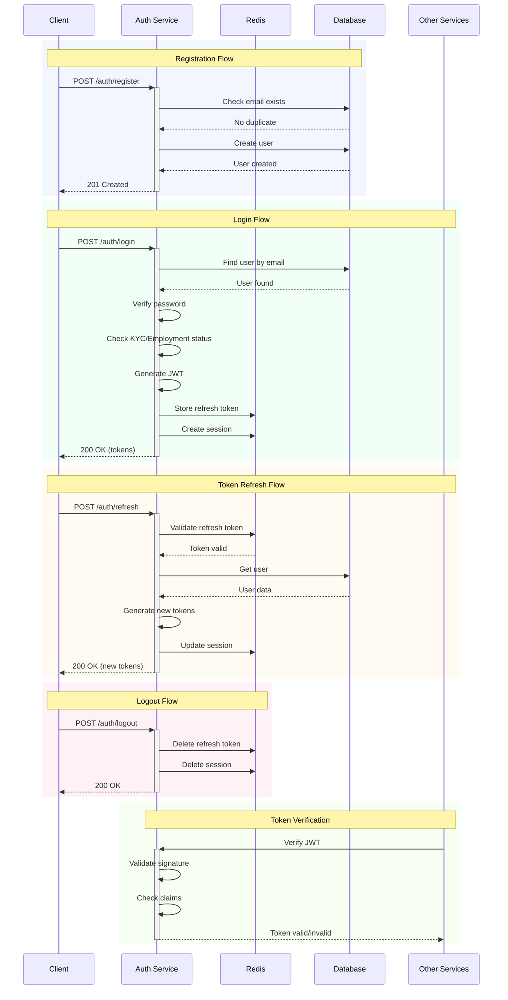

# Auth Service Flows

This document outlines the key authentication flows in the auth service.

## Authentication Flow Sequence

## Key Features

1. **Rate Limiting**
   - Login: 5 attempts per 15 minutes
   - Registration: 3 attempts per hour
   - Token refresh: 10 attempts per 15 minutes

2. **Security Measures**
   - Secure password hashing with Argon2
   - JWT with role-based permissions
   - Refresh token rotation
   - HTTP-only cookies
   - Session tracking

3. **Role-Based Access**
   - Staff role verification
   - KYC status checks
   - Employment eligibility validation

4. **Session Management**
   - IP tracking
   - User agent tracking
   - Activity timestamps
   - Concurrent session control

## Integration Points

1. **Redis Integration**
   - Refresh token storage
   - Session management
   - Rate limiting

2. **Database Integration**
   - User management
   - Credential storage
   - Role and permission storage

3. **Cross-Service Communication**
   - JWT verification
   - User identity propagation
   - Role and permission distribution 