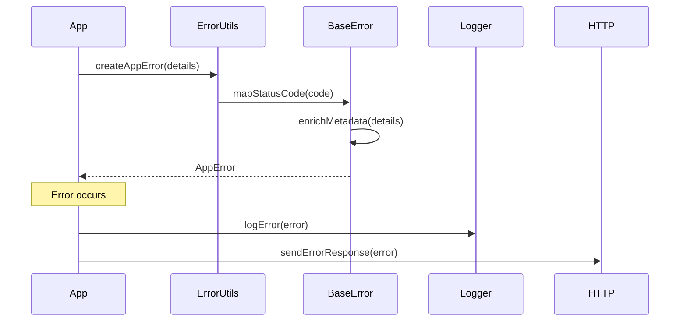
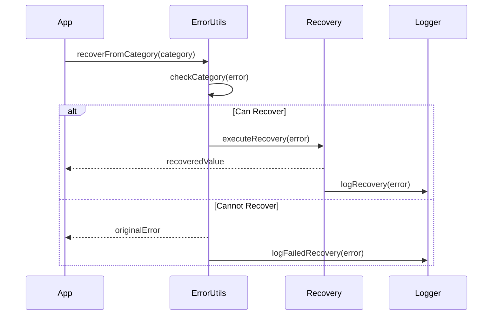

# Error Handling System Architecture

## System Overview

The error handling system provides a comprehensive error management infrastructure using TypeScript and functional programming patterns. It includes specialized error types, error categorization, error enrichment, and integration with both the logging system and HTTP responses.

## Package Dependencies

### Internal Dependencies
- `@eduflow/types`: Shared type definitions for errors and metadata
- `@eduflow/logger`: Integration with logging system
- `@eduflow/constants`: HTTP status codes and error constants

### External Dependencies
- `fp-ts`: Functional programming utilities
- `fastify`: HTTP request/response types
- `jest`: For testing utilities

## Sequence Diagrams

### Error Creation and Handling Flow

### Error Recovery Flow

## Files Involved

### Core Error Files (`libs/common/src/errors/`)
1. `base.error.ts`
   - Base error type implementation
   - HTTP status code mapping
   - Error creation utilities
   - Error response formatting

2. `utils.ts`
   - Error utility functions
   - Error categorization
   - Error enrichment
   - Error combination
   - Request context integration
   - Error recovery patterns

3. `testing.ts`
   - Error testing utilities
   - Error matchers
   - Mock error creation
   - Async error testing

4. `auth.error.ts`
   - Authentication error types
   - Authorization error types
   - Permission error handling

5. `file.error.ts`
   - File operation errors
   - File access errors
   - File quota errors

6. `index.ts`
   - Main entry point
   - Error factory functions
   - Type re-exports

### Type Definitions (`libs/types/src/`)
7. `errors/index.ts`
   - Error type definitions
   - Error metadata types
   - Error category types
   - Error code types

## Error Categories

1. **Authentication (AUTH)**
   - AUTH_ERROR
   - UNAUTHORIZED
   - FORBIDDEN

2. **Resource (RESOURCE)**
   - NOT_FOUND
   - CONFLICT

3. **Validation (VALIDATION)**
   - VALIDATION_ERROR
   - BAD_REQUEST

4. **File Operations (FILE)**
   - FILE_SIZE_ERROR
   - FILE_TYPE_ERROR
   - FILE_QUOTA_ERROR
   - FILE_ACCESS_ERROR
   - FILE_NOT_FOUND

5. **System (SYSTEM)**
   - INTERNAL_SERVER_ERROR
   - SERVICE_UNAVAILABLE

## Key Features

1. **Type Safety**: Full TypeScript support with error type inference
2. **Error Categorization**: Structured error categories and codes
3. **Context Enrichment**: Automatic error context addition
4. **HTTP Integration**: Automatic status code mapping
5. **Recovery Patterns**: Error recovery utilities
6. **Testing Support**: Comprehensive error testing utilities
7. **Logging Integration**: Automatic error logging
8. **Request Context**: Error correlation with HTTP requests
9. **Metadata Support**: Typed error metadata

## Architecture Decisions

1. Base Error Structure:
   - Consistent error format
   - Type-safe error codes
   - Metadata support
   - Cause tracking
   - Status code mapping

2. Functional Programming:
   - TaskEither for async operations
   - Option for nullable handling
   - Pure error transformation
   - Composable error handling

3. Error Categories:
   - Domain-based categorization
   - Recovery patterns by category
   - Consistent error codes
   - HTTP status mapping

4. Testing Support:
   - Jest matchers
   - Async error testing
   - Error metadata validation
   - Mock error creation

## Integration Points

1. Logging System:
   - Error context logging
   - Recovery logging
   - Stack trace preservation
   - Error categorization

2. HTTP Layer:
   - Status code mapping
   - Error response formatting
   - Request context correlation
   - Header propagation

3. Validation System:
   - Field validation errors
   - Constraint validation
   - Combined validation errors
   - Type-safe validation metadata

4. Recovery System:
   - Category-based recovery
   - Fallback patterns
   - Recovery logging
   - Type-safe recovery 