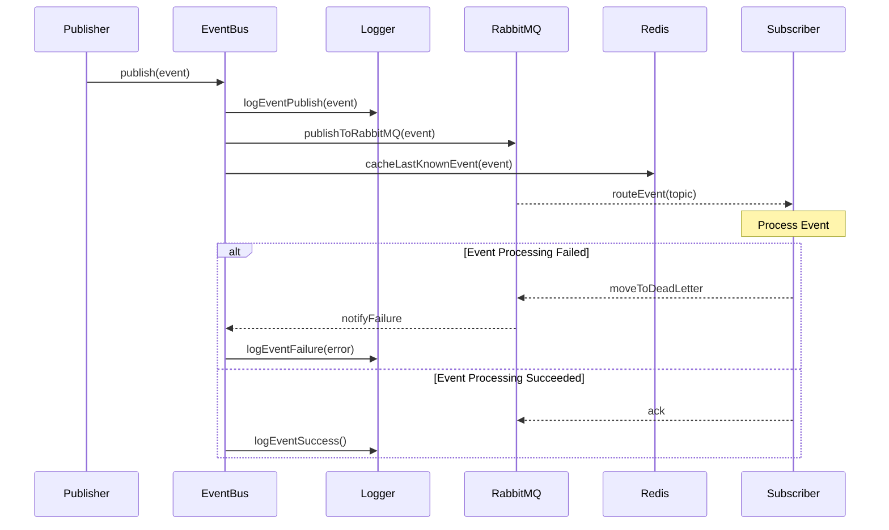

# Event System Architecture

## System Overview

The event system is built on top of RabbitMQ for message queuing and Redis for event caching. It provides a robust, distributed event bus implementation with support for topic-based routing, dead letter queues, and event persistence. The system is tightly integrated with other packages in the monorepo, utilizing shared types, logging infrastructure, and database models.

## Package Dependencies

### Internal Dependencies
- `@eduflow/logger`: Logging infrastructure and monitoring
- `@eduflow/types`: Shared type definitions for events, handlers, and configurations
- `@eduflow/constants`: Shared constants and enums
- `@eduflow/prisma`: Database models and types

### External Dependencies
- `fp-ts`: Functional programming utilities
- `amqplib`: RabbitMQ client
- `ioredis`: Redis client
- `zod`: Schema validation

## Sequence Diagram

## Files Involved

### Core Event System Files (`libs/events/src/`)
1. `index.ts`
   - Main entry point
   - Exports all event system components
   - Re-exports event types from `@eduflow/types`

2. `event-bus.ts`
   - Core event bus implementation
   - Handles RabbitMQ and Redis connections
   - Implements publish/subscribe patterns
   - Uses logger for operation monitoring

3. `factory.ts`
   - Factory functions for creating event bus instances
   - Configuration initialization
   - Logger initialization

4. `internal-types.ts`
   - Internal type definitions
   - Event bus state types
   - Extends base types from `@eduflow/types`

5. `validation.ts`
   - Event validation logic
   - Schema validation for events
   - Uses Prisma types for role and status validation

6. `metrics.ts`
   - Event system metrics
   - Performance monitoring
   - Integration with logger for metric reporting

7. `health.ts`
   - Health check implementations
   - Connection status monitoring
   - Integration with logger for health status

### Type Definitions (`libs/types/src/`)
8. `events/index.ts`
   - Event interface definitions
   - Event type enums
   - Event bus configuration types

9. `events/handlers.ts`
   - Event handler type definitions
   - Subscriber interfaces
   - Publisher interfaces

### Shared Types (`libs/types/src/`)
10. `auth/roles.ts`
    - Role definitions used in event validation
    - Permission types

11. `database/index.ts`
    - Prisma client types
    - Database model types used in events

### Configuration Files
12. `libs/events/package.json`
    - Package dependencies
    - Build configuration
    - Workspace package references

## Service Integration

The event system is utilized by multiple services in the platform:

1. Academic Service
   - Grade and assignment events
   - Performance tracking events

2. User Service
   - Profile update events
   - User relation events

3. Social Service
   - Post and comment events
   - Connection events

4. Notification Service
   - Notification dispatch events
   - Template update events

5. KYC Service
   - Document verification events
   - Identity verification events

## Key Features

1. **Topic-based Routing**: Events are routed using RabbitMQ's topic exchange
2. **Dead Letter Queues**: Failed events are automatically moved to dead letter queues
3. **Event Caching**: Latest events are cached in Redis for quick access
4. **Type Safety**: Full TypeScript support with shared type definitions
5. **Health Monitoring**: Built-in health checks and metrics with logger integration
6. **Validation**: Event payload validation using Zod and shared types
7. **Error Handling**: Comprehensive error handling with retries and logging
8. **Metrics Collection**: Performance and operation metrics with logger integration

## Architecture Decisions

1. RabbitMQ is used as the primary message broker for:
   - Reliable message delivery
   - Topic-based routing
   - Dead letter queue support
   - Event persistence

2. Redis is used for:
   - Caching last known events
   - Quick access to event history
   - Temporary state storage
   - Performance optimization

3. The system uses functional programming patterns (fp-ts) for:
   - Error handling
   - Asynchronous operations
   - Type safety
   - Predictable state management

4. Logging Integration:
   - Comprehensive operation logging
   - Error tracking
   - Performance monitoring
   - Health status reporting 