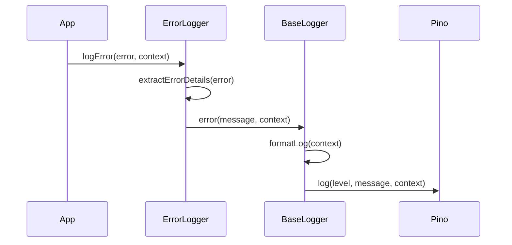
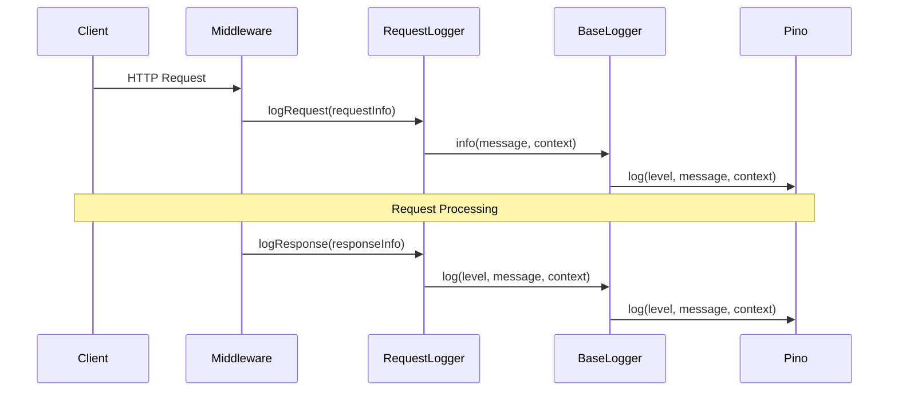

# Logging System Architecture

## System Overview

The logging system provides a comprehensive logging infrastructure built on top of Pino logger. It includes specialized loggers for errors, requests, and general application logging. The system is designed to be extensible and integrates deeply with error handling and request processing.

## Package Dependencies

### Internal Dependencies
- `@eduflow/types`: Shared type definitions for logging, errors, and contexts
- `@eduflow/constants`: Shared constants and log levels

### External Dependencies
- `pino`: High-performance Node.js logger
- `fp-ts`: Functional programming utilities
- `fastify`: For request/response types

## Sequence Diagrams

### Error Logging Flow

### Request Logging Flow

## Files Involved

### Core Logger Files (`libs/logger/src/`)
1. `base.ts`
   - Core logger implementation
   - Pino configuration and setup
   - Log formatting and context handling
   - Child logger creation

2. `error.ts`
   - Error logging specialization
   - Error context extraction
   - Error formatting
   - Integration with AppError type

3. `request.ts`
   - HTTP request/response logging
   - Request context extraction
   - Response timing
   - Status code based log levels
   - Fastify middleware integration

4. `index.ts`
   - Main entry point
   - Logger factory functions
   - Type re-exports

5. `adapter.ts`
   - Logger interface adapters
   - Custom log level handling
   - Context transformation

6. `types.ts`
   - Internal type definitions
   - Logger type extensions

### Type Definitions (`libs/types/src/`)
7. `logger/index.ts`
   - Logger interface definitions
   - Log level types
   - Context types

8. `errors/index.ts`
   - Error type definitions
   - Error context types
   - Error codes

## Key Features

1. **Structured Logging**: JSON-based log format for machine readability
2. **Context Enrichment**: Automatic context addition to all logs
3. **Error Integration**: Specialized error logging with stack traces and codes
4. **Request Tracking**: HTTP request/response logging with timing
5. **Security**: Automatic redaction of sensitive data
6. **Performance**: High-performance logging through Pino
7. **Type Safety**: Full TypeScript support
8. **Correlation**: Request correlation through IDs
9. **Environment Awareness**: Environment-specific logging configuration

## Architecture Decisions

1. Base Logger (Pino):
   - High performance JSON logging
   - Configurable log levels
   - Built-in serializers
   - Automatic timestamps

2. Error Logging:
   - Structured error format
   - Stack trace preservation
   - Error code mapping
   - Context enrichment
   - Error categorization

3. Request Logging:
   - Request/Response correlation
   - Performance timing
   - Status code based levels
   - User agent tracking
   - IP logging
   - Session tracking

4. Security Features:
   - Automatic PII redaction
   - Password masking
   - Token hiding
   - Key redaction

## Integration Points

1. Error Handling System:
   - Direct integration with AppError type
   - Error context preservation
   - Stack trace handling
   - Error categorization
   - Status code mapping

2. HTTP Layer:
   - Fastify middleware integration
   - Request context extraction
   - Response timing
   - Status code handling
   - Session tracking

3. Application Services:
   - Component-specific loggers
   - Context inheritance
   - Level-based filtering
   - Service identification 