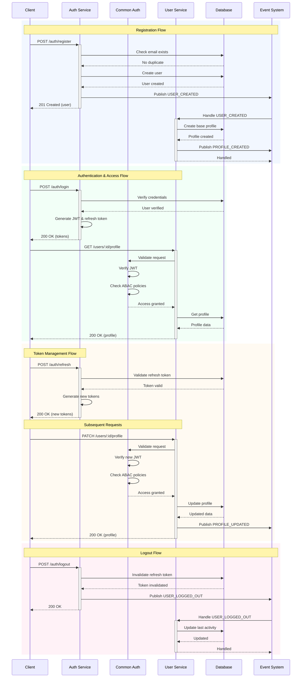

# Service Interaction Flows

This document illustrates how the Auth Service, Common Auth middleware, and User Service work together in various flows.

## Service Interaction Sequence

## Component Responsibilities

1. **Auth Service**
   - User registration and authentication
   - Token issuance and management
   - Session management
   - Credential verification
   - Event publishing for auth events

2. **Common Auth (Middleware)**
   - Token validation
   - ABAC policy enforcement
   - Permission checking
   - Role validation
   - Security context management

3. **User Service**
   - Profile management
   - User data storage
   - Event handling for user lifecycle
   - Profile metadata management
   - Data validation and sanitization

## Integration Points

1. **Event-Based Integration**
   - Auth Service → User Service (user lifecycle events)
   - User Service → Auth Service (profile status updates)
   - Both services → Event System (audit and tracking)

2. **Security Integration**
   - Auth Service issues tokens
   - Common Auth validates tokens
   - User Service protected by Common Auth
   - All services share security context

3. **Data Flow**
   - Auth Service manages credentials
   - User Service manages profile data
   - Common Auth ensures secure access
   - Event System ensures consistency

## Security Considerations

1. **Token Security**
   - Short-lived access tokens
   - Secure refresh token rotation
   - Token validation at every request
   - Secure token storage

2. **Access Control**
   - Multi-layer security (Auth + ABAC)
   - Fine-grained permissions
   - Context-aware access control
   - Role-based restrictions

3. **Data Protection**
   - Secure credential storage
   - Profile data encryption
   - Audit logging
   - Session monitoring 