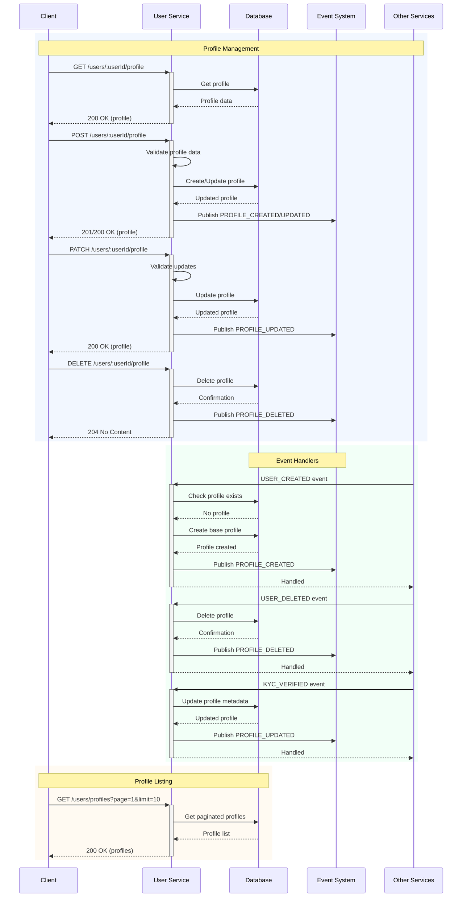

# User Service Flows

This document outlines the key user management flows in the user service.

## User Service Flow Sequence

## Key Features

1. **Profile Management**
   - Create/Update profiles
   - Partial profile updates
   - Profile deletion
   - Profile retrieval
   - Paginated profile listing

2. **Event-Driven Updates**
   - User creation handling
   - User deletion handling
   - KYC verification handling
   - Profile event publishing

3. **Data Validation**
   - Profile schema validation
   - Partial update validation
   - Occupation validation

4. **Integration Features**
   - Event system integration
   - Database transactions
   - Error handling
   - Pagination support

## Integration Points

1. **Database Integration**
   - Profile CRUD operations
   - Transaction management
   - Pagination queries

2. **Event System Integration**
   - Event publishing
   - Event handling
   - Event-driven updates

3. **Service Integration**
   - Auth service integration
   - KYC service integration
   - School service integration

## Error Handling

1. **HTTP Errors**
   - 400: Validation errors
   - 404: Profile not found
   - 500: Internal server errors

2. **Business Logic Errors**
   - Duplicate profiles
   - Invalid updates
   - Missing dependencies

3. **Event Handling Errors**
   - Event validation
   - Event processing
   - Event publishing 