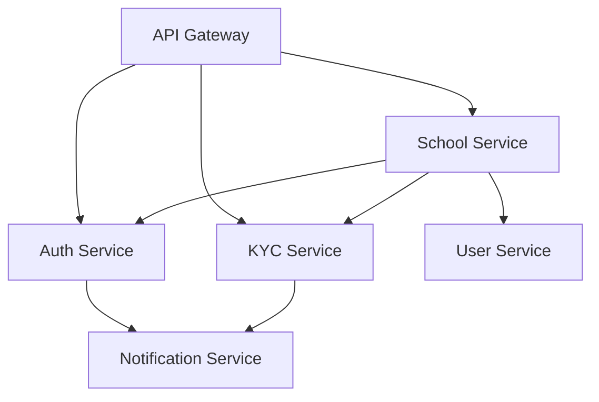

# School Registration Flow Overview

## Introduction

This document provides a high-level overview of the school registration process in EduFlow. For detailed information, please refer to the specific documentation files in this directory.

## Flow Types

1. [New User School Registration](./new-user-flow.md)

   - For school owners without an EduFlow account
   - Complete user and school registration
   - Includes KYC verification

2. [Existing User School Registration](./existing-user-flow.md)
   - For users with an existing EduFlow account
   - Uses OTP verification
   - Links school to existing user

## Key Components

- [Class Setup Process](./class-setup.md)
- [Error Handling & Recovery](./error-handling.md)
- [Validation Rules](./validation-rules.md)
- [Event Flows](./event-flows.md)

## Service Dependencies

## Common Files

- [Retry Mechanisms](./retry-mechanisms.md)
- [Fallback Strategies](./fallback-strategies.md)
- [Progress Tracking](./progress-tracking.md)

## Quick Links

- [API Documentation](./api-docs.md)
- [Testing Guide](./testing-guide.md)
- [Troubleshooting](./troubleshooting.md)
