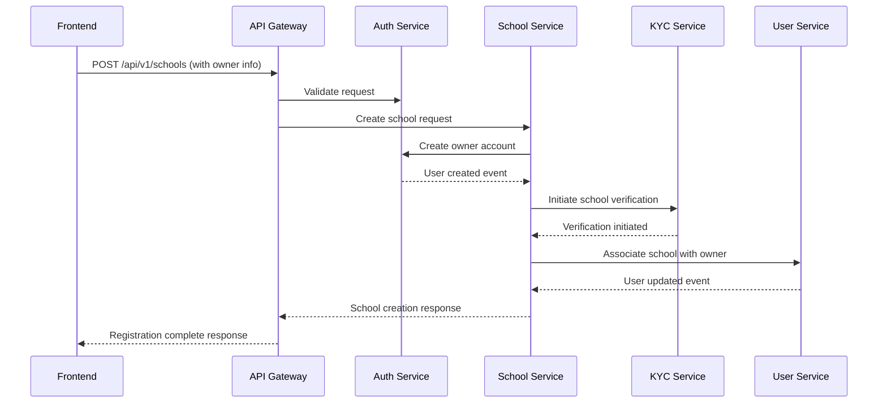
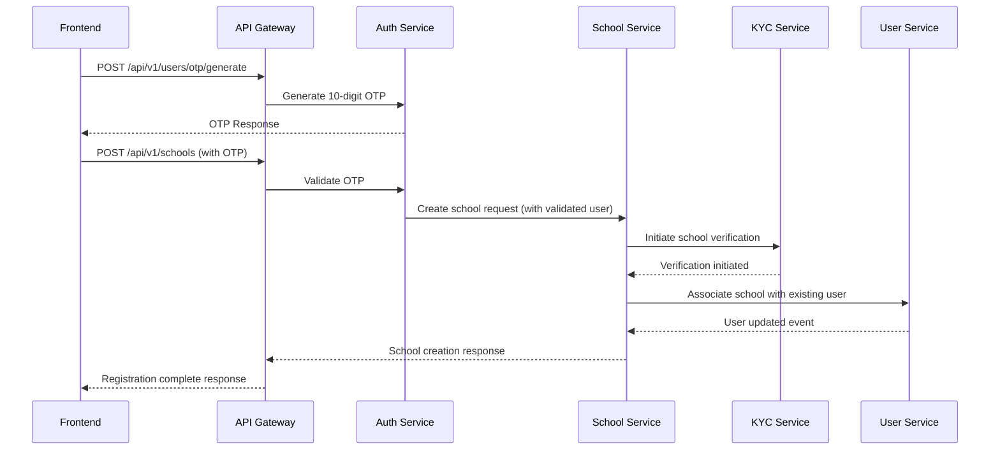

# School Registration Flow

## Overview

This document outlines the two possible flows for school registration in the EduFlow system:

1. Registration for new users (without EduFlow account)
2. Registration for existing users (with EduFlow account)

## Flow 1: New User School Registration



### Data Flow

1. Frontend sends school registration data with owner information
2. API Gateway validates the request format and authorization
3. School Service receives the creation request
4. Auth Service creates the owner account
5. KYC Service initiates school verification process
6. User Service associates the school with the owner
7. Response returns to frontend with registration status

## Flow 2: Existing User School Registration



### Data Flow

1. User requests OTP generation
2. Auth Service generates 10-digit one-time use code
3. Frontend sends school registration data with OTP
4. API Gateway validates the OTP and request format
5. School Service creates the school with validated user
6. KYC Service initiates school verification
7. User Service associates school with existing user
8. Response returns to frontend with registration status

## Data Structures

### New User School Registration Request

```typescript
interface NewSchoolRegistrationRequest {
  name: string;
  email: string;
  phoneNumber: string;
  address: {
    street: string;
    city: string;
    region: string;
    country: string;
    postalCode: string;
  };
  schoolOwner: {
    firstName: string;
    middleName?: string;
    lastName: string;
    email: string;
    phoneNumber: string;
    gender: string;
    dateOfBirth: string;
  };
  availableClasses: string[];
  payrollSettings: {
    paymentDayOfMonth: number;
  };
  motto?: string;
  logo?: string;
}
```

### Existing User School Registration Request

```typescript
interface ExistingUserSchoolRegistrationRequest {
  name: string;
  email: string;
  phoneNumber: string;
  address: {
    street: string;
    city: string;
    region: string;
    country: string;
    postalCode: string;
  };
  otpCode: string; // 10-digit OTP code
  availableClasses: string[];
  payrollSettings: {
    paymentDayOfMonth: number;
  };
  motto?: string;
  logo?: string;
}
```

## Service Responsibilities

### Auth Service

- Generate 10-digit OTP for existing users
- Validate OTP during school registration
- Create new user accounts for non-existing owners
- Manage OTP expiration (24 hours)

### School Service

- Create school records
- Associate schools with owners
- Trigger school verification process
- Manage school settings and configuration

### KYC Service

- Verify school documentation
- Validate school license information
- Perform compliance checks
- Track verification status

### User Service

- Manage user-school relationships
- Update user roles and permissions
- Track school ownership history
- Manage professional profiles

## Security Considerations

1. OTP must be exactly 10 digits
2. OTP expires after 24 hours or one use
3. Rate limiting on OTP generation
4. Validation of school ownership
5. KYC verification requirements
6. Role-based access control
7. Audit logging of all operations
