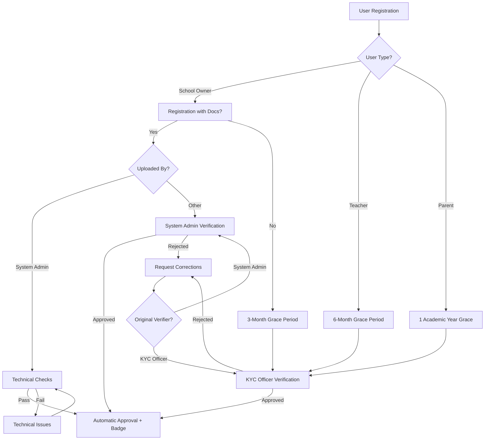

# KYC Verification Flow

## Overview

This document details the Know Your Customer (KYC) verification process for school owners, teachers, and parents in the EduFlow system. School owners have a 3-month grace period, teachers have a 6-month grace period, and parents have one academic year grace period for document submission. Documents uploaded by System Admins are considered pre-verified and only undergo technical validation.

## Verification Roles

### 1. KYC Officer

```typescript
interface KYCOfficer {
  role: 'KYC_OFFICER';
  permissions: {
    verify: {
      teacherDocuments: boolean;
      parentDocuments: boolean;
      pendingSchoolOwnerDocuments: boolean; // For documents submitted after registration
    };
    actions: {
      approve: boolean;
      reject: boolean;
      requestCorrections: boolean;
      extendGracePeriod: boolean;
    };
    access: {
      verificationQueue: boolean;
      verificationHistory: boolean;
      documentStorage: boolean;
    };
  };
  metrics: {
    verificationsCompleted: number;
    averageResponseTime: Duration;
    accuracyRate: number;
    pendingVerifications: number;
  };
}
```

### 2. System Admin Verification Scope

```typescript
interface SystemAdminVerification {
  scope: {
    schoolRegistration: {
      ownerDocuments: boolean; // Only during registration
      schoolDocuments: boolean;
      businessDocuments: boolean;
    };
    timing: 'DURING_REGISTRATION_ONLY';
    fallback: {
      afterRegistration: 'KYC_OFFICER';
      incompleteDocuments: 'KYC_OFFICER';
    };
  };

  documentHandling: {
    uploadedByAdmin: {
      status: 'PRE_VERIFIED'; // Documents are considered verified
      requiredChecks: [
        'VIRUS_SCAN', // Security check
        'FILE_INTEGRITY', // Technical validation
        'FORMAT_VALIDATION', // File format check
      ];
      skipChecks: [
        'DOCUMENT_AUTHENTICITY', // Already verified by admin
        'CONTENT_VERIFICATION', // Already verified by admin
        'MANUAL_REVIEW', // Already verified by admin
      ];
    };
    uploadedByOthers: {
      status: 'PENDING_VERIFICATION';
      requiredChecks: [
        'VIRUS_SCAN',
        'FILE_INTEGRITY',
        'FORMAT_VALIDATION',
        'DOCUMENT_AUTHENTICITY',
        'CONTENT_VERIFICATION',
        'MANUAL_REVIEW',
      ];
    };
  };
}

interface DocumentValidation {
  technicalChecks: {
    virusScan: {
      required: true;
      automated: true;
      blockingOnFail: true;
    };
    fileIntegrity: {
      required: true;
      automated: true;
      blockingOnFail: true;
    };
    formatValidation: {
      required: true;
      automated: true;
      blockingOnFail: true;
    };
  };

  verificationChecks: {
    documentAuthenticity: {
      required: boolean; // False if uploaded by admin
      automated: false;
      blockingOnFail: true;
    };
    contentVerification: {
      required: boolean; // False if uploaded by admin
      automated: false;
      blockingOnFail: true;
    };
    manualReview: {
      required: boolean; // False if uploaded by admin
      automated: false;
      blockingOnFail: true;
    };
  };

  adminUploadProcess: {
    preUploadChecks: [
      'DOCUMENT_AUTHENTICITY',
      'CONTENT_VERIFICATION',
      'EXPIRY_DATES',
      'INFORMATION_ACCURACY',
    ];
    systemActions: {
      automaticallyApprove: true;
      skipManualVerification: true;
      assignVerificationBadge: true;
      updateUserStatus: 'VERIFIED';
    };
    auditTrail: {
      recordAdminVerification: true;
      timestamp: Date;
      adminId: string;
      verificationNotes?: string;
    };
  };
}
```

## Access Restrictions

### 1. Performance Metrics Access

```typescript
interface PerformanceMetricsAccess {
  systemAdmin: {
    access: 'FULL';
    metrics: [
      'SYSTEM_HEALTH',
      'USER_ANALYTICS',
      'FINANCIAL_METRICS',
      'VERIFICATION_STATS',
      'SCHOOL_PERFORMANCE',
      'TEACHER_PERFORMANCE',
    ];
  };

  schoolOwner: {
    access: 'RESTRICTED';
    metrics: ['OWNED_SCHOOL_STATS', 'FINANCIAL_OVERVIEW'];
  };

  teacher: {
    access: 'LIMITED';
    metrics: ['ASSIGNED_CLASS_PERFORMANCE', 'PERSONAL_RATINGS'];
  };
}
```

### 2. Teacher Verification Requirements

```typescript
interface TeacherKYCDocuments {
  requiredDocuments: {
    identification: {
      type: 'NATIONAL_ID' | 'GHANA_CARD' | 'DRIVERS_LICENSE';
      number: string;
      expiryDate: Date;
      document: Document;
      verificationStatus: VerificationStatus;
    };
    teachingCertificate?: {
      number: string;
      issueDate: Date;
      document: Document;
      verificationStatus: VerificationStatus;
    };
  };

  gracePeriod: {
    duration: '6_MONTHS';
    warningSchedule: [
      '5_MONTHS_REMAINING',
      '3_MONTHS_REMAINING',
      '1_MONTH_REMAINING',
      '2_WEEKS_REMAINING',
      'DAILY_LAST_WEEK',
    ];
  };

  restrictions: {
    afterGracePeriod: {
      theHub: {
        viewPosts: true;
        createPosts: false;
        interact: false;
      };
      quizzes: {
        create: false;
        monetization: false;
        existingQuizzes: 'FROZEN';
      };
      tutoring: {
        visibility: false;
        newRequests: false;
      };
      schoolDuties: {
        teaching: true;
        attendance: true;
        grading: true;
        parentMeetings: true;
      };
    };
  };
}
```

### 3. Verification Badges

```typescript
interface VerificationBadge {
  types: {
    VERIFIED_TEACHER: {
      icon: 'CHECKMARK_SHIELD';
      color: 'BLUE';
      tooltip: 'Verified Teaching Professional';
    };
    VERIFIED_PARENT: {
      icon: 'CHECKMARK_CIRCLE';
      color: 'GREEN';
      tooltip: 'Verified Parent/Guardian';
    };
    VERIFIED_SCHOOL_OWNER: {
      icon: 'CHECKMARK_STAR';
      color: 'GOLD';
      tooltip: 'Verified School Owner';
    };
  };

  display: {
    profile: {
      position: 'NEXT_TO_NAME';
      size: 'MEDIUM';
    };
    posts: {
      position: 'NEXT_TO_AUTHOR';
      size: 'SMALL';
    };
    comments: {
      position: 'NEXT_TO_AUTHOR';
      size: 'EXTRA_SMALL';
    };
  };

  verification: {
    issuedBy: 'SYSTEM_ADMIN' | 'KYC_OFFICER';
    timestamp: Date;
    validUntil?: Date;
    documentBasis: string[];
  };
}
```

### 4. Parent Restrictions

```typescript
interface ParentRestrictions {
  unverified: {
    tutoring: {
      searchTeachers: false;
      sendRequests: false;
      viewProfiles: 'LIMITED';
    };
    theHub: {
      createPosts: false;
      interact: false;
      viewPosts: true;
    };
  };

  verified: {
    tutoring: {
      searchTeachers: true;
      sendRequests: true;
      viewProfiles: 'FULL';
    };
    theHub: {
      createPosts: true;
      interact: true;
      viewPosts: true;
    };
    badge: VerificationBadge;
  };
}
```

## KYC Process Flow



## Document Requirements

### 1. School Owner KYC

```typescript
interface OwnerKYCDocuments {
  personalIdentification: {
    type: 'NATIONAL_ID' | 'PASSPORT' | 'DRIVERS_LICENSE';
    number: string;
    expiryDate: Date;
    document: Document;
    verificationStatus: VerificationStatus;
  };

  proofOfAddress: {
    type: 'UTILITY_BILL' | 'BANK_STATEMENT' | 'LEASE_AGREEMENT';
    issueDate: Date;
    document: Document;
    verificationStatus: VerificationStatus;
  };

  businessDocuments: {
    registrationCertificate: {
      number: string;
      issueDate: Date;
      document: Document;
      verificationStatus: VerificationStatus;
    };
    taxCertificate?: {
      number: string;
      document: Document;
      verificationStatus: VerificationStatus;
    };
    operatingLicense?: {
      number: string;
      validUntil: Date;
      document: Document;
      verificationStatus: VerificationStatus;
    };
  };
}
```

## Verification Process

### 1. Initial Registration

```typescript
interface RegistrationVerification {
  timing: {
    submittedWithRegistration: boolean;
    gracePeriodEndDate?: Date;
    userType: 'SCHOOL_OWNER' | 'TEACHER' | 'PARENT';
    gracePeriod: {
      SCHOOL_OWNER: '3_MONTHS';
      TEACHER: '6_MONTHS';
      PARENT: 'IMMEDIATE';
    };
  };

  verifier: {
    type: 'SYSTEM_ADMIN' | 'KYC_OFFICER';
    id: string;
    timestamp: Date;
  };

  status: {
    current: VerificationStatus;
    history: {
      status: VerificationStatus;
      timestamp: Date;
      verifier: string;
      comments?: string;
    }[];
  };
}
```

### 2. Grace Period Management

```typescript
interface GracePeriodControl {
  duration: {
    byUserType: {
      SCHOOL_OWNER: '3_MONTHS';
      TEACHER: '6_MONTHS';
      PARENT: '1_ACADEMIC_YEAR';
    };
    extended?: Duration;
    reason?: string;
  };

  notifications: {
    initial: {
      sent: boolean;
      timestamp: Date;
    };
    reminders: {
      schedule: {
        SCHOOL_OWNER: ['2_MONTHS_REMAINING', '1_MONTH_REMAINING', '2_WEEKS_REMAINING'];
        TEACHER: ['5_MONTHS_REMAINING', '3_MONTHS_REMAINING', '1_MONTH_REMAINING'];
        PARENT: [
          '9_MONTHS_REMAINING',
          '6_MONTHS_REMAINING',
          '3_MONTHS_REMAINING',
          '1_MONTH_REMAINING',
        ];
      };
      sent: {
        type: string;
        timestamp: Date;
      }[];
    };
  };
}
```

## Notifications

### 1. Verification Notifications

```typescript
interface KYCNotifications {
  user: {
    submission: {
      received: boolean;
      missingDocuments?: string[];
      nextSteps?: string[];
    };
    verification: {
      status: VerificationStatus;
      feedback?: string;
      requiredActions?: string[];
    };
    gracePeriod: {
      remaining: Duration;
      warningLevel: 'INFO' | 'WARNING' | 'CRITICAL';
      restrictions?: string[];
    };
    badge: {
      awarded: boolean;
      type: string;
      displayLocations: string[];
    };
  };

  systemAdmin: {
    verificationQueue: {
      pending: number;
      byUserType: {
        SCHOOL_OWNER: number;
        TEACHER: number;
        PARENT: number;
      };
      urgent: number;
    };
  };
}
```

## See Also

- [User Role Access](../userRoleAccess.md)
- [School Registration Flow](../registration/school-registration-flow.md)
- [Teacher Employment Flow](../employment/staff-employment-flow.md)

### Verification Assignment Rules

```typescript
interface VerificationAssignment {
  rules: {
    systemAdmin: {
      triggers: ['NEW_SCHOOL_REGISTRATION_WITH_COMPLETE_DOCS'];
      scope: ['OWNER_DOCUMENTS', 'SCHOOL_DOCUMENTS', 'BUSINESS_DOCUMENTS'];
      timeframe: 'DURING_REGISTRATION';
      documentStatus: 'PRE_VERIFIED'; // Documents uploaded by admin are pre-verified
    };

    kycOfficer: {
      triggers: [
        'NEW_TEACHER_REGISTRATION',
        'NEW_PARENT_REGISTRATION',
        'INCOMPLETE_SCHOOL_REGISTRATION',
        'POST_REGISTRATION_DOCUMENT_SUBMISSION',
      ];
      scope: ['ALL_TEACHER_DOCUMENTS', 'ALL_PARENT_DOCUMENTS', 'PENDING_OWNER_DOCUMENTS'];
      timeframe: 'ANY_TIME';
      documentStatus: 'REQUIRES_VERIFICATION';
    };
  };

  workflow: {
    documentSubmission: {
      initialCheck: 'AUTOMATED';
      assignTo: 'KYC_OFFICER' | 'SYSTEM_ADMIN';
      priority: 'HIGH' | 'MEDIUM' | 'LOW';
      byUploader: {
        SYSTEM_ADMIN: {
          status: 'PRE_VERIFIED';
          skipVerification: true;
          onlyTechnicalChecks: true;
        };
        OTHER: {
          status: 'PENDING_VERIFICATION';
          skipVerification: false;
          requiresFullVerification: true;
        };
      };
    };

    verificationQueue: {
      sortBy: ['GRACE_PERIOD_REMAINING', 'USER_TYPE', 'SUBMISSION_DATE'];
      priorityRules: {
        HIGH: ['SCHOOL_REGISTRATION_IN_PROGRESS'];
        MEDIUM: ['APPROACHING_GRACE_PERIOD_END'];
        LOW: ['STANDARD_VERIFICATION'];
      };
      excludeFromQueue: {
        condition: 'UPLOADED_BY_SYSTEM_ADMIN';
        reason: 'PRE_VERIFIED';
      };
    };
  };
}
```
