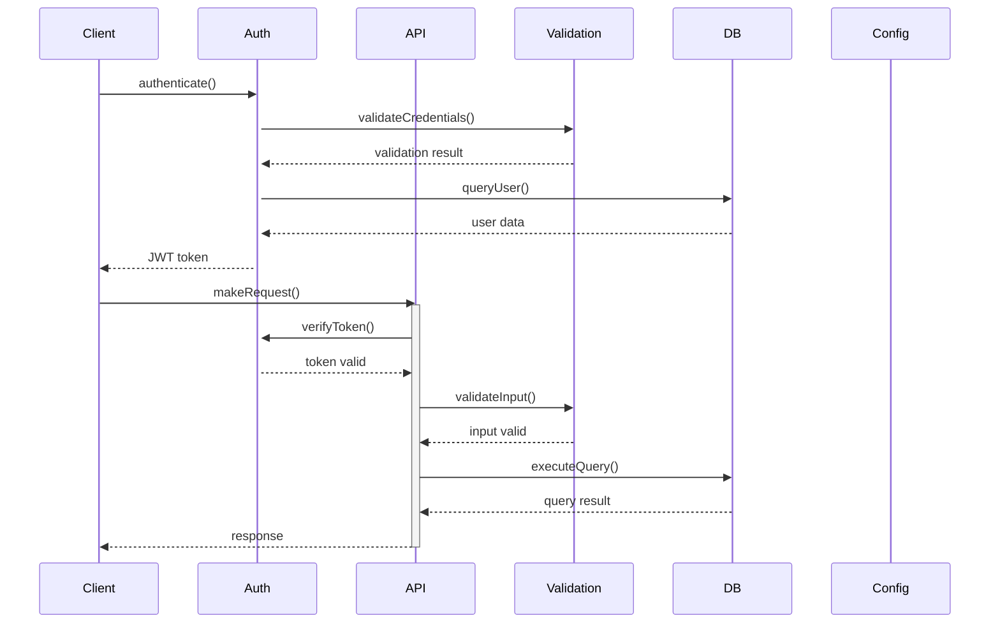

# Libs System Analysis

## Systems Overview

The `libs` folder contains several core systems:

1. **Authentication System**
   - Handles user authentication and authorization
   - Manages JWT tokens and sessions

2. **Database System**
   - Manages database connections and queries
   - Handles data persistence and retrieval

3. **Configuration System**
   - Manages environment variables and app configuration
   - Handles different environment setups

4. **Validation System**
   - Validates input data and forms
   - Provides schema validation utilities

5. **API Client System**
   - Manages external API communications
   - Handles HTTP requests and responses

## Sequence Diagram

## System Interactions

1. **Client → Authentication**
   - Initial login/signup
   - Token validation
   - Session management

2. **Authentication → Database**
   - User data retrieval
   - Session storage
   - Credentials verification

3. **API → Validation**
   - Request payload validation
   - Response data validation
   - Schema checking

4. **API → Database**
   - Data CRUD operations
   - Query execution
   - Transaction management

5. **All Systems → Configuration**
   - Environment variables access
   - Feature flags
   - System settings
