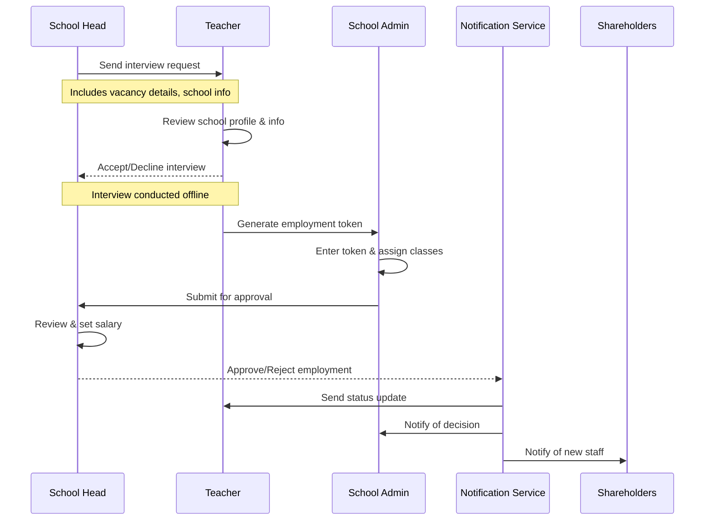

# Staff Employment Flow

## Overview
This document details the end-to-end process of employing staff members in schools, from initial interview requests through final approval and onboarding.

## Employment Process Flow



## Process Stages

### 1. Interview Request
```typescript
interface InterviewRequest {
  schoolHead: {
    actions: {
      searchTeachers: boolean      // Search available teachers
      viewProfiles: boolean        // View teacher profiles
      sendInterviewRequest: boolean // Send interview invitations
    }
    
    requestData: {
      vacancy: {
        subjects: string[]
        classes: string[]
        requirements: string[]
      }
      schoolInfo: {
        staffCount: number
        facilities: string[]
        publicProfile: SchoolProfile
      }
    }
  }
  
  teacher: {
    actions: {
      viewRequest: boolean
      viewSchoolProfile: boolean
      acceptDecline: boolean
    }
    responseWindow: '48 hours'
  }
}
```

### 2. Employment Token
```typescript
interface EmploymentToken {
  // Token Configuration
  config: {
    length: 10                  // Fixed 10-digit token
    validity: '2 hours'         // 2-hour validity period
    useLimit: 1                 // One-time use only
    type: 'EMPLOYMENT_TOKEN'
  }
  
  // Token Data
  data: {
    teacherId: string          // ID of teacher generating token
    schoolId: string          // School ID from interview request
    interviewId: string       // Reference to completed interview
    generatedAt: Date
    expiresAt: Date
    status: TokenStatus
  }
}
```

### 3. School Admin Processing
```typescript
interface AdminProcessing {
  tokenValidation: {
    validateToken: boolean
    validateTeacher: boolean
    validateSchool: boolean
  }
  
  assignment: {
    classes: string[]
    subjects: string[]
    schedule: {
      startDate: Date
      periods: number[]
    }
  }
}
```

### 4. School Head Approval
```typescript
interface HeadApproval {
  review: {
    assignedClasses: string[]
    assignedSubjects: string[]
    schedule: Schedule
  }
  
  salary: {
    amount: number
    currency: string
    paymentSchedule: string
  }
  
  decision: {
    status: 'APPROVED' | 'REJECTED'
    comments?: string
    effectiveDate: Date
  }
}
```

### 5. Notifications
```typescript
interface EmploymentNotifications {
  teacher: {
    stages: {
      AWAITING_ADMIN: 'Waiting for class/subject assignment'
      AWAITING_HEAD: 'Waiting for final approval'
      APPROVED: {
        details: {
          classes: string[]
          subjects: string[]
          salary: SalaryInfo
          startDate: Date
        }
      }
      REJECTED: {
        reason?: string
      }
    }
  }
  
  schoolAdmin: {
    tokenStatus: 'VALID' | 'INVALID' | 'EXPIRED'
    processStatus: 'PENDING' | 'COMPLETED'
  }
  
  schoolHead: {
    pendingApprovals: boolean
    employmentDetails: EmploymentDetails
  }
  
  shareholders: {
    newStaffNotification: {
      role: string
      department: string
      startDate: Date
      salary: SalaryInfo
    }
  }
}
```

## Status Types
```typescript
enum EmploymentStatus {
  INTERVIEW_REQUESTED = 'INTERVIEW_REQUESTED',
  INTERVIEW_ACCEPTED = 'INTERVIEW_ACCEPTED',
  INTERVIEW_DECLINED = 'INTERVIEW_DECLINED',
  TOKEN_GENERATED = 'TOKEN_GENERATED',
  ADMIN_PROCESSING = 'ADMIN_PROCESSING',
  AWAITING_HEAD_APPROVAL = 'AWAITING_HEAD_APPROVAL',
  APPROVED = 'APPROVED',
  REJECTED = 'REJECTED'
}
```

## Security Measures

### 1. Token Security
```typescript
interface TokenSecurity {
  generation: {
    requiresInterviewCompletion: boolean
    requiresSchoolInvitation: boolean
    entropy: number
  }
  
  validation: {
    checksumEnabled: boolean
    matchesInvitedSchool: boolean
    matchesInterviewedTeacher: boolean
  }
}
```

### 2. Audit Trail
```typescript
interface EmploymentAudit {
  tracking: {
    interviewRequest: {
      requestedBy: string
      timestamp: Date
      vacancy: VacancyDetails
    }
    
    tokenGeneration: {
      teacherId: string
      timestamp: Date
      schoolId: string
    }
    
    adminProcessing: {
      adminId: string
      timestamp: Date
      assignments: AssignmentDetails
    }
    
    headApproval: {
      approvedBy: string
      timestamp: Date
      decision: ApprovalDecision
    }
  }
  
  logging: {
    level: 'INFO' | 'WARN' | 'ERROR'
    retention: '90 days'
    alerts: boolean
  }
}
```

## See Also
- [User Role Access](../userRoleAccess.md)
- [School Registration Flow](../registration/overview.md)
- [Error Handling](../registration/error-handling.md) 