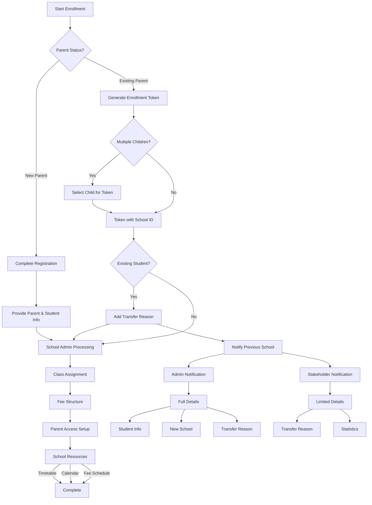

# Student Enrollment Flow

## Overview
This document details the process of enrolling students in schools through the EduFlow system. Every student must be associated with a parent/guardian account, and enrollment is managed through a token-based system.

## Enrollment Scenarios



## Token System

### 1. Enrollment Token
```typescript
interface EnrollmentToken {
  // Token Configuration
  config: {
    length: 10                  // Fixed 10-digit token
    validity: '2 hours'         // 2-hour validity period
    useLimit: 1                 // One-time use only
    type: 'ENROLLMENT_TOKEN'
  }
  
  // Token Data
  data: {
    parentId: string           // ID of parent generating token
    schoolId: string          // Target school ID
    childId?: string         // Required for existing children
    transferReason?: {       // Required for school changes
      category: TransferReasonCategory
      description: string
      confidential: boolean  // If true, only shown to school admins
    }
    generatedAt: Date
    expiresAt: Date
    status: TokenStatus
  }
}

enum TokenStatus {
  ACTIVE = 'ACTIVE',
  USED = 'USED',
  EXPIRED = 'EXPIRED',
  REVOKED = 'REVOKED'
}

enum TransferReasonCategory {
  RELOCATION = 'RELOCATION',
  ACADEMIC_PREFERENCE = 'ACADEMIC_PREFERENCE',
  FINANCIAL = 'FINANCIAL',
  PERSONAL = 'PERSONAL',
  DISCIPLINARY = 'DISCIPLINARY',
  OTHER = 'OTHER'
}
```

## Parent-Child Relationship

### 1. Parent/Guardian Account
```typescript
interface ParentAccount {
  profile: {
    id: string
    fullName: string
    contact: {
      primary: string
      emergency: string
      email: string
    }
    address: {
      residential: string
      postal?: string
    }
  }
  
  children: {
    registered: Student[]        // Children with EduFlow accounts
    pending: PendingStudent[]    // Children awaiting registration
  }
  
  schools: {
    schoolId: string
    children: string[]          // Child IDs in this school
    accessLevel: ParentAccessLevel
  }[]
  
  notifications: {
    enrollment: EnrollmentNotification[]
    academic: AcademicNotification[]
    financial: FinancialNotification[]
  }
}
```

### 2. Student Registration
```typescript
interface StudentRegistration {
  type: 'NEW_STUDENT_NEW_PARENT' | 'NEW_STUDENT_EXISTING_PARENT' | 'EXISTING_STUDENT'
  
  parentInfo?: {               // Required for new parents
    fullName: string
    contact: ContactInfo
    address: AddressInfo
    identification: {
      type: 'NATIONAL_ID' | 'PASSPORT' | 'DRIVERS_LICENSE'
      number: string
      document: Document
    }
  }
  
  studentInfo: {
    fullName: string
    dateOfBirth: Date
    gender: 'MALE' | 'FEMALE'
    bloodGroup?: string
    medicalConditions?: string[]
    allergies?: string[]
    documents: {
      birthCertificate: Document
      immunizationRecords?: Document
      medicalReports?: Document[]
      passport?: Document
    }
  }
  
  enrollmentToken: {
    code: string               // Token from parent
    schoolId: string          // Must match token's schoolId
    childId?: string         // For existing children
  }
}
```

## School Admin Processing

### 1. Token Validation
```typescript
interface TokenValidation {
  checks: {
    isValid: boolean           // Token exists and not expired
    matchesSchool: boolean     // Token schoolId matches
    parentExists: boolean      // Parent account exists
    childStatus: {
      exists: boolean          // For existing child tokens
      alreadyEnrolled: boolean // Check duplicate enrollment
    }
  }
  
  requirements: {
    documents: DocumentRequirement[]
    verifications: VerificationType[]
    payments: PaymentRequirement[]
  }
}
```

### 2. Class Assignment
```typescript
interface ClassAssignment {
  criteria: {
    age: AgeRange
    academicLevel: {
      minimum: number
      recommended: number
    }
    specialNeeds?: {
      type: string
      accommodations: string[]
    }
  }
  
  placement: {
    class: string
    section: string
    subjects: {
      core: string[]
      elective?: string[]
    }
    schedule: ClassSchedule
  }
}
```

## Parent Access Setup

### 1. School Resources
```typescript
interface SchoolResources {
  timetable: {
    classes: {
      grade: string
      section: string
      schedule: DailySchedule[]
    }[]
    effectiveDate: Date
  }
  
  calendar: {
    academicYear: {
      start: Date
      end: Date
    }
    terms: {
      name: string
      start: Date
      end: Date
      events: SchoolEvent[]
    }[]
  }
  
  fees: {
    structure: FeeStructure
    schedule: {
      dueDate: Date
      amount: number
      category: string
    }[]
    paymentMethods: PaymentMethod[]
  }
}
```

### 2. Access Management
```typescript
interface ParentAccess {
  dashboard: {
    children: {
      childId: string
      class: string
      section: string
      attendance: AttendanceRecord
      performance: PerformanceMetrics
    }[]
  }
  
  communications: {
    announcements: boolean
    teacherMessages: boolean
    reportCards: boolean
  }
  
  payments: {
    viewFees: boolean
    makePayments: boolean
    viewHistory: boolean
  }
}
```

## Status Types
```typescript
enum EnrollmentStage {
  TOKEN_GENERATED = 'TOKEN_GENERATED',
  REGISTRATION_SUBMITTED = 'REGISTRATION_SUBMITTED',
  DOCUMENT_VERIFICATION = 'DOCUMENT_VERIFICATION',
  CLASS_ASSIGNMENT = 'CLASS_ASSIGNMENT',
  FEE_PAYMENT = 'FEE_PAYMENT',
  ACCESS_SETUP = 'ACCESS_SETUP',
  COMPLETE = 'COMPLETE',
  REJECTED = 'REJECTED'
}
```

## Notifications

### 1. Enrollment Notifications
```typescript
interface EnrollmentNotifications {
  parent: {
    tokenGeneration: {
      token: string
      validity: string
      schoolInfo: SchoolBasicInfo
    }
    registration: {
      status: EnrollmentStage
      nextSteps?: string[]
      requirements?: string[]
    }
    completion: {
      studentId: string
      class: string
      credentials: {
        username: string
        temporaryPassword: string
      }
      resources: {
        timetable: string    // URL
        calendar: string     // URL
        feeSchedule: string  // URL
      }
    }
  }
  
  school: {
    newRegistration: {
      studentInfo: StudentBasicInfo
      parentInfo: ParentBasicInfo
      enrollmentType: string
    }
  }

  previousSchool: {
    adminNotification: {
      student: {
        fullName: string
        previousClass: string
        enrollmentId: string
        lastAttendanceDate: Date
      }
      newSchool: {
        name: string
        location: string
        contactInfo: string
      }
      transfer: {
        date: Date
        reason: {
          category: TransferReasonCategory
          description: string
        }
      }
      notificationRecipients: {
        schoolHead: string[]
        classTeachers: string[]
        schoolAdmin: string[]
      }
      autoUpdates: {
        removeFromActiveRoll: boolean
        updateAttendanceRecords: boolean
        archiveStudentData: boolean
      }
    }
    
    stakeholderNotification: {
      transfer: {
        date: Date
        reason: {
          category: TransferReasonCategory
          description: string
        }
        statistics: {
          totalTransfersThisTerm: number
          reasonDistribution: Record<TransferReasonCategory, number>
        }
      }
      impact: {
        classCapacity: {
          before: number
          after: number
        }
        financialImplication?: string  // Only if reason is FINANCIAL
      }
    }
  }
}

### 2. Transfer Processing
```typescript
interface TransferProcessing {
  previousSchool: {
    notification: {
      type: 'STUDENT_TRANSFER'
      priority: 'HIGH'
      channels: [
        'EMAIL',
        'SYSTEM_NOTIFICATION',
        'DASHBOARD_ALERT'
      ]
      privacyLevel: {
        adminView: 'FULL'           // Full student details + reason
        stakeholderView: 'LIMITED'  // Only reason and statistics
      }
    }
    actions: {
      required: {
        updateEnrollmentStatus: boolean
        generateTransferRecord: boolean
        archiveStudentFiles: boolean
        recordTransferReason: boolean
      }
      automatic: {
        removeFromActiveClasses: boolean
        updateClassCapacity: boolean
        notifyRelevantStaff: boolean
        updateTransferStatistics: boolean
      }
    }
    dataHandling: {
      academicRecords: 'ARCHIVE'
      attendanceRecords: 'ARCHIVE'
      financialRecords: 'RETAIN'
      disciplinaryRecords: 'ARCHIVE'
      transferReason: {
        storage: 'ENCRYPTED'
        access: 'RESTRICTED'
        retentionPeriod: '7_YEARS'
      }
    }
  }
  
  systemUpdates: {
    studentStatus: 'TRANSFERRED'
    previousSchoolAccess: 'READ_ONLY'
    dataRetentionPeriod: '7_YEARS'
    statisticsUpdate: {
      updateSchoolMetrics: boolean
      updateReasonStatistics: boolean
    }
  }
}
```

## Audit Trail
```typescript
interface EnrollmentAudit {
  tracking: {
    tokenGeneration: {
      parentId: string
      timestamp: Date
      schoolId: string
      childId?: string
    }
    
    registration: {
      submittedBy: string
      timestamp: Date
      type: string
    }
    
    processing: {
      adminId: string
      actions: {
        action: string
        timestamp: Date
        status: string
      }[]
    }
    
    completion: {
      timestamp: Date
      finalStatus: string
      assignedClass: string
    }
  }
  
  logging: {
    level: 'INFO' | 'WARN' | 'ERROR'
    retention: '90 days'
    alerts: boolean
  }
}
```

## See Also
- [User Role Access](../userRoleAccess.md)
- [Fee Management](../finance/fee-management.md)
- [Class Setup](../academic/class-setup.md) 