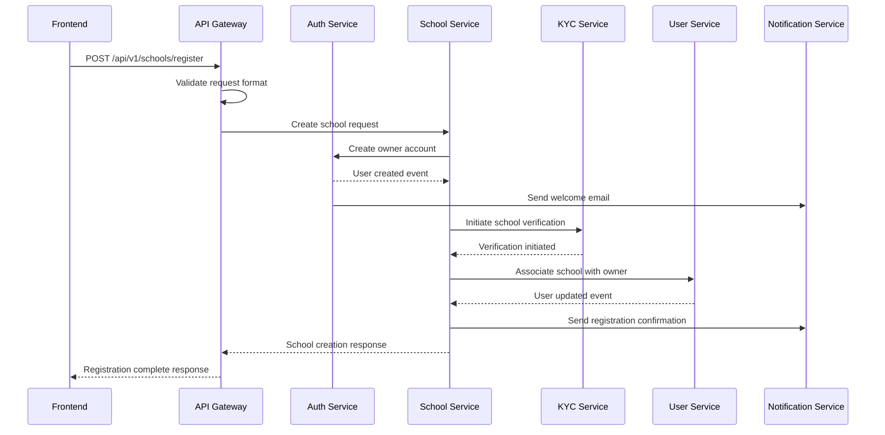

# New User School Registration Flow

## Flow Diagram


## Process Steps

### 1. Initial Request Validation
```typescript
interface ValidationChecks {
  // Request Format
  validateRequestFormat(): boolean
  validateRequiredFields(): boolean
  validateEmailFormat(): boolean
  validatePhoneFormat(): boolean
  
  // Business Rules
  validateSchoolType(): boolean
  validateClassConfiguration(): boolean
  validateOwnerInformation(): boolean
}
```

### 2. Owner Account Creation
```typescript
interface OwnerCreation {
  steps: [
    'VALIDATE_OWNER_INFO',
    'CREATE_AUTH_RECORD',
    'SETUP_INITIAL_ROLES',
    'SEND_WELCOME_EMAIL'
  ]
  
  rollback: {
    trigger: 'CREATION_FAILED' | 'VALIDATION_FAILED' | 'EMAIL_FAILED'
    actions: string[]
    compensation: Record<string, Function>
  }
}
```

### 3. School Setup Process
```typescript
interface SchoolSetup {
  steps: [
    'CREATE_SCHOOL_RECORD',
    'SETUP_CLASS_STRUCTURE',
    'INITIALIZE_SETTINGS',
    'TRIGGER_VERIFICATION'
  ]
  
  validations: {
    preSetup: string[]
    duringSetup: string[]
    postSetup: string[]
  }
}
```

### 4. Class Configuration
```typescript
interface ClassSetup {
  standardClasses: {
    validate(): boolean
    setup(): Promise<void>
  }
  
  sections: {
    validate(): boolean
    create(): Promise<void>
    assignCapacities(): Promise<void>
  }
}
```

## Error Handling

### Retry Policies
```typescript
interface RetryConfig {
  maxAttempts: 3
  backoffMultiplier: 2
  initialDelay: 1000 // ms
  maxDelay: 10000 // ms
  
  retryableErrors: [
    'NETWORK_ERROR',
    'TEMPORARY_SERVICE_UNAVAILABLE',
    'CONCURRENT_MODIFICATION'
  ]
}
```

### Compensation Actions
```typescript
interface CompensationActions {
  ownerCreationFailed: () => Promise<void>
  schoolCreationFailed: () => Promise<void>
  verificationFailed: () => Promise<void>
  classSetupFailed: () => Promise<void>
}
```

## Progress Tracking

### Registration States
```typescript
type RegistrationState =
  | 'INITIATED'
  | 'VALIDATING_INPUT'
  | 'CREATING_OWNER'
  | 'SETTING_UP_SCHOOL'
  | 'CONFIGURING_CLASSES'
  | 'VERIFYING'
  | 'COMPLETED'
  | 'FAILED'

interface ProgressTracking {
  currentState: RegistrationState
  completedSteps: string[]
  failedSteps: string[]
  lastUpdated: Date
  errorDetails?: {
    step: string
    error: string
    retryCount: number
    lastRetry: Date
  }
}
```

## Notifications

### User Notifications
```typescript
interface NotificationPoints {
  REGISTRATION_INITIATED: {
    channel: ['EMAIL']
    template: 'REGISTRATION_STARTED'
  }
  ACCOUNT_CREATED: {
    channel: ['EMAIL', 'SMS']
    template: 'WELCOME_OWNER'
  }
  VERIFICATION_NEEDED: {
    channel: ['EMAIL', 'IN_APP']
    template: 'KYC_REQUIRED'
  }
  SETUP_COMPLETED: {
    channel: ['EMAIL', 'SMS', 'IN_APP']
    template: 'REGISTRATION_COMPLETE'
  }
}
```

## Validation Rules

### School Configuration
```typescript
interface SchoolValidation {
  name: {
    minLength: 3
    maxLength: 100
    pattern: '^[a-zA-Z0-9\\s\\-\\.]+$'
  }
  
  contact: {
    email: RegExp
    phone: RegExp
    required: string[]
  }
  
  classes: {
    minClasses: 1
    maxSectionsPerClass: number
    requiredFields: string[]
  }
}
```

## See Also
- [Error Handling Guide](./error-handling.md)
- [Retry Mechanisms](./retry-mechanisms.md)
- [Class Setup Details](./class-setup.md) 