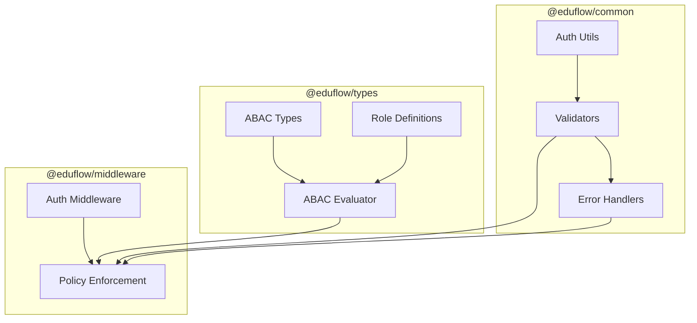
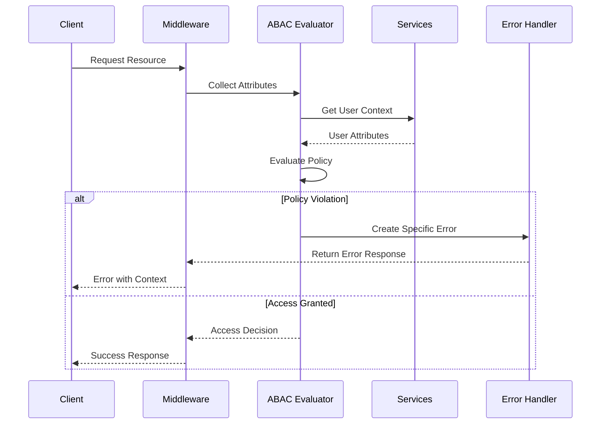

# Attribute-Based Access Control (ABAC) Documentation

## Overview
The ABAC system provides fine-grained access control based on user attributes, environmental conditions, and resource characteristics. It follows functional programming principles using `fp-ts` and integrates with the error handling system for robust error management.

## Architecture

### Component Diagram


### Access Control Flow


## Type System (`libs/types/src/auth`)

### Core Types

#### Resource Actions
```typescript
type ResourceAction = 'CREATE' | 'READ' | 'UPDATE' | 'DELETE';
```

#### User Attributes
```typescript
interface UserAttributes {
  id: string;
  email: string;
  status: string;
  globalRoles: Role[];
  schoolRoles: Record<string, Role[]>;
  kyc: UserKYC;
  employment: UserEmployment;
  access: UserAccess;
  context: UserContext;
}
```

#### Access Policy
```typescript
interface AccessPolicy {
  resource: string;
  action: ResourceAction;
  conditions: PolicyConditions;
}
```

### Policy Conditions

#### School Conditions
```typescript
interface SchoolConditions {
  mustBeInSchool?: boolean;
  mustBeOwner?: boolean;
  mustBeCurrentSchool?: boolean;
  allowedRoles?: Role[];
}
```

#### Environment Conditions
```typescript
interface EnvironmentConditions {
  timeRestrictions?: TimeRestrictions;
  ipRestrictions?: IPRestrictions;
  locationRestrictions?: LocationRestrictions;
  deviceRestrictions?: DeviceRestrictions;
}
```

#### Verification Conditions
```typescript
interface VerificationConditions {
  requireKYC?: boolean;
  kycStatus?: KYCStatus[];
  employmentStatus?: EmploymentEligibilityStatus[];
  officerPermissions?: string[];
}
```

## Policy Evaluation (`libs/types/src/auth/abac-evaluator.ts`)

### Core Functions

#### Attribute Collection
```typescript
const collectUserAttributes = async (
  userId: string
): Promise<UserAttributes>
```

#### Role Hierarchy
```typescript
const checkRoleHierarchy = (
  userRoles: Role[],
  requiredRoles: Role[]
): boolean
```

#### Permission Checking
```typescript
const checkPermissions = (
  userRoles: Role[],
  requiredPermissions: Permission[]
): boolean
```

### Context Validation

#### Time Restrictions
```typescript
const isWithinAllowedTime = (
  allowedDays: string[],
  allowedHours: string[],
  timezone: string
): boolean
```

#### IP Validation
```typescript
const isIPAllowed = (
  ip: string | undefined,
  allowlist?: string[],
  denylist?: string[]
): boolean
```

#### Device Trust
```typescript
const isTrustedDevice = (
  deviceInfo: UserContext['deviceInfo']
): boolean
```

### Main Evaluator
```typescript
const evaluateAccess = async (
  userId: string,
  policy: AccessPolicy
): Promise<ValidationResult>
```

## Middleware Integration (`libs/middleware/src/auth.middleware.ts`)

### Authentication
```typescript
const authenticate = async (
  request: FastifyRequest
): Promise<RequestWithUser>
```

### Authorization
```typescript
const authorize = (roles: UserRole[]) => 
  async (request: FastifyRequest): Promise<void>
```

## Error Handling

### Error Categories
The system uses specialized error creators for different types of access violations:

#### Role-Based Errors
```typescript
const roleError = createRoleError('User does not have required roles', {
  code: 'INSUFFICIENT_ROLES',
  requiredRoles: ['ADMIN', 'TEACHER'],
  userGlobalRoles: user.globalRoles,
  userSchoolRoles: user.schoolRoles
});
```

#### Verification Errors
```typescript
const verificationError = createVerificationError('KYC verification required', {
  code: 'VERIFICATION_REQUIRED',
  currentKycStatus: user.kyc.status,
  requiredStatus: 'VERIFIED'
});
```

#### School Context Errors
```typescript
const schoolError = createSchoolContextError('No current school context', {
  code: 'INVALID_SCHOOL_CONTEXT',
  userId: user.id,
  context: user.context
});
```

#### Environment Restriction Errors
```typescript
const envError = createEnvironmentError('Access not allowed from region', {
  code: 'ENVIRONMENT_RESTRICTION',
  userRegion: userLocation.region,
  allowedRegions: locationRestrictions.regions
});
```

### Error Response Format
All ABAC errors follow a consistent format:
```typescript
interface AbacError {
  message: string;
  code: string;
  metadata: {
    resource: string;
    action: string;
    userId: string;
    [key: string]: any;
  };
}
```

## Policy Evaluation

### Core Functions

#### Validation Chain
The system uses a functional approach with Either monad for validation:
```typescript
const validationResults = [
  validateRoles(user, conditions),
  validateVerification(user, conditions),
  validateSchoolContext(user, conditions),
  validateEnvironment(user, conditions),
  validateCustomConditions(user, conditions, context)
];
```

#### Role Validation
```typescript
const validateRoles = (
  user: UserAttributes,
  conditions: PolicyConditions
): E.Either<AppError, true> => {
  // Checks both anyOf and allOf role conditions
  // Returns detailed error on failure
};
```

#### Environment Validation
```typescript
const validateEnvironment = (
  user: UserAttributes,
  conditions: PolicyConditions
): E.Either<AppError, true> => {
  // Validates IP, time, device, and location restrictions
  // Returns context-rich errors on violations
};
```

## Usage Examples

### Basic Policy with Error Handling
```typescript
const documentAccessPolicy: AccessPolicy = {
  resource: 'document',
  action: 'READ',
  conditions: {
    anyOf: {
      roles: ['TEACHER', 'ADMIN']
    },
    verification: {
      requireKYC: true,
      kycStatus: ['VERIFIED']
    },
    school: {
      mustBeCurrentSchool: true
    },
    environment: {
      timeRestrictions: {
        allowedDays: ['1', '2', '3', '4', '5'], // Mon-Fri
        allowedHours: ['09', '17'], // 9 AM - 5 PM
        timezone: 'UTC'
      }
    }
  }
};

// Using the policy
try {
  const result = await validateAccess(user, documentAccessPolicy);
  if (!result.granted) {
    // Error will contain detailed context about the violation
    handleAccessDenied(result.reason);
  }
} catch (error) {
  // System errors are wrapped with proper context
  handleSystemError(error);
}
```

### Custom Validation with Error Context
```typescript
const customPolicy: AccessPolicy = {
  resource: 'grade',
  action: 'UPDATE',
  conditions: {
    custom: [{
      evaluator: (attributes, context) => {
        const isTeacher = attributes.schoolRoles[context.schoolId]?.includes('TEACHER');
        const isAssignedClass = attributes.classes?.includes(context.classId);
        return isTeacher && isAssignedClass;
      },
      errorMessage: 'Teacher must be assigned to the class'
    }]
  }
};
```

## Best Practices

### 1. Error Handling
- Use specialized error creators for different violation types
- Include relevant context in error metadata
- Maintain consistent error structure
- Provide actionable error messages

### 2. Policy Definition
- Group related conditions logically
- Use role hierarchy appropriately
- Include meaningful error messages
- Keep policies granular and focused

### 3. Performance
- Cache user attributes when possible
- Use hierarchical evaluations
- Optimize condition order
- Implement efficient role checks

### 4. Security
- Always verify KYC status when required
- Implement proper IP restrictions
- Enforce device trust requirements
- Log access decisions with context

### 5. Maintenance
- Document policy changes
- Version control policies
- Test policy combinations
- Monitor policy effectiveness
- Track error patterns

## Testing

### Policy Testing with Error Cases
```typescript
describe('Document Access Policy', () => {
  it('should return proper error for unverified user', async () => {
    const result = await validateAccess(
      unverifiedUser,
      documentAccessPolicy
    );
    expect(result.granted).toBe(false);
    expect(result.reason).toContain('KYC verification required');
  });

  it('should return detailed error for time restriction', async () => {
    const result = await validateAccess(
      userOutsideHours,
      documentAccessPolicy
    );
    expect(result.granted).toBe(false);
    expect(result.reason).toMatch(/Access not allowed at .* Allowed hours: 09:00-17:00/);
  });
});
```

## Related Documentation

### Core Documentation
- [Error Handling](./error-handling.md) - Error handling system implementation
- [Logger Integration](../logger/docs/logger.md) - Logging system integration
- [ABAC Types](../types/docs/types.md#abac-types) - Type definitions for ABAC system

### Integration & Usage
- [ABAC Integration Guide](../docs/abac-integration.md) - How to integrate ABAC in your service
- [Error Handling Integration](../docs/error-handling-integration.md) - Error handling integration guide
- [System Integration](../docs/system-integration.md) - Overall system integration guide

### Implementation Details
- [ABAC Flow](../types/src/auth/ABAC_FLOW.md) - Detailed flow diagrams and implementation notes
- [Middleware Documentation](../middleware/docs/middleware.md) - ABAC middleware implementation
- [Constants Documentation](../constants/docs/constants.md) - Error codes and constants

