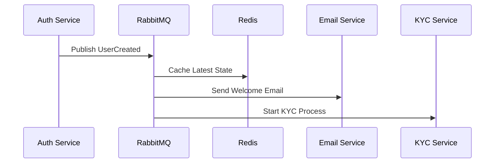
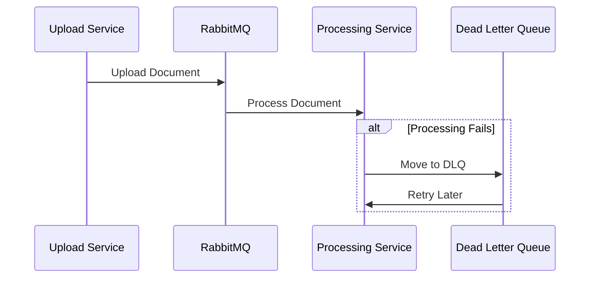

# Event System Architecture Guide

## Overview

Our event system is designed to handle complex messaging scenarios using two powerful tools:

1. **RabbitMQ** - For reliable message queuing and event processing
2. **Redis** - For caching and maintaining event state

## Key Features

### 1. Persistent Messaging

- Events are stored reliably in RabbitMQ queues
- Messages survive system restarts
- No messages are lost even if the receiver is temporarily down

### 2. Event Queuing

- Messages are queued in order
- Multiple services can process events at their own pace
- Automatic load balancing between multiple consumers

### 3. Dead Letter Handling

- Failed messages are automatically moved to a "dead letter queue"
- Retry mechanism with configurable attempts
- Error tracking and monitoring

### 4. Event Caching

- Latest event state cached in Redis
- Fast access to current state
- Reduces load on the message queue

## How It Works

### Publishing Events

```typescript
// Example: Publishing a user created event
await eventBus.publish(
  {
    type: 'USER_CREATED',
    data: {
      userId: '123',
      email: 'user@example.com',
      role: 'STUDENT',
    },
  },
  {
    persistent: true, // Store in disk
    cache: true, // Cache in Redis
  }
);
```

### Subscribing to Events

```typescript
// Example: Handling user created events
await eventBus.subscribe(
  'USER_CREATED',
  async (event) => {
    // Handle the event
    await updateUserDatabase(event.data);
  },
  {
    durable: true, // Queue survives restarts
    useCache: true, // Check cache first
  }
);
```

## Common Use Cases

### 1. User Registration Flow



### 2. Document Processing



## Error Handling

1. **Automatic Retries**

   - Failed events are automatically retried
   - Configurable retry count and delay
   - Example: `retryCount: 3, retryDelay: 1000`

2. **Dead Letter Queue**

   - After max retries, events go to DLQ
   - Includes error context and retry history
   - Can be manually reprocessed

3. **Error Logging**
   ```typescript
   {
     error: 'Processing failed',
     retryCount: 2,
     timestamp: '2024-03-21T10:00:00Z',
     correlationId: 'tx-123'
   }
   ```

## Best Practices

1. **Always Use Correlation IDs**

   - Track events across services
   - Link related events together
   - Debug issues easier

2. **Include Version Information**

   ```typescript
   metadata: {
     version: '1.0.0',
     schemaVersion: '1.0'
   }
   ```

3. **Handle Events Idempotently**

   - Events might be processed multiple times
   - Use unique IDs and checks
   - Cache processed events

4. **Monitor Queue Health**
   - Watch queue lengths
   - Track processing times
   - Set up alerts for DLQ

## Configuration Example

```typescript
const config = {
  serviceName: 'my-service',
  rabbitmq: {
    url: 'amqp://localhost',
    exchange: 'main-exchange',
    deadLetterExchange: 'dlq-exchange',
    retryCount: 3,
    retryDelay: 1000,
  },
  redis: {
    url: 'redis://localhost',
    keyPrefix: 'events:',
    eventTTL: 86400, // 24 hours
  },
};
```
