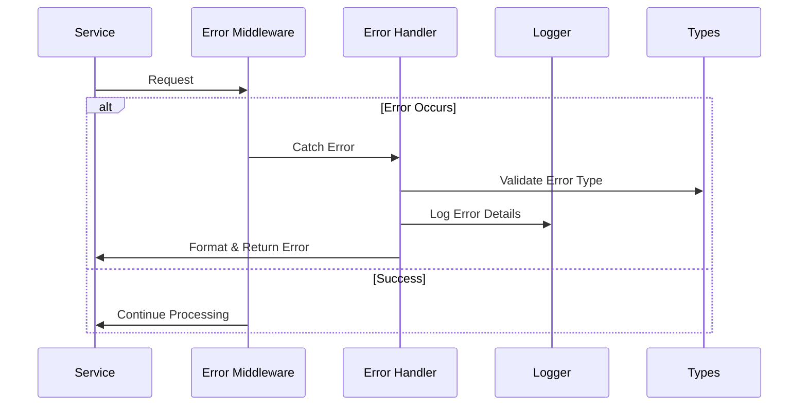
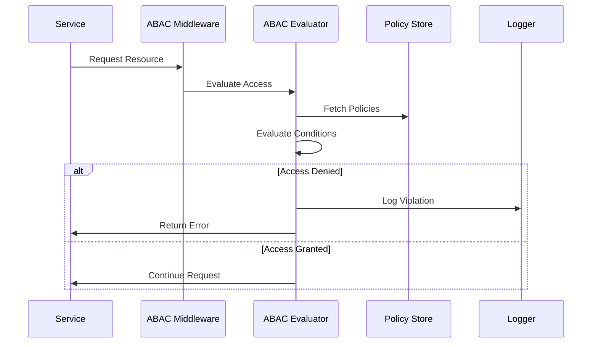
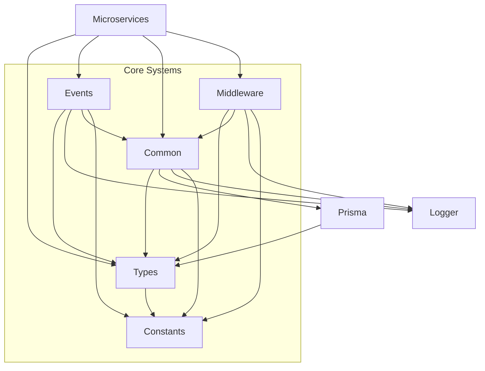

# @libs Architecture

This document outlines the detailed architecture of the `@libs` directory, focusing on cross-cutting concerns like error handling and ABAC.

## Directory Structure

```
libs/
├── types/                    # Type definitions and schemas
│   ├── src/
│   │   ├── auth/            # Auth domain types
│   │   │   ├── abac.ts      # ABAC types
│   │   │   ├── schema.ts    # Auth schemas
│   │   │   └── events.ts    # Auth event types
│   │   ├── errors/          # Error types
│   │   │   ├── types.ts     # Error type definitions
│   │   │   └── codes.ts     # Error codes
│   │   └── [domain]/        # Other domain types
│   └── docs/
│
├── common/                   # Shared utilities
│   ├── src/
│   │   ├── errors/          # Error handling
│   │   │   ├── base.ts      # Base error utilities
│   │   │   └── handlers.ts  # Error handlers
│   │   ├── security/        # Security utilities
│   │   │   ├── abac.ts      # ABAC implementation
│   │   │   └── crypto.ts    # Crypto utilities
│   │   └── utils/           # Other utilities
│   └── docs/
│
├── middleware/               # HTTP middleware
│   ├── src/
│   │   ├── auth/            # Auth middleware
│   │   │   ├── abac.ts      # ABAC middleware
│   │   │   └── jwt.ts       # JWT middleware
│   │   ├── error/           # Error middleware
│   │   └── validation/      # Validation middleware
│   └── docs/
│
├── events/                   # Event system
│   ├── src/
│   │   ├── bus/             # Event bus
│   │   ├── handlers/        # Event handlers
│   │   └── validation/      # Event validation
│   └── docs/
│
├── prisma/                   # Database layer
│   ├── schema/              # Database schema
│   ├── migrations/          # Database migrations
│   └── client/              # Generated client
│
├── logger/                   # Logging system
│   ├── src/
│   │   ├── formatters/      # Log formatters
│   │   └── transport/       # Log transport
│   └── docs/
│
└── constants/               # Global constants
    ├── src/
    │   ├── errors/         # Error constants
    │   ├── events/         # Event constants
    │   └── config/         # Config constants
    └── docs/
```

## Cross-Cutting Concerns

### Error Handling System



#### Error Flow

1. Error types defined in `@types/errors`
2. Error handling implemented in `@common/errors`
3. HTTP error handling in `@middleware/error`
4. Error logging through `@logger`

### ABAC (Access Control) System



#### ABAC Flow

1. ABAC types in `@types/auth/abac`
2. Core implementation in `@common/security/abac`
3. HTTP middleware in `@middleware/auth/abac`
4. Domain-specific policies with domains

## Package Dependencies



## Package Responsibilities

### @types

- Domain-specific type definitions
- Error type definitions
- ABAC type definitions
- Validation schemas (Zod)
- NO implementation logic

### @common

- Error handling implementation
- ABAC core implementation
- Shared business logic
- Security utilities
- Helper functions

### @middleware

- ABAC middleware
- Error handling middleware
- Request validation
- Authentication middleware

### @events

- Event bus implementation
- Event validation
- Event handlers
- Event error handling

### @prisma

- Database schema (source of truth)
- Database operations
- Type generation
- Migrations

### @logger

- Structured logging
- Error logging
- Performance tracking
- Log transport

### @constants

- Error codes
- Event types
- Configuration
- Feature flags

## Implementation Examples

### Error Handling

```typescript
// @types/errors/types.ts
export interface AppError {
  code: ErrorCode;
  message: string;
  metadata?: Record<string, unknown>;
  cause?: unknown;
}

// @common/errors/base.ts
export const createAppError = (details: ErrorDetails): AppError => ({
  code: details.code,
  message: details.message,
  metadata: details.metadata,
  cause: details.cause,
});

// @middleware/error/handler.ts
export const errorMiddleware = (
  error: unknown,
  req: Request,
  res: Response,
  next: NextFunction
) => {
  const appError = isAppError(error)
    ? error
    : createAppError({
        code: 'INTERNAL_SERVER_ERROR',
        message: 'An unexpected error occurred',
        cause: error,
      });

  logger.error('Request failed', { error: appError });
  res.status(getStatusCode(appError.code)).json(createErrorResponse(appError));
};
```

### ABAC Implementation

```typescript
// @types/auth/abac.ts
export interface AccessPolicy {
  resource: string;
  action: ResourceAction;
  conditions: PolicyConditions;
}

// @common/security/abac.ts
export const evaluateAccess = async (
  user: UserAttributes,
  policy: AccessPolicy
): Promise<ValidationResult> => {
  // Policy evaluation logic
};

// @middleware/auth/abac.ts
export const abacMiddleware =
  (policy: AccessPolicy) => async (req: Request, res: Response, next: NextFunction) => {
    try {
      const result = await evaluateAccess(req.user, policy);
      if (!result.granted) {
        throw createAccessDeniedError(result.reason);
      }
      next();
    } catch (error) {
      next(error);
    }
  };
```

## Best Practices

### Package Organization

1. Keep domain logic with domain types
2. Implement cross-cutting concerns in appropriate packages
3. Use clear dependency boundaries
4. Maintain single responsibility

### Error Handling

1. Define errors in types
2. Implement handlers in common
3. Use middleware for HTTP errors
4. Log appropriately

### ABAC

1. Define policies with domains
2. Implement core in common
3. Use middleware for HTTP
4. Log access decisions

### General

1. Follow domain-driven design
2. Maintain clear boundaries
3. Document interactions
4. Use type safety
