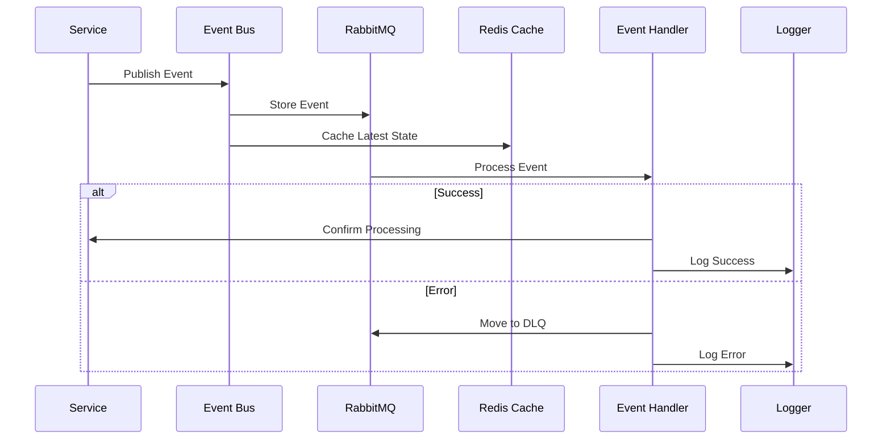
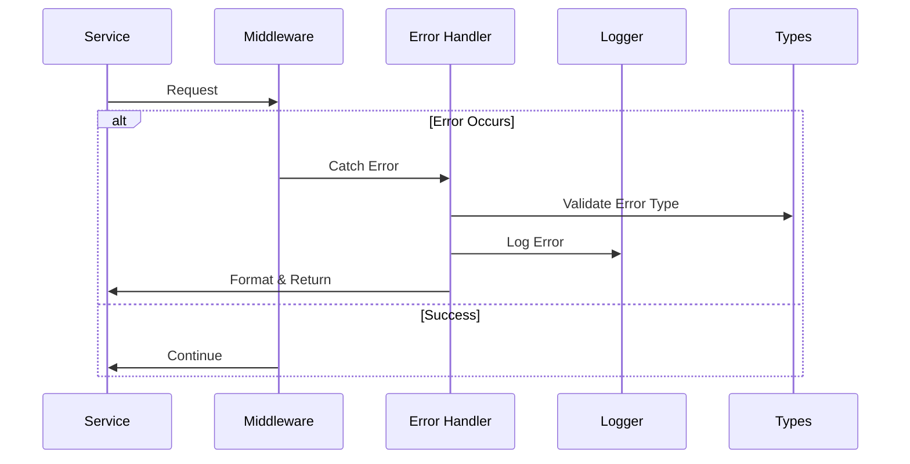
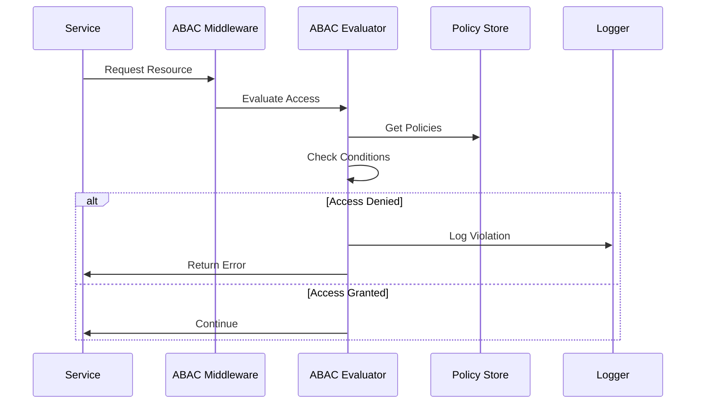
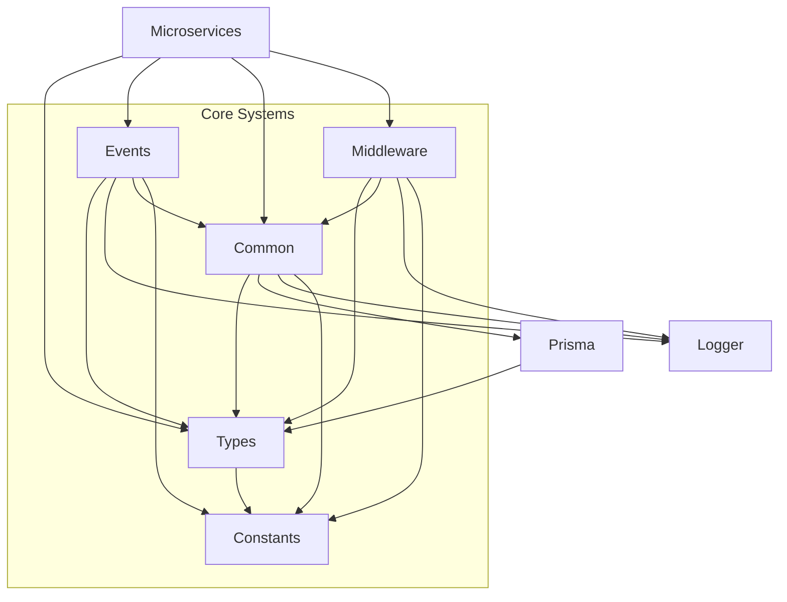

# Package Interactions in @libs

This document outlines the architecture and interactions between packages in the `@libs` directory.

## Directory Structure

```
libs/
├── types/                    # Type definitions and schemas
│   ├── src/
│   │   ├── auth/            # Auth domain types
│   │   │   ├── docs/         # Auth domain documentation
│   │   │   ├── abac.ts      # ABAC types
│   │   │   ├── schema.ts    # Auth schemas
│   │   │   └── events.ts    # Auth event types
│   │   ├── errors/          # Error types
│   │   │   ├── docs/         # Error domain documentation
│   │   │   ├── types.ts     # Error type definitions
│   │   │   └── codes.ts     # Error codes
│   │   └── [domain]/        # Other domain types
│   │       └── docs/         # Domain-specific documentation
│   └── docs/                 # Package-level documentation
│
├── common/                   # Shared utilities
│   ├── src/
│   │   ├── errors/          # Error handling
│   │   │   ├── docs/         # Error handling documentation
│   │   │   ├── base.ts      # Base error utilities
│   │   │   └── handlers.ts  # Error handlers
│   │   ├── security/        # Security utilities
│   │   │   ├── docs/         # Security documentation
│   │   │   ├── abac.ts      # ABAC implementation
│   │   │   └── crypto.ts    # Crypto utilities
│   │   └── utils/           # Other utilities
│   │       └── docs/         # Utils documentation
│   └── docs/                 # Package-level documentation
│
├── middleware/               # HTTP middleware
│   ├── src/
│   │   ├── auth/            # Auth middleware
│   │   │   ├── docs/         # Auth middleware documentation
│   │   │   ├── abac.ts      # ABAC middleware
│   │   │   └── jwt.ts       # JWT middleware
│   │   ├── error/           # Error middleware
│   │   │   └── docs/         # Error middleware documentation
│   │   └── validation/      # Validation middleware
│   │       └── docs/         # Validation middleware documentation
│   └── docs/                 # Package-level documentation
│
├── events/                   # Event system
│   ├── src/
│   │   ├── bus/             # Event bus
│   │   │   └── docs/         # Event bus documentation
│   │   ├── handlers/        # Event handlers
│   │   │   └── docs/         # Handlers documentation
│   │   └── validation/      # Event validation
│   │       └── docs/         # Validation documentation
│   └── docs/                 # Package-level documentation
│
├── prisma/                   # Database layer
│   ├── schema/              # Database schema
│   │   └── docs/            # Schema documentation
│   ├── migrations/          # Database migrations
│   │   └── docs/            # Migrations documentation
│   ├── client/              # Generated client
│   │   └── docs/            # Client documentation
│   └── docs/                # Package-level documentation
│
├── logger/                   # Logging system
│   ├── src/
│   │   ├── formatters/      # Log formatters
│   │   │   └── docs/         # Formatters documentation
│   │   └── transport/       # Log transport
│   │       └── docs/         # Transport documentation
│   └── docs/                 # Package-level documentation
│
└── constants/               # Global constants
    ├── src/
    │   ├── errors/         # Error constants
    │   │   └── docs/        # Error constants documentation
    │   ├── events/         # Event constants
    │   │   └── docs/        # Event constants documentation
    │   └── config/         # Config constants
    │       └── docs/        # Config documentation
    └── docs/                # Package-level documentation
```

## Core Systems Interaction

### Event Processing Flow



### Error Handling Flow



### ABAC Flow



## Package Dependencies



## Package Responsibilities

### @types

- Domain-specific type definitions
- Error type definitions
- ABAC type definitions
- Validation schemas (Zod)
- NO implementation logic

### @common

- Error handling implementation
- ABAC core implementation
- Shared business logic
- Security utilities
- Helper functions

### @middleware

- ABAC middleware
- Error handling middleware
- Request validation
- Authentication middleware

### @events

- Event bus implementation
- Message persistence with RabbitMQ
- Event state caching with Redis
- Dead letter queue handling
- Retry mechanisms
- Event validation
- Error tracking

### @prisma

- Database schema (source of truth)
- Database operations
- Type generation
- Migrations

### @logger

- Structured logging
- Error logging
- Performance tracking
- Log transport

### @constants

- Error codes
- Event types
- Configuration
- Feature flags

## Cross-Cutting Concerns

### Event Processing

- Types defined in `@types/events`
- Core implementation in `@events/event-bus`
- Caching in Redis via `@events/cache`
- Error handling via DLQ
- Monitoring via `@logger`

### Error Handling

- Defined in `@types/errors`
- Implemented in `@common/errors`
- Used through `@middleware/error`
- Logged via `@logger`

### ABAC (Access Control)

- Types in `@types/auth/abac`
- Core in `@common/security/abac`
- Middleware in `@middleware/auth/abac`
- Policies in respective domains

### Validation

- Schemas in domain directories
- Middleware in `@middleware/validation`
- Utilities in `@common/validation`

## Example Flows

### Event Publishing in Service

```typescript
// Service publishing an event
import { createEventBus } from '@eduflow/events';
import { EventBusConfig } from '@eduflow/types';

const eventBus = await createEventBus({
  serviceName: 'user-service',
  rabbitmq: {
    url: process.env.RABBITMQ_URL,
    exchange: 'main',
    deadLetterExchange: 'dlq',
    retryCount: 3,
    retryDelay: 1000,
  },
  redis: {
    url: process.env.REDIS_URL,
    keyPrefix: 'events:',
    eventTTL: 86400,
  },
});

await eventBus.publish(
  {
    type: 'USER_CREATED',
    data: {
      userId: '123',
      email: 'user@example.com',
    },
    metadata: {
      correlationId: 'tx-123',
      timestamp: new Date().toISOString(),
      version: '1.0.0',
    },
  },
  {
    persistent: true,
    cache: true,
  }
);
```

### Event Handling in Service

```typescript
// Service handling events
import { createEventBus } from '@eduflow/events';
import { logger } from '@eduflow/logger';

const eventBus = await createEventBus(config);

await eventBus.subscribe(
  'USER_CREATED',
  async (event) => {
    try {
      // Process the event
      await processUser(event.data);

      logger.info('User processed', {
        userId: event.data.userId,
        correlationId: event.metadata.correlationId,
      });
    } catch (error) {
      logger.error('Failed to process user', {
        userId: event.data.userId,
        correlationId: event.metadata.correlationId,
        error: error instanceof Error ? error.message : String(error),
      });
      throw error; // Will trigger retry/DLQ logic
    }
  },
  {
    durable: true,
    useCache: true,
  }
);
```

### Error Handling in Service

```typescript
// Service using error handling
import { createAppError } from '@eduflow/common/errors';
import { ErrorCode } from '@eduflow/types/errors';

try {
  // Operation
} catch (error) {
  throw createAppError({
    code: ErrorCode.NOT_FOUND,
    message: 'Resource not found',
    cause: error,
  });
}
```

### ABAC in Service

```typescript
// Service using ABAC
import { evaluateAccess } from '@eduflow/common/security/abac';
import { createPolicy } from '@eduflow/types/auth/abac';

const policy = createPolicy({
  resource: 'document',
  action: 'READ',
  conditions: {
    roles: ['TEACHER'],
    school: { mustBeCurrentSchool: true },
  },
});

await evaluateAccess(user, policy);
```

## Best Practices

### Event System

1. Use correlation IDs for tracking
2. Include version information
3. Handle events idempotently
4. Monitor queue health
5. Log event lifecycle

### Package Organization

1. Keep domain logic with domain types
2. Implement cross-cutting concerns in appropriate packages
3. Use clear dependency boundaries
4. Maintain single responsibility

### Error Handling

1. Define errors in types
2. Implement handlers in common
3. Use middleware for HTTP errors
4. Log appropriately

### ABAC

1. Define policies with domains
2. Implement core in common
3. Use middleware for HTTP
4. Log access decisions

### General

1. Follow domain-driven design
2. Maintain clear boundaries
3. Document interactions
4. Use type safety
