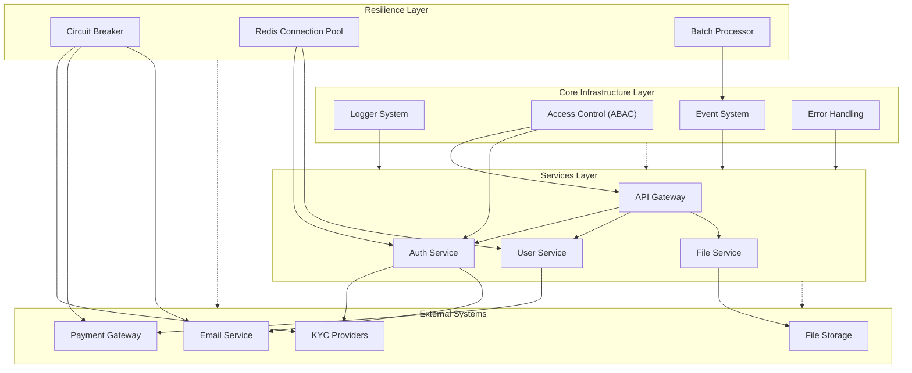

# EduFlow System Integration Guide

## System Architecture Overview



## Component Integration

### 1. Core Infrastructure

#### Logger System
- Centralized logging across all services
- Request/Response tracking
- Error and performance monitoring
- Integration with monitoring tools

```typescript
// Service initialization with logger
const logger = createLogger({
  service: 'auth-service',
  environment: process.env.NODE_ENV,
  minLevel: 'info'
});

// Request logging middleware
app.use(requestLogger(logger));

// Structured logging in services
logger.info('Processing payment', {
  userId,
  amount,
  currency,
  provider
});
```

#### ABAC (Attribute Based Access Control)
- Fine-grained access control
- Role and attribute-based permissions
- Policy enforcement points

```typescript
// ABAC middleware
app.use(abacMiddleware({
  getUser: (req) => req.user,
  policies: [
    {
      resource: 'STUDENT_RECORDS',
      action: 'VIEW',
      conditions: {
        roles: ['TEACHER', 'ADMIN'],
        schoolId: (user, resource) => user.schoolId === resource.schoolId
      }
    }
  ]
}));
```

#### Event System
- Asynchronous communication
- Event-driven architecture
- Message persistence and replay

```typescript
// Publishing events
await eventBus.publish({
  type: 'USER_VERIFIED',
  data: { userId, verificationDetails }
});

// Subscribing to events
eventBus.subscribe('PAYMENT_COMPLETED', async (event) => {
  await updateSubscriptionStatus(event.data);
});
```

### 2. Resilience Layer

#### Circuit Breaker
- Fault tolerance for external services
- Automatic recovery
- Failure monitoring

```typescript
const paymentProcessor = createCircuitBreaker({
  timeout: 5000,
  errorThreshold: 5,
  resetTimeout: 30000
}, logger);

const processPayment = paymentProcessor.wrap(
  async (paymentDetails) => {
    return await paymentGateway.charge(paymentDetails);
  }
);
```

#### Redis Connection Pool
- Connection management
- Load balancing
- Resource optimization

```typescript
const redisPool = createRedisPool({
  nodes: [
    { host: 'redis-1', port: 6379 },
    { host: 'redis-2', port: 6379 }
  ],
  maxConnections: 10
}, logger);

await redisPool.withClient(async (client) => {
  await client.set('session:123', sessionData);
});
```

#### Batch Processor
- Message batching
- Performance optimization
- Retry handling

```typescript
const batchProcessor = createBatchProcessor(channel, {
  batchSize: 100,
  flushInterval: 1000,
  maxRetries: 3
}, logger);

await batchProcessor.add({
  exchange: 'notifications',
  routingKey: 'email.send',
  content: emailData
});
```

### 3. Integration Patterns

#### Service Layer Integration
```typescript
export const createAuthService = (config: AuthConfig) => {
  // Core infrastructure
  const logger = createLogger(config.logger);
  const eventBus = createEventBus(config.events);
  
  // Resilience layer
  const redisPool = createRedisPool(config.redis, logger);
  const emailService = createCircuitBreaker(config.email);
  const batchProcessor = createBatchProcessor(channel, config.batch);

  // Service setup
  const service = {
    async login(credentials: Credentials) {
      try {
        // Use Redis pool for session management
        const session = await redisPool.withClient(async (redis) => {
          return await redis.get(`session:${credentials.userId}`);
        });

        // Publish login event
        await eventBus.publish({
          type: 'USER_LOGGED_IN',
          data: { userId: credentials.userId }
        });

        // Batch process notifications
        await batchProcessor.add({
          exchange: 'notifications',
          routingKey: 'login.alert',
          content: { userId: credentials.userId }
        });

        return session;
      } catch (error) {
        logger.error('Login failed', { error });
        throw new AuthError('LOGIN_FAILED');
      }
    }
  };

  return service;
};
```

#### API Gateway Integration
```typescript
export const createApiGateway = (config: GatewayConfig) => {
  const app = fastify();
  
  // Core infrastructure setup
  app.register(loggerPlugin, config.logger);
  app.register(abacPlugin, config.abac);
  app.register(errorHandlerPlugin);

  // Resilience for downstream services
  const services = {
    auth: createCircuitBreaker(config.services.auth),
    user: createCircuitBreaker(config.services.user),
    files: createCircuitBreaker(config.services.files)
  };

  // Route handlers
  app.post('/auth/login', async (req, reply) => {
    const result = await services.auth.wrap(
      async () => await authService.login(req.body)
    )();
    reply.send(result);
  });

  return app;
};
```

## Best Practices

1. **Layer Separation**
   - Keep core infrastructure independent
   - Use resilience layer as middleware
   - Maintain clean service boundaries

2. **Configuration Management**
   - Centralize configuration
   - Environment-specific settings
   - Feature flags for gradual rollout

3. **Error Handling**
   - Use custom error types
   - Proper error propagation
   - Consistent error responses

4. **Monitoring and Metrics**
   - Track resilience metrics
   - Monitor service health
   - Alert on threshold breaches

## Related Documentation
- [Error Handling Guide](./error-handling-integration.md)
- [Logger Integration](./logger-integration.md)
- [ABAC Integration](./abac-integration.md)
- [Events Integration](./events-integration.md) 