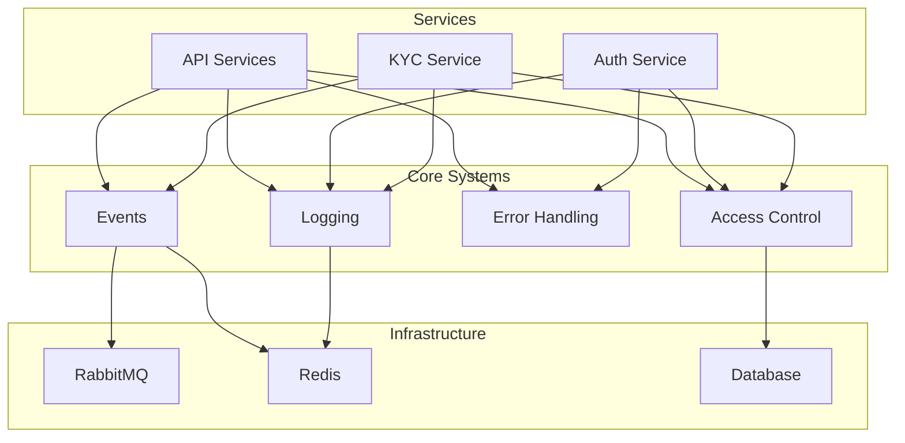
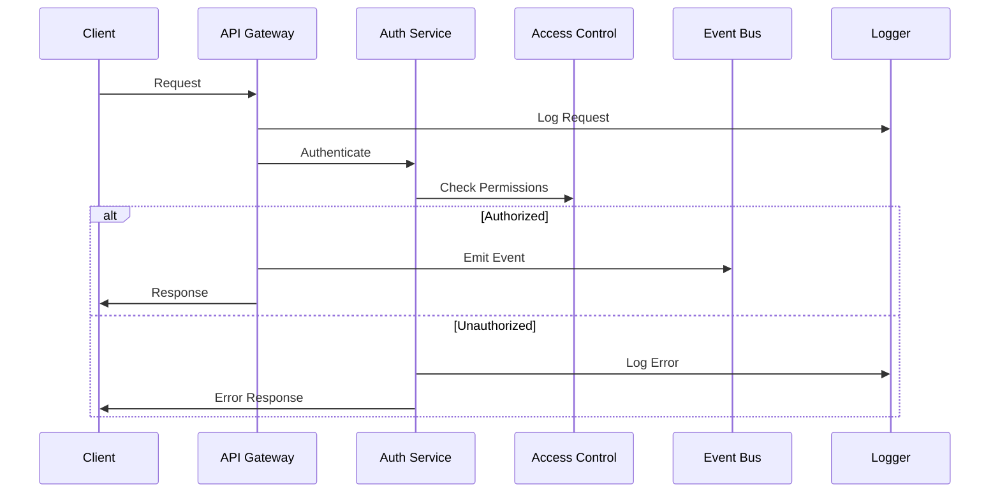

# System Integration Guide

## Overview
This guide provides a comprehensive overview of integrating all core systems in the EduPlan platform. It serves as a high-level guide that connects the individual system components. For detailed integration of specific systems, please refer to their respective integration guides.

## System Architecture

### High-Level Architecture


### System Flow


## Core Systems Integration

### 1. Access Control (ABAC)
The ABAC system provides attribute-based access control across all services.

```typescript
import { createAbacMiddleware } from '@eduplan/abac';
import { logger } from './logger';

// Setup ABAC middleware
const setupAbac = (app: FastifyInstance) => {
  const abacMiddleware = createAbacMiddleware({
    logger,
    // See ABAC integration guide for full configuration
  });

  app.addHook('preHandler', abacMiddleware);
};
```

For detailed ABAC integration, see [ABAC Integration Guide](./abac-integration.md).

### 2. Logging System
Centralized logging system for consistent log management across services.

```typescript
import { createLogger } from '@eduplan/logger';
import { createRequestLogger } from '@eduplan/logger/request';

// Setup service logger
const logger = createLogger({
  service: 'my-service',
  // See Logger integration guide for full configuration
});

// Setup request logging
app.use(createRequestLogger(logger));
```

For detailed logging integration, see [Logger Integration Guide](./logger-integration.md).

### 3. Error Handling
Unified error handling system for consistent error management.

```typescript
import { createErrorHandler } from '@eduplan/common';
import { logger } from './logger';

// Setup error handling
const setupErrorHandling = (app: FastifyInstance) => {
  const errorHandler = createErrorHandler({
    logger,
    // See Error Handling integration guide for full configuration
  });

  app.setErrorHandler(errorHandler);
};
```

For detailed error handling integration, see [Error Handling Integration Guide](./error-handling-integration.md).

### 4. Event System
Event-driven architecture for service communication.

```typescript
import { createEventBus } from '@eduplan/events';
import { logger } from './logger';

// Setup event bus
const setupEvents = async () => {
  const eventBus = await createEventBus({
    service: 'my-service',
    logger,
    // See Events integration guide for full configuration
  });

  return eventBus;
};
```

For detailed event system integration, see [Events Integration Guide](./events-integration.md).

## Service Integration Patterns

### 1. API Service Template
```typescript
import { setupAbac, setupLogger, setupErrorHandling, setupEvents } from '@eduplan/common';

export const createService = async () => {
  // Initialize core systems
  const logger = setupLogger('api-service');
  const eventBus = await setupEvents(logger);
  
  // Create Fastify app
  const app = fastify({
    logger
  });

  // Setup middleware
  await setupAbac(app);
  await setupErrorHandling(app);
  
  // Setup routes with integrated systems
  app.post('/resource', {
    handler: async (request, reply) => {
      const { logger } = request;
      
      try {
        // Operation with all systems integrated
        const result = await processResource(request.body);
        
        await eventBus.publish('RESOURCE_CREATED', result);
        logger.info('Resource created', { resourceId: result.id });
        
        return result;
      } catch (error) {
        // Error will be handled by error handler
        throw error;
      }
    }
  });

  return app;
};
```

### 2. Event Handler Template
```typescript
import { createEventHandler } from '@eduplan/events';
import { logger } from './logger';

export const setupEventHandlers = (eventBus: EventBus) => {
  // Setup event handlers with integrated systems
  const handleResourceCreated = createEventHandler(
    'RESOURCE_CREATED',
    async (event) => {
      const handlerLogger = logger.child({
        event: event.type,
        resourceId: event.data.id
      });

      try {
        await processResourceCreated(event.data);
        handlerLogger.info('Resource processed');
      } catch (error) {
        handlerLogger.error('Failed to process resource', { error });
        throw error;
      }
    }
  );

  return eventBus.subscribe(handleResourceCreated);
};
```

## Best Practices

### 1. System Initialization
- Initialize logger first
- Setup error handling early
- Initialize ABAC before routes
- Setup event bus with retry mechanisms

### 2. Context Propagation
- Pass logger through request context
- Use correlation IDs across systems
- Maintain ABAC context in requests
- Link events to originating requests

### 3. Error Management
- Use structured error logging
- Implement proper error boundaries
- Handle system-specific errors appropriately
- Maintain error context across systems

### 4. Performance
- Use appropriate log levels
- Implement caching strategies
- Batch event publishing when possible
- Monitor system health metrics

### 5. Security
- Implement proper access controls
- Sanitize logged data
- Secure event payloads
- Handle sensitive errors appropriately

## Testing Integration

### 1. Integration Test Setup
```typescript
import { createTestContext } from '@eduplan/testing';

describe('Integrated Systems', () => {
  let context: TestContext;

  beforeAll(async () => {
    context = await createTestContext({
      logger: true,
      abac: true,
      events: true
    });
  });

  it('should handle integrated flow', async () => {
    const { app, eventBus } = context;

    // Test integrated systems
    const response = await app.inject({
      method: 'POST',
      url: '/resource',
      payload: testData
    });

    // Verify event was published
    expect(eventBus.publish).toHaveBeenCalledWith(
      'RESOURCE_CREATED',
      expect.any(Object)
    );

    // Verify logs were created
    expect(context.logger.info).toHaveBeenCalledWith(
      'Resource created',
      expect.any(Object)
    );
  });
});
```

## Related Documentation

### Core Systems
- [ABAC Integration](./abac-integration.md)
- [Logger Integration](./logger-integration.md)
- [Error Handling Integration](./error-handling-integration.md)
- [Events Integration](./events-integration.md)

### Type Definitions
- [Common Types](../types/docs/types.md)
- [Event Types](../types/docs/types.md#event-system-types)
- [Logger Types](../types/docs/types.md#logger-types)
- [Error Types](../types/docs/types.md#error-types)

### Implementation Details
- [ABAC Implementation](../common/docs/abac.md)
- [Logger Implementation](../logger/docs/logger.md)
- [Error Handling Implementation](../common/docs/error-handling.md)
- [Events Implementation](../events/docs/events.md) 