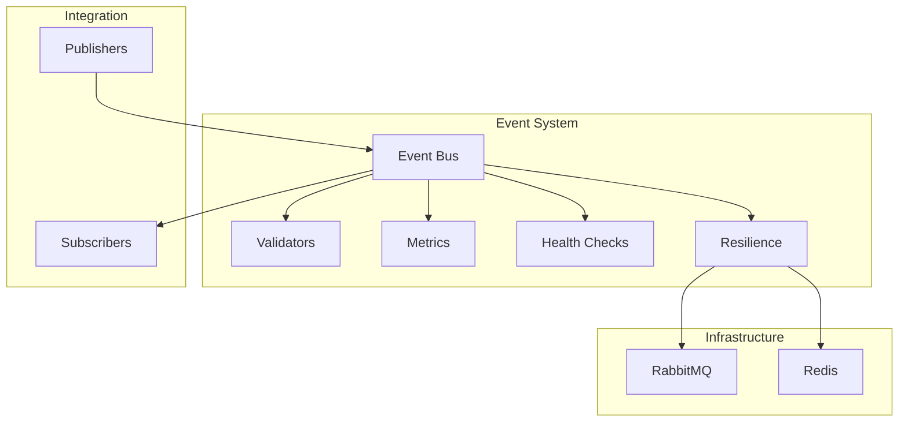
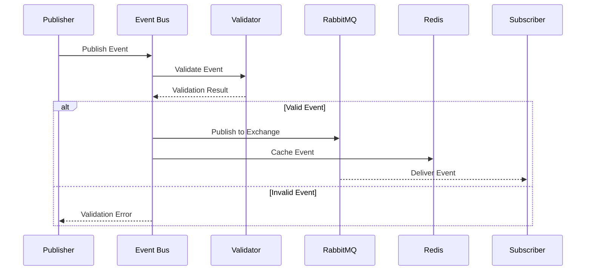

# Events Library Documentation

## Overview

The events library provides a robust, functional event system for building event-driven architectures. This documentation covers the complete implementation details and core functionality. For integration patterns and examples, see the [Events Integration Guide](../../docs/events-integration.md).

## Architecture

### System Architecture



### Event Flow



This document provides a comprehensive overview of all functions and utilities exported from the events library. For type definitions and interfaces, please refer to the [Types Documentation](../../types/docs/types.md#event-system-types).

## Table of Contents

- [Event Bus Core](#event-bus-core)
  - [Initialization Functions](#initialization-functions)
  - [Event Operations](#event-operations)
  - [Cache Operations](#cache-operations)
  - [Cleanup Functions](#cleanup-functions)
- [Event Bus Factory](#event-bus-factory)
- [Event Validation](#event-validation)
- [Metrics and Monitoring](#metrics-and-monitoring)
  - [Core Metrics](#core-metrics)
  - [Queue Metrics](#queue-metrics)
  - [Cache Metrics](#cache-metrics)
  - [Metric Utilities](#metric-utilities)
- [Health Monitoring](#health-monitoring)
  - [Component Checks](#component-checks)
  - [System Health](#system-health)
- [Resilience Features](#resilience-features)
  - [Circuit Breaker](#circuit-breaker)
  - [Redis Connection Pool](#redis-connection-pool)
  - [Batch Processing](#batch-processing)

## Event Bus Core

Located in `src/event-bus.ts`, this module provides the core event bus functionality.

### Initialization Functions

- `initializeRabbitMQ(config: EventBusConfig, logger: Logger): TaskEither<Error, { connection: Connection; channel: Channel }>`

  - Initializes RabbitMQ connection and sets up exchanges
  - Creates topic exchanges for main events and dead letters
  - For config type definition, see [EventBusConfig](../../types/docs/types.md#event-bus-configuration)
  - For logger interface, see [Logger Interface](../../logger/docs/logger.md#logger-interface)

- `initializeRedis(config: EventBusConfig): TaskEither<Error, Redis>`

  - Initializes Redis connection for caching
  - Uses IoRedis client for better performance
  - For config type definition, see [EventBusConfig](../../types/docs/types.md#event-bus-configuration)

- `createEventBusState(config: EventBusConfig, logger: Logger): EventBusInternalState`
  - Creates initial event bus state
  - Initializes empty handlers map
  - For state type definition, see [EventBusState](../../types/docs/types.md#event-bus-state)

### Event Operations

- `publish(state: EventBusInternalState) => <T>(event: Event<T>, options?: PublishOptions): TaskEither<Error, void>`

  - Publishes events to RabbitMQ with optional caching
  - Supports message persistence and priority
  - Automatically adds metadata (source, timestamp)
  - For event type definition, see [Event Interface](../../types/docs/types.md#core-event-types)
  - For options, see [PublishOptions](../../types/docs/types.md#event-bus-configuration)

- `subscribe(state: EventBusInternalState) => <T>(eventType: string, handler: EventHandler<T>, options?: SubscribeOptions): TaskEither<Error, void>`

  - Subscribes to events with configurable options
  - Supports dead letter queues
  - Can use cached events for initial state
  - For handler type, see [EventHandler](../../types/docs/types.md#core-event-types)
  - For options, see [SubscribeOptions](../../types/docs/types.md#event-bus-configuration)

- `unsubscribe(state: EventBusInternalState) => (eventType: string): TaskEither<Error, void>`
  - Removes event subscriptions
  - Cleans up queues and bindings

### Cache Operations

- `cacheLastKnownEvent(redis: Redis, keyPrefix: string, eventTTL: number) => <T>(event: Event<T>): TaskEither<Error, void>`

  - Caches the most recent event of each type
  - Uses Redis with configurable TTL
  - For event type definition, see [Event Interface](../../types/docs/types.md#core-event-types)

- `getLastKnownEvent(redis: Redis, keyPrefix: string) => <T>(eventType: string): TaskEither<Error, Option<Event<T>>>`
  - Retrieves the last known event from cache
  - Returns Option type for safe handling

### Cleanup Functions

- `close(state: EventBusInternalState): TaskEither<Error, void>`
  - Gracefully closes all connections
  - Cleans up RabbitMQ and Redis clients

## Event Bus Factory

Located in `src/factory.ts`, provides a convenient way to create an event bus instance.

### Types

- `EventBusOperations`
  ```typescript
  type EventBusOperations = {
    publish: ReturnType<typeof publish>;
    subscribe: ReturnType<typeof subscribe>;
    unsubscribe: ReturnType<typeof unsubscribe>;
    close: typeof close;
  };
  ```

### Functions

- `createEventBus(config: EventBusConfig): TaskEither<Error, EventBusOperations>`
  - Creates a fully configured event bus instance
  - Sets up logging with service name
  - Returns an [EventBus](../../types/docs/types.md#event-bus-state) interface
  - For config options, see [EventBusConfig](../../types/docs/types.md#event-bus-configuration)

## Event Validation

Located in `src/validation.ts`, provides event validation using Zod schemas.

### Schemas

- Base metadata schema
- Base event schema
- Event-specific schemas for:
  - User events (created, updated, deleted)
  - Authentication events (login, OTP)
  - KYC events (verified, rejected)
  - Employment events

### Functions

- `validateEvent<T>(event: Event<T>): TaskEither<ValidationError, Event<T>>`

  - Validates events against their respective schemas
  - Checks both base structure and event-specific data
  - For event types, see [Event Types](../../types/docs/types.md#core-event-types)
  - For validation errors, see [Error Types](../../types/docs/types.md#error-types)

- `validateEventType(type: string): TaskEither<ValidationError, EventType>`
  - Validates event type strings
  - For event types, see [Event Constants](../../types/docs/types.md#event-constants)

## Metrics and Monitoring

Located in `src/metrics.ts`, provides comprehensive metrics collection.

### Types

```typescript
interface MetricsState {
  eventProcessingTimes: Map<string, number[]>;
  eventCounts: Map<string, { success: number; error: number }>;
  queueSizes: Map<string, number>;
  deadLetterQueueSizes: Map<string, number>;
  cacheStats: Map<string, { hits: number; total: number }>;
}
```

### Core Metrics

- `recordProcessingTime(logger: Logger, eventType: string, service: string, startTime: number): void`

  - Records event processing duration
  - Calculates duration in seconds
  - For logger interface, see [Logger Interface](../../logger/docs/logger.md#logger-interface)

- `incrementEventCounter(logger: Logger, eventType: string, service: string, status: 'success' | 'error'): void`
  - Tracks successful and failed event processing
  - Maintains separate counters by event type

### Queue Metrics

- `updateQueueSize(logger: Logger, queueName: string, size: number): void`

  - Updates queue size metrics
  - Tracks message backlog

- `updateDeadLetterQueueSize(logger: Logger, queueName: string, size: number): void`
  - Tracks dead letter queue sizes
  - Monitors failed message handling

### Cache Metrics

- `updateCacheHitRatio(logger: Logger, service: string, hits: number, total: number): void`
  - Records cache performance metrics
  - Calculates hit ratio percentage

### Metric Utilities

- `getMetricsSummary(logger: Logger): Record<string, any>`

  - Retrieves current metrics summary
  - Includes processing times, counts, queue sizes
  - Returns formatted metrics object

- `resetMetrics(): void`

  - Resets all metrics to initial state
  - Clears all counters and timers

- `withMetrics<T>(logger: Logger, event: Event<T>, service: string, processor: Function): Promise<void>`
  - Higher-order function to wrap event processing with metrics
  - Automatically records timing and success/failure

## Health Monitoring

Located in `src/health.ts`, provides health checking capabilities.

### Types

```typescript
interface HealthStatus {
  status: 'healthy' | 'unhealthy';
  details: {
    rabbitmq: {
      connected: boolean;
      exchangeAvailable: boolean;
      queues: Array<{
        name: string;
        available: boolean;
        messageCount: number;
      }>;
    };
    redis: {
      connected: boolean;
      latency: number;
      memoryUsage: {
        used: number;
        peak: number;
        fragmentationRatio: number;
      };
    };
  };
  timestamp: string;
}
```

### Component Checks

- `checkRabbitMQ(channel: Channel, connection: Connection, exchangeName: string): TaskEither<Error, ComponentHealth>`

  - Checks RabbitMQ connection and exchange health
  - Verifies queue availability
  - For health types, see [Health Types](../../types/docs/types.md#health-types)

- `checkRedis(client: Redis): TaskEither<Error, ComponentHealth>`
  - Checks Redis connection and memory usage
  - Measures latency
  - Monitors memory fragmentation

### System Health

- `checkHealth(state: EventBusInternalState): TaskEither<Error, SystemHealth>`
  - Performs complete health check of the event system
  - Combines RabbitMQ and Redis health status
  - For health status types, see [Health Types](../../types/docs/types.md#health-types)

## Resilience Features

Located in `libs/common/src/resilience/`, these features provide robust error handling and performance optimizations using functional programming patterns.

### Circuit Breaker

Located in `circuit-breaker.ts`, provides fault tolerance for external service calls using pure functions.

#### Configuration

```typescript
interface CircuitBreakerOptions {
  timeout: number; // Operation timeout in ms
  errorThreshold: number; // Number of failures before opening
  resetTimeout: number; // Time before attempting reset
  monitorInterval?: number; // Health check interval
}
```

#### Usage Example

```typescript
const circuitBreaker = createCircuitBreaker(
  {
    timeout: 5000,
    errorThreshold: 5,
    resetTimeout: 30000,
  },
  logger
);

// Wrap operations
const result = await circuitBreaker.wrap(async () => {
  return await someOperation();
})();
```

### Redis Connection Pool

Located in `redis-pool.ts`, provides functional connection pooling and load balancing for Redis.

#### Configuration

```typescript
interface RedisPoolOptions {
  nodes: Array<{ host: string; port: number }>;
  maxConnections: number;
  minConnections?: number;
  acquireTimeout?: number;
  idleTimeout?: number;
}
```

#### Usage Example

```typescript
const pool = createRedisPool(
  {
    nodes: [
      { host: 'redis-1', port: 6379 },
      { host: 'redis-2', port: 6379 },
    ],
    maxConnections: 10,
    minConnections: 2,
  },
  logger
);

await pool.init();

// Use with automatic release
await pool.withClient(async (client) => {
  return await client.get('key');
});
```

### Batch Processing

Located in `batch-processor.ts`, provides functional message batching for RabbitMQ operations.

#### Configuration

```typescript
interface BatchProcessorOptions {
  batchSize: number; // Messages per batch
  flushInterval: number; // Flush interval in ms
  maxRetries?: number; // Max retry attempts
  retryDelay?: number; // Base retry delay in ms
}
```

#### Usage Example

```typescript
const batchProcessor = createBatchProcessor(
  {
    batchSize: 100,
    flushInterval: 1000,
    maxRetries: 3,
  },
  channel,
  logger
);

// Add messages to batch
await batchProcessor.add({
  exchange: 'my-exchange',
  routingKey: 'my-key',
  content: myMessage,
});
```

### Functional Programming Patterns

The resilience features use several functional programming patterns:

1. **Pure Functions**:

   - All core operations are implemented as pure functions
   - State is explicitly passed and returned
   - Side effects are isolated and managed

2. **TaskEither for Error Handling**:

   - Operations that can fail return `TaskEither`
   - Errors are handled in a type-safe way
   - Composition using `pipe` and `chain`

3. **Option for Nullable Values**:
   - Optional values are wrapped in `Option`
   - Safe handling of undefined/null
   - Composition with other fp-ts types

Example of functional composition:

```typescript
const performOperation = <T>(operation: () => Promise<T>) =>
  pipe(
    TE.tryCatch(() => operation(), E.toError),
    TE.chain((result) =>
      pipe(
        circuitBreaker.wrap(() => Promise.resolve(result)),
        TE.chain((value) =>
          pipe(
            pool.withClient((client) =>
              batchProcessor.add({
                exchange: 'results',
                routingKey: 'processed',
                content: value,
              })
            ),
            TE.map(() => result)
          )
        )
      )
    )
  );
```

### Integration with Event Bus

The resilience features are integrated into the event bus system using functional patterns:

1. **Circuit Breaker**:

   ```typescript
   const protectedPublish = pipe(
     createCircuitBreaker(options, logger),
     (breaker) => (event: Event<T>) => breaker.wrap(() => publish(event))
   );
   ```

2. **Redis Pool**:

   ```typescript
   const cachedOperation = pipe(
     createRedisPool(options, logger),
     (pool) =>
       <T>(key: string, operation: () => Promise<T>) =>
         pool.withClient((client) =>
           pipe(
             TE.tryCatch(() => client.get(key), E.toError),
             TE.chain((cached) => (cached ? TE.right(JSON.parse(cached)) : operation()))
           )
         )
   );
   ```

3. **Batch Processing**:
   ```typescript
   const batchedPublish = pipe(
     createBatchProcessor(options, channel, logger),
     (processor) =>
       <T>(events: Event<T>[]) =>
         pipe(
           events,
           A.traverse(TE.ApplicativePar)((event) =>
             processor.add({
               exchange: config.exchange,
               routingKey: event.type,
               content: event,
             })
           )
         )
   );
   ```

### Best Practices

1. **Pure Functions**:

   - Keep functions pure and predictable
   - Pass state explicitly
   - Return new state instead of mutating

2. **Error Handling**:

   - Use `TaskEither` for operations that can fail
   - Compose error handlers with `pipe`
   - Provide meaningful error context

3. **State Management**:
   - Manage state immutably
   - Use functional updates
   - Track state transitions explicitly

### Monitoring

All resilience features include functional monitoring:

1. **Metrics Collection**:

   ```typescript
   const collectMetrics = <T>(operation: () => Promise<T>) =>
     pipe(
       TE.Do,
       TE.bind('startTime', () => TE.right(Date.now())),
       TE.bind('result', () => TE.tryCatch(operation, E.toError)),
       TE.chain(({ startTime, result }) =>
         pipe(
           recordMetric({
             duration: Date.now() - startTime,
             success: true,
           }),
           TE.map(() => result)
         )
       )
     );
   ```

2. **Error Tracking**:
   ```typescript
   const trackErrors = <T>(operation: () => Promise<T>) =>
     pipe(
       operation,
       TE.mapLeft((error) =>
         pipe(
           recordError(error),
           TE.map(() => error)
         )
       )
     );
   ```

For more information about monitoring, see the [Metrics and Monitoring](#metrics-and-monitoring) section.

## Event Schema Management

### Core Schemas

```typescript
import { z } from 'zod';

const eventSchemas = {
  USER_CREATED: z.object({
    id: z.string(),
    email: z.string().email(),
    role: z.enum(['STUDENT', 'TEACHER', 'ADMIN']),
  }),

  GRADE_UPDATED: z.object({
    studentId: z.string(),
    courseId: z.string(),
    grade: z.number().min(0).max(100),
  }),
} as const;

type EventSchemas = typeof eventSchemas;
type EventTypes = keyof EventSchemas;
type EventData<T extends EventTypes> = z.infer<EventSchemas[T]>;
```

### Error Categories

```typescript
const EventErrorTypes = {
  VALIDATION_ERROR: 'EVENT_VALIDATION_ERROR',
  PROCESSING_ERROR: 'EVENT_PROCESSING_ERROR',
  PUBLISH_ERROR: 'EVENT_PUBLISH_ERROR',
  SUBSCRIPTION_ERROR: 'EVENT_SUBSCRIPTION_ERROR',
} as const;

type EventErrorType = (typeof EventErrorTypes)[keyof typeof EventErrorTypes];
```

## Advanced Features

### Dead Letter Queue Management

```typescript
const moveToDeadLetterQueue = async (event: Event<unknown>, error: Error): Promise<void> => {
  const deadLetterEvent = {
    ...event,
    metadata: {
      ...event.metadata,
      error: {
        message: error.message,
        stack: error.stack,
      },
      retryCount: (event.metadata?.retryCount || 0) + 1,
      lastAttempt: new Date().toISOString(),
    },
  };

  await channel.publish(
    config.deadLetterExchange,
    event.type,
    Buffer.from(JSON.stringify(deadLetterEvent))
  );
};
```

### Retry Mechanism

```typescript
const withRetry = <T>(
  operation: () => TE.TaskEither<Error, T>,
  retryCount: number = 3,
  delay: number = 1000
): TE.TaskEither<Error, T> => {
  const retry = (remainingAttempts: number, lastError: Error): TE.TaskEither<Error, T> =>
    remainingAttempts <= 0
      ? TE.left(lastError)
      : pipe(
          TE.tryCatch(
            () => new Promise((resolve) => setTimeout(resolve, delay)),
            (error) => error as Error
          ),
          TE.chain(() => operation()),
          TE.orElse((error) => retry(remainingAttempts - 1, error as Error))
        );

  return pipe(
    operation(),
    TE.orElse((error) => retry(retryCount - 1, error as Error))
  );
};
```

## Related Documentation

- [Event Types](../../types/docs/types.md#event-system-types)
- [Logger Documentation](../../logger/docs/logger.md)
- [Error Handling](../../common/docs/error-handling.md)
- [Constants](../../constants/docs/constants.md)
