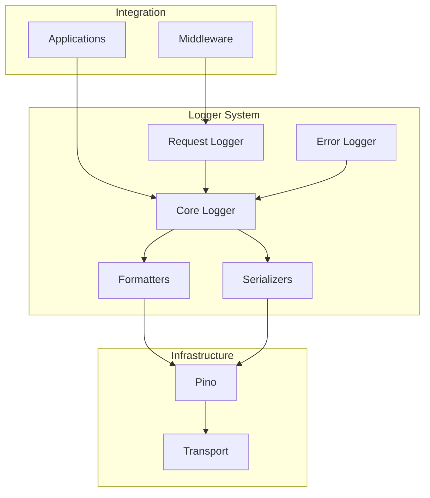
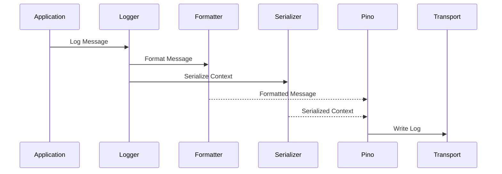

# Logger Library Documentation

## Overview
The logger library provides a robust, functional logging system built on top of Pino. This documentation covers the complete implementation details and core functionality. For integration patterns and examples, see the [Logger Integration Guide](../../docs/logger-integration.md).

## Architecture

### System Architecture


### Logging Flow


This document provides a comprehensive overview of all functions and utilities exported from the logger library. For type definitions and interfaces, please refer to the [Types Documentation](../../types/docs/types.md#logger-types).

## Table of Contents
- [Core Logger](#core-logger)
  - [Main Functions](#main-functions)
  - [Internal Utilities](#internal-utilities)
- [Request Logger](#request-logger)
  - [Main Functions](#request-logger-functions)
  - [Internal Utilities](#request-logger-utilities)
- [Error Logger](#error-logger)
  - [Main Functions](#error-logger-functions)
  - [Internal Utilities](#error-logger-utilities)
- [Implementation Details](#implementation-details)

## Core Logger

Located in `src/base.ts`, provides the foundation for all logging functionality.

### Main Functions

- `createLogger(options: LoggerOptions): Logger`
  - Creates a new logger instance with the given options
  - Parameters:
    - `options`: See [LoggerOptions](../../types/docs/types.md#logger-types)
  - Returns: [Logger](../../types/docs/types.md#logger-types) instance
  - Features:
    - Configurable log levels
    - Environment-aware logging
    - Automatic timestamp addition
    - Field redaction for sensitive data
    - Child logger creation

### Internal Utilities

- `createPinoLogger(options: LoggerOptions): pino.Logger`
  - Internal function to create a Pino logger instance
  - Configures serializers, timestamps, and base context
  - Used by: `createLogger`

- `createLogFunction(pinoLogger: pino.Logger, baseContext: LogContext, level: LogLevel): LogFn`
  - Creates a log function for a specific level
  - Used by: `createLogger`
  - For log levels, see [LogLevel](../../types/docs/types.md#logger-types)

## Request Logger

Located in `src/request.ts`, provides HTTP request logging middleware.

### Request Logger Functions

- `createRequestLogger(logger: Logger): RequestLogger`
  - Creates request logging middleware for Fastify
  - Parameters:
    - `logger`: [Logger](../../types/docs/types.md#logger-types) instance
  - Returns: Fastify middleware function
  - Features:
    - Automatic request/response logging
    - Correlation ID tracking
    - Response time measurement
    - Request context preservation

### Request Logger Utilities

- `extractRequestInfo(request: FastifyRequest): LogContext`
  - Extracts relevant information from request object
  - Used by: `createRequestLogger`
  - Returns: [RequestContext](../../types/docs/types.md#logger-types)

- `extractResponseInfo(reply: FastifyReply): LogContext`
  - Extracts relevant information from response object
  - Used by: `createRequestLogger`
  - Returns response information in [LogContext](../../types/docs/types.md#logger-types) format

## Error Logger

Located in `src/error.ts`, provides error logging utilities.

### Error Logger Functions

- `createErrorLogger(logger: Logger): ErrorLogger`
  - Creates an error logger with specialized methods
  - Parameters:
    - `logger`: [Logger](../../types/docs/types.md#logger-types) instance
  - Returns: Object with error logging methods:
    - `logError`: Logs error with full context
    - `logErrorAndReturn`: Logs error and returns it (for fp-ts pipes)
  - Features:
    - Structured error logging
    - Error stack preservation
    - Error metadata handling
    - fp-ts integration

### Error Logger Utilities

- `extractErrorDetails(error: AppError): ErrorContext`
  - Extracts error details for logging
  - Used by: `createErrorLogger`
  - Returns: [ErrorContext](../../types/docs/types.md#logger-types)

## Implementation Details

The logger library is built on top of Pino and integrates with fp-ts for functional programming patterns. It provides:

- Type-safe logging through TypeScript
- Structured logging with JSON output
- Performance optimized through Pino
- Functional programming support via fp-ts
- Automatic context propagation
- Request/Response correlation
- Error handling utilities

For implementation details about the logger types and interfaces, please refer to:
- [Logger Types Documentation](../../types/docs/types.md#logger-types)
- [Error Types](../../types/docs/types.md#error-types)

## Type Exports

The library re-exports all types from `@eduflow/types`. For type definitions, see:
- [Logger Types](../../types/docs/types.md#logger-types)
- [Error Types](../../types/docs/types.md#error-types)
- [Context Types](../../types/docs/types.md#context-types)

## Related Documentation
- [Types Library](../../types/docs/types.md)
- [Error Handling](../../common/docs/error-handling.md)
- [Events Integration](../events/docs/events.md)

## Context Management

### Context Types
```typescript
type ServiceContext = 'api' | 'database' | 'cache' | 'queue' | 'auth' | 'file' | 'integration';

interface BaseContext {
  service: string;
  environment: string;
  version?: string;
}

interface OperationContext extends BaseContext {
  operation: string;
  duration?: number;
  result: 'success' | 'failure';
}

interface RequestContext extends BaseContext {
  requestId: string;
  method: string;
  path: string;
  statusCode?: number;
  duration?: number;
}

interface ErrorContext extends BaseContext {
  code: ErrorCode;
  message: string;
  statusCode: number;
  metadata?: ErrorMetadata;
  stack?: string;
}
```

### Context Propagation
```typescript
const createContextLogger = (baseContext: BaseContext) => {
  const logger = createLogger(baseContext);
  
  return {
    withContext: <T>(context: Partial<BaseContext>, operation: () => Promise<T>) =>
      pipe(
        TE.tryCatch(
          () => operation(),
          (error) => error as Error
        ),
        TE.tap((result) =>
          TE.right(
            logger.child(context).info('Operation completed', { result })
          )
        )
      )
  };
};
```

## Performance Guidelines

### Logging Levels
```typescript
enum LogLevel {
  ERROR = 'error',
  WARN = 'warn',
  INFO = 'info',
  DEBUG = 'debug',
  TRACE = 'trace'
}

const isEnabled = (level: LogLevel): boolean => {
  const currentLevel = process.env.LOG_LEVEL || 'info';
  const levels = {
    error: 0,
    warn: 1,
    info: 2,
    debug: 3,
    trace: 4
  };
  return levels[level] <= levels[currentLevel as keyof typeof levels];
};
```

### Performance Optimizations
```typescript
// Lazy evaluation of expensive operations
const logWithPerformance = (logger: Logger) => ({
  debug: (message: string, expensiveContext: () => object) => {
    if (isEnabled('debug')) {
      logger.debug(message, expensiveContext());
    }
  }
});

// Reusable child loggers
const createServiceLogger = (service: string) => {
  const baseLogger = createLogger({ service });
  const childLoggers = new Map<string, Logger>();

  return {
    forContext: (context: string): Logger => {
      if (!childLoggers.has(context)) {
        childLoggers.set(
          context,
          baseLogger.child({ context })
        );
      }
      return childLoggers.get(context)!;
    }
  };
};
```

## Security Guidelines

### Sensitive Data Handling
```typescript
const sensitiveFields = ['password', 'token', 'key', 'secret'];

const redactSensitiveData = (data: object): object =>
  Object.entries(data).reduce(
    (acc, [key, value]) => ({
      ...acc,
      [key]: sensitiveFields.includes(key.toLowerCase())
        ? '[REDACTED]'
        : value
    }),
    {}
  );

const createSecureLogger = (logger: Logger): Logger => ({
  ...logger,
  info: (message: string, context?: object) =>
    logger.info(message, context ? redactSensitiveData(context) : undefined)
  // ... implement for other levels
});
```

### Sanitization
```typescript
const sanitizeError = (error: Error): ErrorContext => ({
  message: error.message,
  stack: process.env.NODE_ENV === 'production'
    ? undefined
    : error.stack,
  code: isAppError(error) ? error.code : 'UNKNOWN_ERROR',
  statusCode: isAppError(error) ? error.statusCode : 500
});
```
