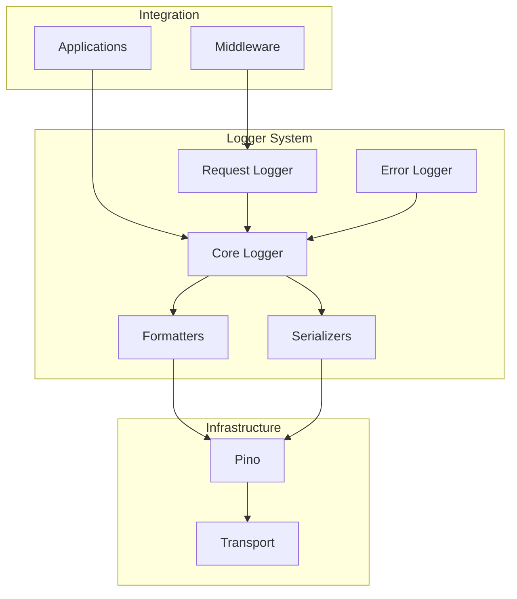
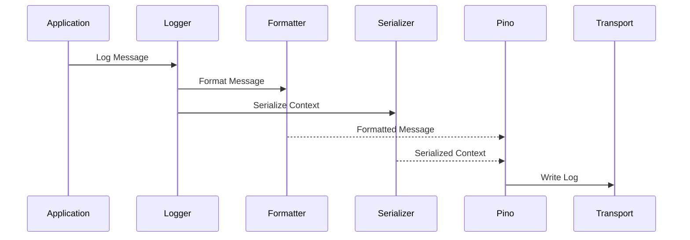

# Logger Library Documentation

## Overview
The logger library provides a robust, standardized logging system built on top of Pino. This documentation covers the implementation details and core functionality. For integration patterns and examples, see the [Logger Usage Guide](../../apps/docs/logger-usage.md).

## Architecture

### System Architecture


### Logging Flow


## Core Components

### 1. Core Logger (`src/index.ts`)

The core logger provides the foundation for all logging functionality:

```typescript
const logger = createLogger({
  service: 'my-service',
  environment: 'production',
  minLevel: 'info',
  redactPaths: ['password', 'token']
});
```

#### Features
- Type-safe logging methods (trace, debug, info, warn, error, fatal)
- Automatic timestamp and service context
- Configurable log levels
- Sensitive data redaction
- Child logger creation
- JSON structured output

### 2. Request Logger (`src/request.ts`)

Specialized logger for HTTP request handling:

```typescript
const requestLogger = createRequestLogger(logger);
app.addHook('onRequest', createRequestLoggingMiddleware(logger));
```

#### Features
- Automatic request/response logging
- Duration tracking
- Status code-based log levels
- Correlation ID tracking
- Request context preservation

### 3. Error Logger (`src/error.ts`)

Specialized logger for error handling:

```typescript
const errorLogger = createErrorLogger(logger);
errorLogger.logError(error, { userId: '123' });
```

#### Features
- Structured error logging
- Stack trace preservation
- Error context handling
- Error return utilities
- Type-safe error handling

## Type System

### Core Types

```typescript
interface LoggerOptions {
  service: string;
  environment?: string;
  minLevel?: LogLevel;
  redactPaths?: string[];
}

interface Logger {
  trace: LogFn;
  debug: LogFn;
  info: LogFn;
  warn: LogFn;
  error: LogFn;
  fatal: LogFn;
  child: (bindings: Record<string, unknown>) => Logger;
}
```

### Context Types

```typescript
interface BaseContext {
  service: string;
  environment: string;
  timestamp?: string;
  correlationId?: string;
}

interface RequestContext extends BaseContext {
  path: string;
  method: string;
  userAgent?: string;
  ip?: string;
  userId?: string;
  sessionId?: string;
  duration?: number;
  statusCode?: number;
}

interface ErrorContext extends BaseContext {
  code: ErrorCode;
  message: string;
  statusCode: number;
  metadata?: ErrorMetadata;
  stack?: string;
}
```

## Best Practices

### 1. Logger Creation
```typescript
// Create a single logger instance per service
const logger = createLogger({
  service: 'api-service',
  environment: process.env.NODE_ENV,
  minLevel: process.env.LOG_LEVEL || 'info',
  redactPaths: ['password', 'token']
});
```

### 2. Context Usage
```typescript
// Add context through child loggers
const requestLogger = logger.child({
  correlationId: request.id,
  userId: request.user?.id
});

// Log with additional context
requestLogger.info('Operation completed', {
  duration: 123,
  result: 'success'
});
```

### 3. Error Handling
```typescript
const errorLogger = createErrorLogger(logger);

try {
  // ... operation
} catch (error) {
  errorLogger.logError(error, {
    operation: 'user_creation',
    userId: user.id
  });
}
```

### 4. Request Handling
```typescript
const requestLogger = createRequestLogger(logger);

app.addHook('onRequest', createRequestLoggingMiddleware(logger));

// Additional request context
app.addHook('preHandler', (request, reply, done) => {
  request.log = requestLogger.child({
    userId: request.user?.id,
    sessionId: request.session?.id
  });
  done();
});
```

## Performance Considerations

1. **Log Level Checks**
   - Log levels are checked at the Pino level
   - No performance impact from disabled levels
   - Use appropriate log levels for different environments

2. **Child Loggers**
   - Child loggers are lightweight
   - Reuse child loggers when possible
   - Context is efficiently merged

3. **Serialization**
   - JSON serialization is handled by Pino
   - Custom serializers for specific types
   - Efficient error serialization

## Security Guidelines

1. **Sensitive Data**
   - Use redactPaths for sensitive fields
   - Never log credentials or tokens
   - Sanitize error messages

2. **Production Settings**
   - Limit stack traces in production
   - Use appropriate log levels
   - Implement proper log shipping

3. **Context Validation**
   - Validate log context data
   - Sanitize user input
   - Limit context object size

## Related Documentation
- [Logger Usage Guide](../../apps/docs/logger-usage.md)
- [Types Documentation](../../types/docs/types.md)
- [Error Handling](../../common/docs/error-handling.md)
