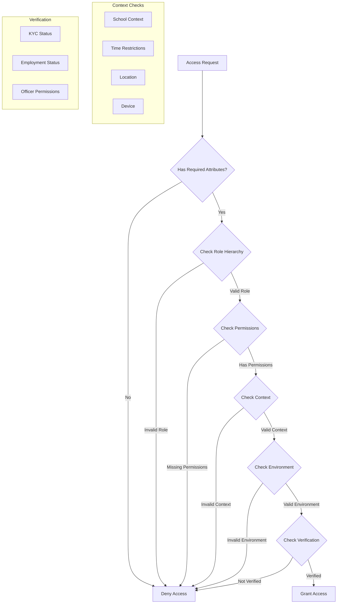

# ABAC Flow and Implementation Guide

## Flow Diagram



## Implementation Steps

1. **Attribute Collection**

```typescript
const collectUserAttributes = async (userId: string): Promise<UserAttributes> => {
  const user = await getUser(userId);
  const kyc = await getKYCStatus(userId);
  const employment = await getEmploymentStatus(userId);
  const context = await getUserContext(userId);

  return {
    id: user.id,
    email: user.email,
    status: user.status,
    globalRoles: user.roles,
    schoolRoles: user.schoolRoles,
    kyc,
    employment,
    access: user.access,
    context,
  };
};
```

2. **Role Hierarchy Check**

```typescript
const checkRoleHierarchy = (userRoles: Role[], requiredRoles: Role[]): boolean => {
  return requiredRoles.some((required) =>
    userRoles.some(
      (userRole) => ROLE_HIERARCHY[userRole].includes(required) || userRole === required
    )
  );
};
```

3. **Permission Check**

```typescript
const checkPermissions = (userRoles: Role[], requiredPermissions: Permission[]): boolean => {
  const userPermissions = userRoles.flatMap((role) => ROLE_PERMISSIONS[role]);
  return requiredPermissions.every((permission) => userPermissions.includes(permission));
};
```

4. **Context Validation**

```typescript
const validateContext = (context: UserContext, conditions: PolicyConditions): ValidationResult => {
  // School context
  if (
    conditions.school?.mustBeCurrentSchool &&
    context.currentSchoolId !== conditions.school.requiredSchoolId
  ) {
    return { granted: false, reason: 'Invalid school context' };
  }

  // Time restrictions
  if (conditions.environment?.timeRestrictions) {
    const { allowedDays, allowedHours, timezone } = conditions.environment.timeRestrictions;
    if (!isWithinAllowedTime(allowedDays, allowedHours, timezone)) {
      return { granted: false, reason: 'Outside allowed time' };
    }
  }

  return { granted: true };
};
```

5. **Environment Check**

```typescript
const checkEnvironment = (context: UserContext, conditions: PolicyConditions): ValidationResult => {
  const { environment } = conditions;

  // IP check
  if (environment?.ipRestrictions) {
    const { allowlist, denylist } = environment.ipRestrictions;
    if (!isIPAllowed(context.location?.ip, allowlist, denylist)) {
      return { granted: false, reason: 'IP not allowed' };
    }
  }

  // Device check
  if (environment?.deviceRestrictions?.requireTrusted && !isTrustedDevice(context.deviceInfo)) {
    return { granted: false, reason: 'Untrusted device' };
  }

  return { granted: true };
};
```

6. **Verification Check**

```typescript
const checkVerification = (
  attributes: UserAttributes,
  conditions: PolicyConditions
): ValidationResult => {
  const { verification } = conditions;

  if (verification?.requireKYC && !verification.kycStatus?.includes(attributes.kyc.status)) {
    return { granted: false, reason: 'KYC verification required' };
  }

  if (
    verification?.employmentStatus &&
    !verification.employmentStatus.includes(attributes.employment.status)
  ) {
    return { granted: false, reason: 'Employment verification required' };
  }

  return { granted: true };
};
```

7. **Main ABAC Evaluation**

```typescript
const evaluateAccess = async (userId: string, policy: AccessPolicy): Promise<ValidationResult> => {
  // Collect attributes
  const attributes = await collectUserAttributes(userId);

  // Check role hierarchy
  if (
    policy.conditions.anyOf?.roles &&
    !checkRoleHierarchy(attributes.globalRoles, policy.conditions.anyOf.roles)
  ) {
    return { granted: false, reason: 'Insufficient role' };
  }

  // Check permissions
  if (
    policy.conditions.allOf?.permissions &&
    !checkPermissions(attributes.globalRoles, policy.conditions.allOf.permissions)
  ) {
    return { granted: false, reason: 'Missing required permissions' };
  }

  // Check context
  const contextResult = validateContext(attributes.context, policy.conditions);
  if (!contextResult.granted) return contextResult;

  // Check environment
  const envResult = checkEnvironment(attributes.context, policy.conditions);
  if (!envResult.granted) return envResult;

  // Check verification
  const verificationResult = checkVerification(attributes, policy.conditions);
  if (!verificationResult.granted) return verificationResult;

  // Run custom evaluators
  if (policy.conditions.custom) {
    for (const { evaluator, errorMessage } of policy.conditions.custom) {
      if (!evaluator(attributes, policy.conditions)) {
        return { granted: false, reason: errorMessage };
      }
    }
  }

  return { granted: true };
};
```

## Usage Example

```typescript
const policy: AccessPolicy = {
  resource: 'school.finances',
  action: 'READ',
  conditions: {
    anyOf: {
      roles: ['SCHOOL_OWNER', 'ACCOUNTANT'],
    },
    allOf: {
      permissions: [Permission.VIEW_PAYMENTS],
    },
    verification: {
      requireKYC: true,
      kycStatus: ['VERIFIED'],
    },
    school: {
      mustBeCurrentSchool: true,
    },
    environment: {
      timeRestrictions: {
        allowedDays: ['MONDAY', 'TUESDAY', 'WEDNESDAY', 'THURSDAY', 'FRIDAY'],
        allowedHours: ['09:00-17:00'],
        timezone: 'UTC',
      },
    },
  },
};

const result = await evaluateAccess('user123', policy);
if (result.granted) {
  // Proceed with access
} else {
  // Handle denial with reason
  console.log(`Access denied: ${result.reason}`);
}
```
