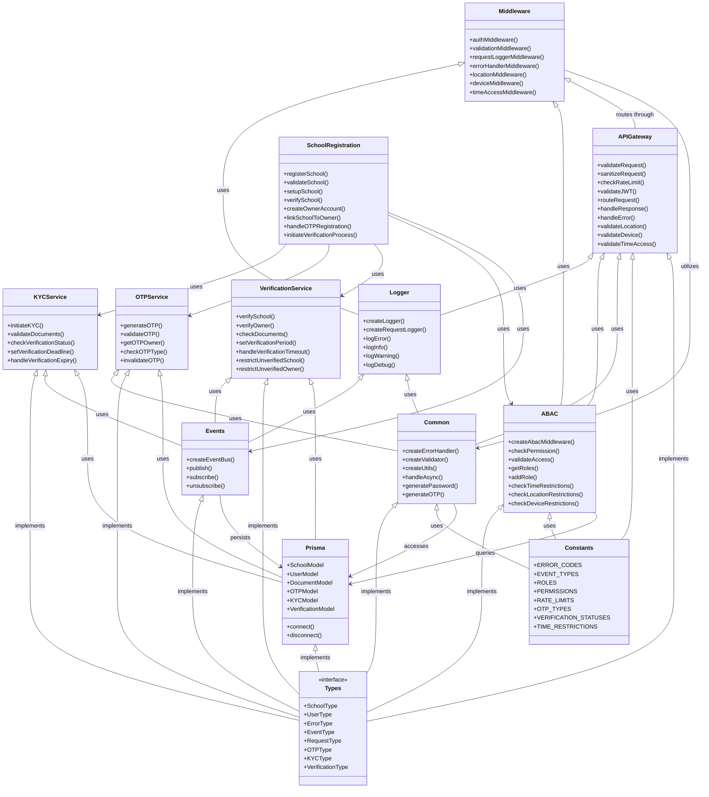
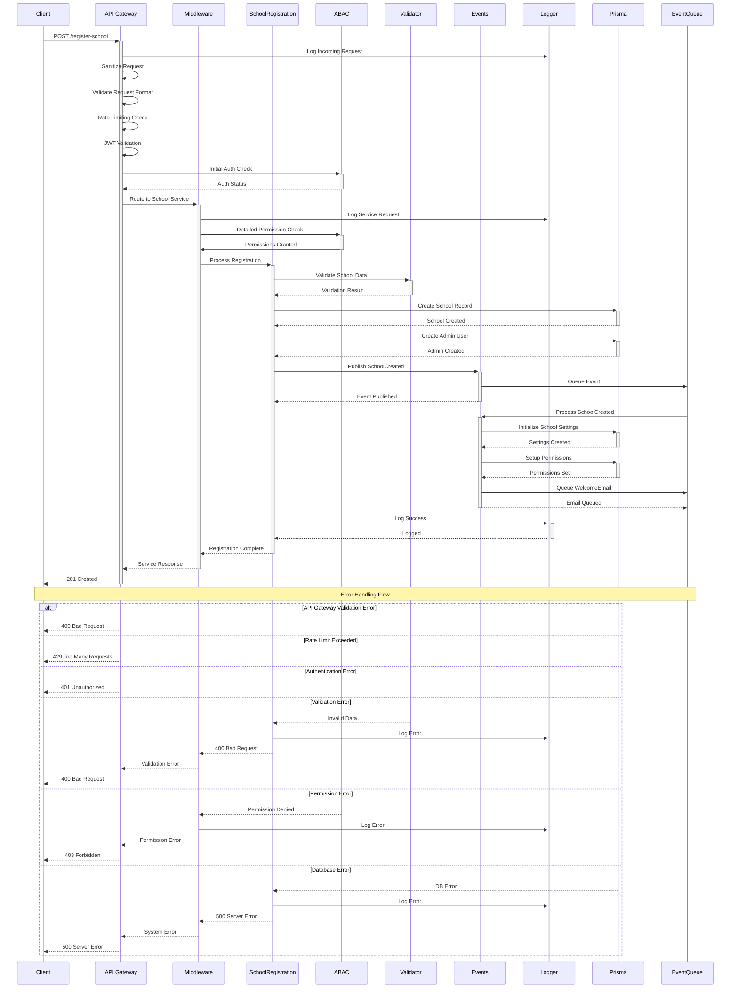
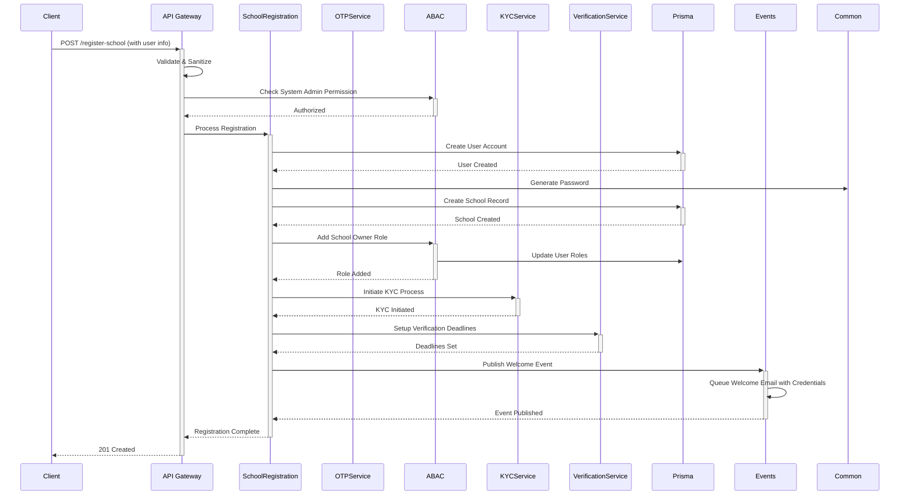
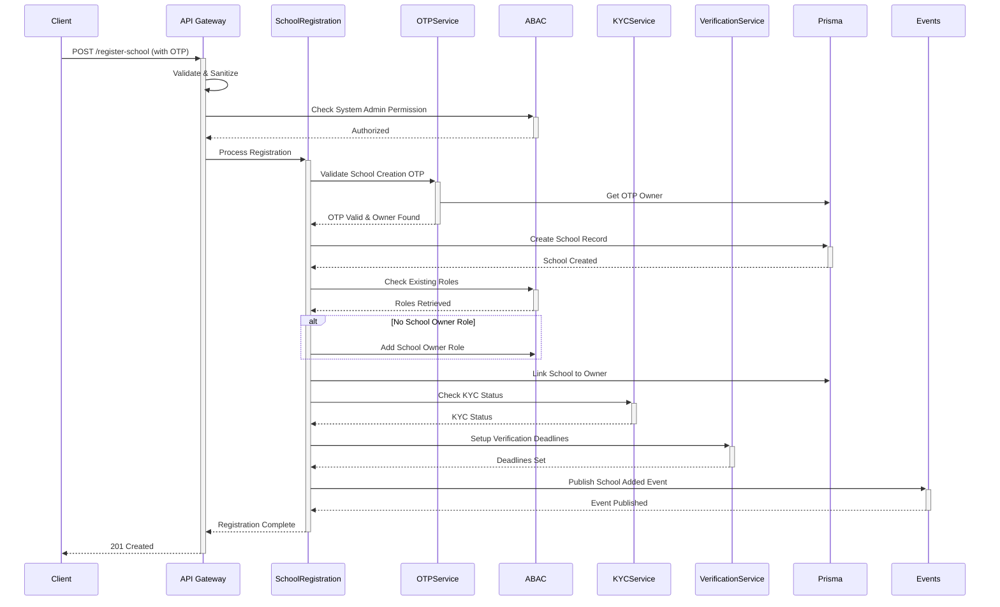

# School Registration System Components

## System Architecture Class Diagram

## System Components Description

### Core Libraries
1. **Logger**
   - Comprehensive logging system
   - Request tracking
   - Error logging
   - Performance monitoring

2. **Common**
   - Error handling utilities
   - Validation helpers
   - Async operation handlers
   - Shared utilities

3. **Events**
   - Event bus implementation
   - Pub/sub system
   - Async communication
   - Event persistence

4. **Types**
   - TypeScript type definitions
   - Interface declarations
   - Type guards
   - Generic types

### Middleware Components
1. **Middleware**
   - Authentication
   - Request validation
   - Logging middleware
   - Error handling

2. **ABAC (Attribute-Based Access Control)**
   - Permission management
   - Role-based access
   - Access validation
   - Security controls

### Support Systems
1. **Constants**
   - System-wide enums
   - Error codes
   - Event types
   - Role definitions

2. **Prisma**
   - Database models
   - CRUD operations
   - Relationships
   - Data persistence

### Main Application
**SchoolRegistration**
- Implements core registration logic
- Uses all available systems
- Handles complete registration flow
- Manages school lifecycle

## Component Interactions

- **Logger** provides logging capabilities to all components
- **Events** enables async communication between components
- **Common** provides shared utilities across the system
- **Types** ensures type safety throughout the application
- **Middleware** handles cross-cutting concerns
- **ABAC** manages security and access control
- **Prisma** handles data persistence
- **Constants** provides system-wide constants and enums 

## Registration Process Sequence

## Sequence Flow Description

### 1. API Gateway Processing
- Request sanitization and format validation
- Rate limiting checks
- JWT validation
- Initial authentication
- Request routing

### 2. Initial Request Processing
- Middleware processing
- Detailed permission checks
- Service-level validation
- Request logging

### 3. Core Registration
- School record creation
- Admin user setup
- Initial settings configuration
- Permission setup

### 4. Event Processing
- School creation event
- Settings initialization
- Welcome email queuing
- Notification dispatching

### 5. Error Scenarios
- Validation errors
- Permission issues
- Database failures
- System errors

### 6. Logging & Monitoring
- Request logging
- Operation tracking
- Error logging
- Performance monitoring

### 7. Response Handling
- Success response
- Error responses
- Status updates
- Client notification 

## Registration Scenarios

### Scenario 1: New User Registration

### Scenario 2: Existing User Registration
