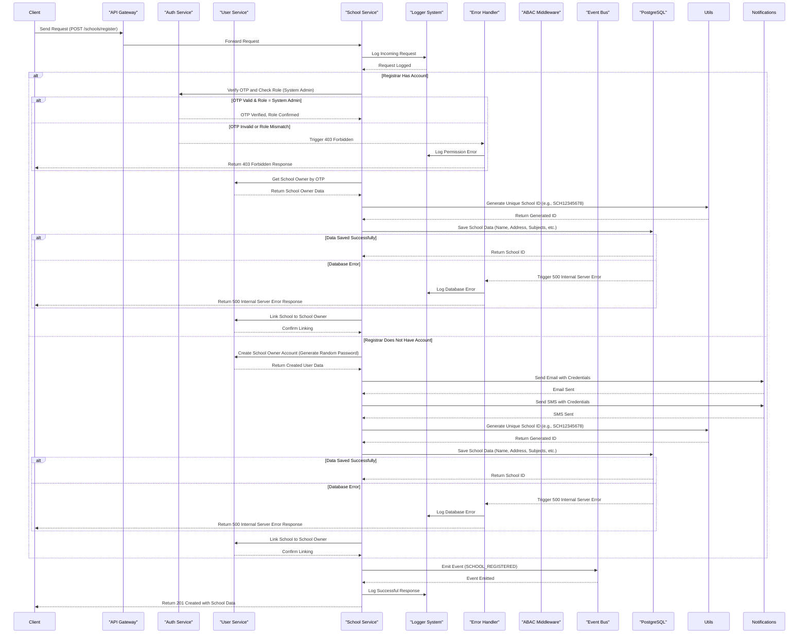

```mermaid
sequenceDiagram
    participant Client
    participant API_Gateway as "API Gateway"
    participant Auth_Service as "Auth Service"
    participant User_Service as "User Service"
    participant School_Service as "School Service"
    participant Logger_System as "Logger System"
    participant ErrorHandler as "Error Handler"
    participant ABAC_Middleware as "ABAC Middleware"
    participant Event_Bus as "Event Bus"
    participant Database as "PostgreSQL"

    %% Step 1: Client sends a request to register a school
    Client->>API_Gateway: Send Request (POST /schools/register)
    API_Gateway->>School_Service: Forward Request

    %% Step 2: Log incoming request
    School_Service->>Logger_System: Log Incoming Request
    Logger_System-->>School_Service: Request Logged

    %% Step 3: Determine if the registrar has an account
    alt Registrar Has Account
        %% Step 4: Validate OTP and user role
        School_Service->>Auth_Service: Verify OTP and Check Role (System Admin)
        alt OTP Valid & Role = System Admin
            Auth_Service-->>School_Service: OTP Verified, Role Confirmed
        else OTP Invalid or Role Mismatch
            Auth_Service-->>ErrorHandler: Trigger 403 Forbidden
            ErrorHandler->>Logger_System: Log Permission Error
            ErrorHandler-->>Client: Return 403 Forbidden Response
        end

        %% Step 5: Retrieve school owner from OTP
        School_Service->>User_Service: Get School Owner by OTP
        User_Service-->>School_Service: Return School Owner Data

        %% Step 6: Generate unique school ID
        School_Service->>Utils: Generate Unique School ID (e.g., SCH12345678)
        Utils-->>School_Service: Return Generated ID

        %% Step 7: Save school data to database
        School_Service->>Database: Save School Data (Name, Address, Subjects, etc.)
        alt Data Saved Successfully
            Database-->>School_Service: Return School ID
        else Database Error
            Database-->>ErrorHandler: Trigger 500 Internal Server Error
            ErrorHandler->>Logger_System: Log Database Error
            ErrorHandler-->>Client: Return 500 Internal Server Error Response
        end

        %% Step 8: Link school to school owner
        School_Service->>User_Service: Link School to School Owner
        User_Service-->>School_Service: Confirm Linking

    else Registrar Does Not Have Account
        %% Step 9: Create school owner account
        School_Service->>User_Service: Create School Owner Account (Generate Random Password)
        User_Service-->>School_Service: Return Created User Data

        %% Step 10: Send credentials to school owner
        School_Service->>Notifications: Send Email with Credentials
        Notifications-->>School_Service: Email Sent
        School_Service->>Notifications: Send SMS with Credentials
        Notifications-->>School_Service: SMS Sent

        %% Step 11: Generate unique school ID
        School_Service->>Utils: Generate Unique School ID (e.g., SCH12345678)
        Utils-->>School_Service: Return Generated ID

        %% Step 12: Save school data to database
        School_Service->>Database: Save School Data (Name, Address, Subjects, etc.)
        alt Data Saved Successfully
            Database-->>School_Service: Return School ID
        else Database Error
            Database-->>ErrorHandler: Trigger 500 Internal Server Error
            ErrorHandler->>Logger_System: Log Database Error
            ErrorHandler-->>Client: Return 500 Internal Server Error Response
        end

        %% Step 13: Link school to newly created school owner
        School_Service->>User_Service: Link School to School Owner
        User_Service-->>School_Service: Confirm Linking
    end

    %% Step 14: Emit event for school registration
    School_Service->>Event_Bus: Emit Event (SCHOOL_REGISTERED)
    Event_Bus-->>School_Service: Event Emitted

    %% Step 15: Log successful response
    School_Service->>Logger_System: Log Successful Response
    School_Service-->>Client: Return 201 Created with School Data
```
	