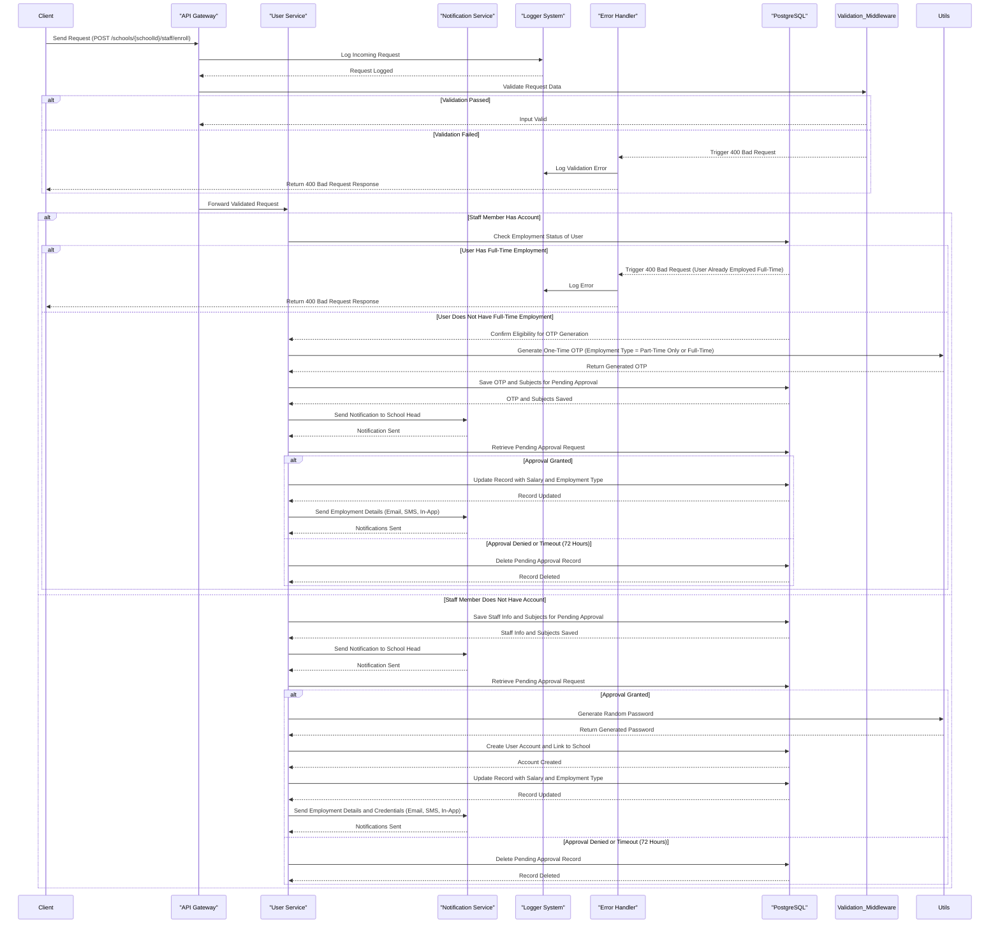

```mermaid
sequenceDiagram
    participant Client
    participant API_Gateway as "API Gateway"
    participant User_Service as "User Service"
    participant Notification_Service as "Notification Service"
    participant Logger_System as "Logger System"
    participant ErrorHandler as "Error Handler"
    participant Database as "PostgreSQL"

    %% Step 1: Client sends request
    Client->>API_Gateway: Send Request (POST /schools/{schoolId}/staff/enroll)

    %% Step 2: Log incoming request
    API_Gateway->>Logger_System: Log Incoming Request
    Logger_System-->>API_Gateway: Request Logged

    %% Step 3: Validate request at API Gateway
    API_Gateway->>Validation_Middleware: Validate Request Data
    alt Validation Passed
        Validation_Middleware-->>API_Gateway: Input Valid
    else Validation Failed
        Validation_Middleware-->>ErrorHandler: Trigger 400 Bad Request
        ErrorHandler->>Logger_System: Log Validation Error
        ErrorHandler-->>Client: Return 400 Bad Request Response
    end

    %% Step 4: Forward request to User Service
    API_Gateway->>User_Service: Forward Validated Request

    %% Step 5: Determine if the staff member has an account
    alt Staff Member Has Account
        %% Step 6: Validate OTP generation eligibility
        User_Service->>Database: Check Employment Status of User
        alt User Has Full-Time Employment
            Database-->>ErrorHandler: Trigger 400 Bad Request (User Already Employed Full-Time)
            ErrorHandler->>Logger_System: Log Error
            ErrorHandler-->>Client: Return 400 Bad Request Response
        else User Does Not Have Full-Time Employment
            Database-->>User_Service: Confirm Eligibility for OTP Generation

            %% Step 7: Generate OTP for employment
            User_Service->>Utils: Generate One-Time OTP (Employment Type = Part-Time Only or Full-Time)
            Utils-->>User_Service: Return Generated OTP

            %% Step 8: Add OTP and subjects to request
            User_Service->>Database: Save OTP and Subjects for Pending Approval
            Database-->>User_Service: OTP and Subjects Saved

            %% Step 9: Notify School Head for approval
            User_Service->>Notification_Service: Send Notification to School Head
            Notification_Service-->>User_Service: Notification Sent

            %% Step 10: Wait for School Head approval
            User_Service->>Database: Retrieve Pending Approval Request
            alt Approval Granted
                %% Step 11: Approve enrollment and add salary/employment type
                User_Service->>Database: Update Record with Salary and Employment Type
                Database-->>User_Service: Record Updated

                %% Step 12: Notify staff member
                User_Service->>Notification_Service: Send Employment Details (Email, SMS, In-App)
                Notification_Service-->>User_Service: Notifications Sent
            else Approval Denied or Timeout (72 Hours)
                %% Step 13: Remove pending record
                User_Service->>Database: Delete Pending Approval Record
                Database-->>User_Service: Record Deleted
            end
        end
    else Staff Member Does Not Have Account
        %% Step 14: Collect staff member's personal info and subjects
        User_Service->>Database: Save Staff Info and Subjects for Pending Approval
        Database-->>User_Service: Staff Info and Subjects Saved

        %% Step 15: Notify School Head for approval
        User_Service->>Notification_Service: Send Notification to School Head
        Notification_Service-->>User_Service: Notification Sent

        %% Step 16: Wait for School Head approval
        User_Service->>Database: Retrieve Pending Approval Request
        alt Approval Granted
            %% Step 17: Create user account for staff member
            User_Service->>Utils: Generate Random Password
            Utils-->>User_Service: Return Generated Password

            User_Service->>Database: Create User Account and Link to School
            Database-->>User_Service: Account Created

            %% Step 18: Add salary/employment type
            User_Service->>Database: Update Record with Salary and Employment Type
            Database-->>User_Service: Record Updated

            %% Step 19: Notify staff member
            User_Service->>Notification_Service: Send Employment Details and Credentials (Email, SMS, In-App)
            Notification_Service-->>User_Service: Notifications Sent
        else Approval Denied or Timeout (72 Hours)
            %% Step 20: Remove pending record
            User_Service->>Database: Delete Pending Approval Record
            Database-->>User_Service: Record Deleted
        end
    end
```
