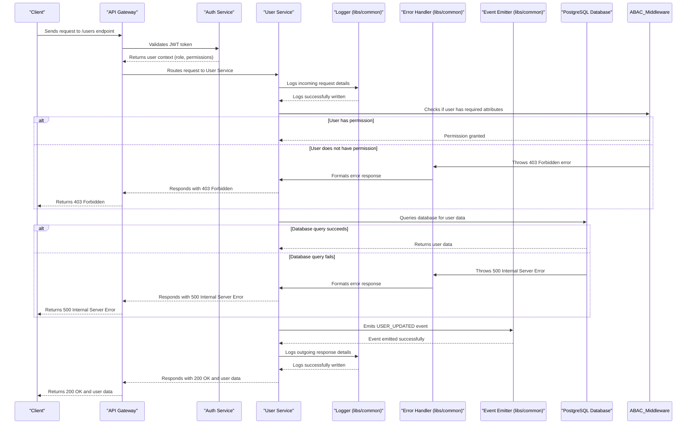

```mermaid
sequenceDiagram
    participant Client as "Client"
    participant API_Gateway as "API Gateway"
    participant Auth_Service as "Auth Service"
    participant User_Service as "User Service"
    participant Logger as "Logger (libs/common)"
    participant ErrorHandler as "Error Handler (libs/common)"
    participant Event_Emitter as "Event Emitter (libs/common)"
    participant Database as "PostgreSQL Database"

    %% Step 1: Client sends a request
    Client->>API_Gateway: Sends request to /users endpoint
    API_Gateway->>Auth_Service: Validates JWT token
    Auth_Service-->>API_Gateway: Returns user context (role, permissions)

    %% Step 2: API Gateway routes the request to User Service
    API_Gateway->>User_Service: Routes request to User Service

    %% Step 3: Logging the request
    User_Service->>Logger: Logs incoming request details
    Logger-->>User_Service: Logs successfully written

    %% Step 4: ABAC Middleware checks permissions
    User_Service->>ABAC_Middleware: Checks if user has required attributes
    alt User has permission
        ABAC_Middleware-->>User_Service: Permission granted
    else User does not have permission
        ABAC_Middleware->>ErrorHandler: Throws 403 Forbidden error
        ErrorHandler->>User_Service: Formats error response
        User_Service-->>API_Gateway: Responds with 403 Forbidden
        API_Gateway-->>Client: Returns 403 Forbidden
    end

    %% Step 5: Business logic execution
    User_Service->>Database: Queries database for user data
    alt Database query succeeds
        Database-->>User_Service: Returns user data
    else Database query fails
        Database->>ErrorHandler: Throws 500 Internal Server Error
        ErrorHandler->>User_Service: Formats error response
        User_Service-->>API_Gateway: Responds with 500 Internal Server Error
        API_Gateway-->>Client: Returns 500 Internal Server Error
    end

    %% Step 6: Event emission for successful actions
    User_Service->>Event_Emitter: Emits USER_UPDATED event
    Event_Emitter-->>User_Service: Event emitted successfully

    %% Step 7: Logging the response
    User_Service->>Logger: Logs outgoing response details
    Logger-->>User_Service: Logs successfully written

    %% Step 8: Return success response
    User_Service-->>API_Gateway: Responds with 200 OK and user data
    API_Gateway-->>Client: Returns 200 OK and user data
```